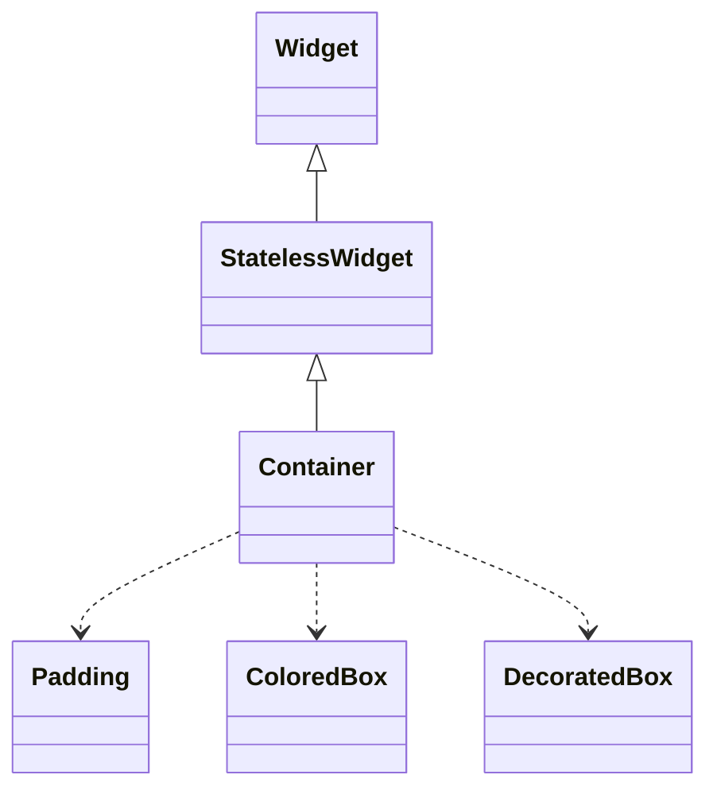
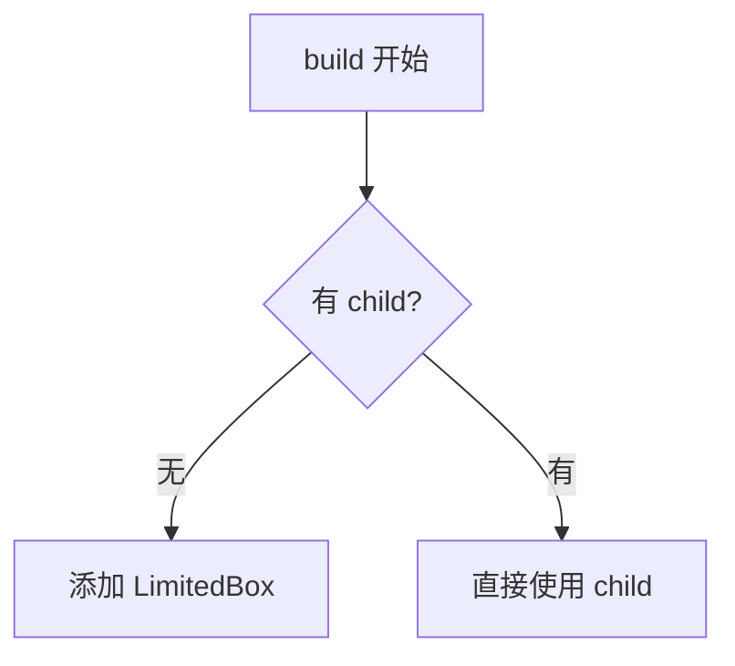

# Flutter Widget 深度讲解

当用户要求深入讲解某个 Flutter Widget 时，按照以下 8 个维度组织回答。

## 讲解结构

对任意 Flutter Widget，必须按顺序覆盖以下 8 个方面：

### 1. 架构设计

- Widget 在 Flutter 框架中的定位（是 `StatelessWidget` / `StatefulWidget` / `RenderObjectWidget` 还是组合类）
- 如果是组合类（如 Container），说明它组合了哪些底层 Widget
- 类继承关系：`Widget → StatelessWidget → Container`
- 设计意图：为什么这样设计，解决了什么问题

### 2. 类关系图（Mermaid）

- 用 Mermaid classDiagram 或 flowchart 展示类继承关系和组合关系
- 标注核心属性和方法
- 如果涉及 RenderObject，画出 Widget → Element → RenderObject 的映射



### 3. 流程图（Mermaid）

- 用 Mermaid flowchart 或 sequenceDiagram 展示核心流程
- 例如：`build()` 流程、布局流程、绘制流程
- 标注关键决策点和分支条件



- **包裹层级图**（按 `build()` 实际包裹顺序从外到内绘制）

```
┌──────────────────────────────────────┐
│           Transform (最外层)          │
│  ┌────────────────────────────────┐  │
│  │        Padding (margin)        │  │
│  │  ┌──────────────────────────┐  │  │
│  │  │     ConstrainedBox       │  │  │
│  │  │  ┌────────────────────┐  │  │  │
│  │  │  │   DecoratedBox(fg)  │  │  │  │
│  │  │  │  ┌──────────────┐  │  │  │  │
│  │  │  │  │ DecoratedBox │  │  │  │  │
│  │  │  │  │  ┌────────┐  │  │  │  │  │
│  │  │  │  │  │ClipPath│  │  │  │  │  │
│  │  │  │  │  │ ┌────┐ │  │  │  │  │  │
│  │  │  │  │  │ │ .. │ │  │  │  │  │  │
│  │  │  │  │  │ └────┘ │  │  │  │  │  │
│  │  │  │  │  └────────┘  │  │  │  │  │
│  │  │  │  └──────────────┘  │  │  │  │
│  │  │  └────────────────────┘  │  │  │
│  │  └──────────────────────────┘  │  │
│  └────────────────────────────────┘  │
└──────────────────────────────────────┘
```

> 每一层对应一个包裹 Widget；组合类按 `build()` 的顺序展开，RenderObjectWidget 按 Widget → Element → RenderObject → paint。

### 4. 源码解析

- 引用真实源码的关键方法（如 `build()`、`createElement()`、`createRenderObject()`）
- 解释参数如何转化（如 Container 的 `width/height` → `BoxConstraints`）
- 标注源码中的关键逻辑和注释
- 代码引用用 Dart 语法高亮

### 5. 使用场景

- 列举 3-6 个典型使用场景
- 每个场景附代码示例
- 说明选择该 Widget 的原因
- 与其他类似 Widget 的选型对比

### 6. 优缺点

| 优点  | 缺点  |
| ----- | ----- |
| 优点1 | 缺点1 |
| 优点2 | 缺点2 |

- 至少列出 3 个优点和 3 个缺点
- 必须是实际开发中能感知的，而非泛泛而谈

### 7. 常见坑

- 列出 3-5 个开发者容易犯的错误
- 每个坑附：错误代码 ❌ → 问题分析 → 正确代码 ✅
- 优先覆盖编译不报错但运行时行为不符合预期的情况

### 8. 性能优化

- 该 Widget 相关的性能注意事项
- 如何避免不必要的 rebuild
- `const` 构造函数的使用建议
- 与 `RepaintBoundary`、`AutomaticKeepAliveClientMixin` 等的关系（如相关）

## 输出格式

- 每个维度用小标题 `##` 分隔
- 代码块标注语言类型
- Mermaid 图表用 ` ```mermaid ` 块
- 表格用于对比信息
