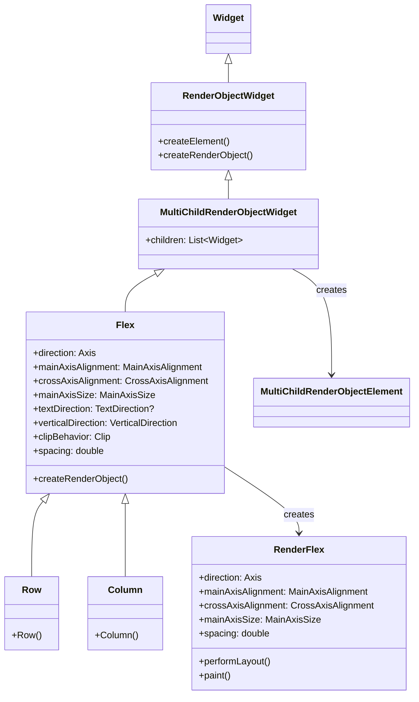
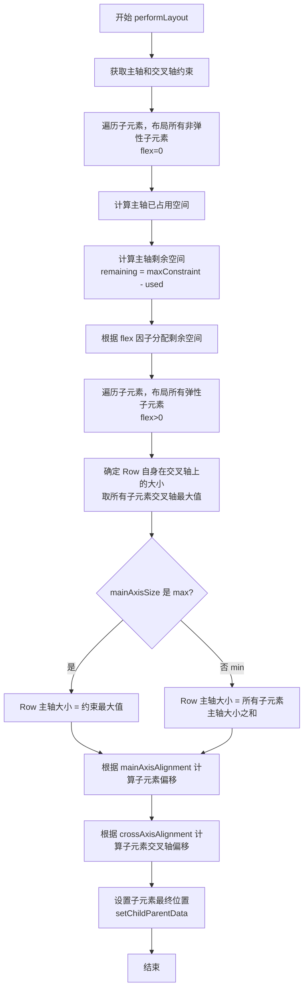
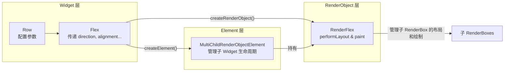

好的，遵照您提供的详细模板，我将对 Flutter 的 `Row` 组件进行一次全面、深入的讲解。

---

## 1. 架构设计

- **Widget 定位**：`Row` 是一个组合类的 `RenderObjectWidget`，更准确地说，它是一个 **MultiChildRenderObjectWidget**。它本身不持有状态，通过组合和配置底层 `RenderObject` 来实现布局。

- **组合与继承**：`Row` 是 `Flex` 类的子类，其核心布局逻辑完全由 `Flex` 提供。`Flex` 则是一个 `MultiChildRenderObjectWidget`。`Row` 和它的兄弟 `Column` 的唯一区别在于构造时传入的 `direction` 参数不同（`Axis.horizontal` vs `Axis.vertical`）。

- **类继承关系**：
  `Object` → `Diagnosticable` → `DiagnosticableTree` → `Widget` → `RenderObjectWidget` → `MultiChildRenderObjectWidget` → `Flex` → `Row`

- **设计意图**：
  1.  **专一性与复用性**：将水平布局的通用逻辑（如主轴/交叉轴对齐、弹性分配）抽象到父类 `Flex` 和 `RenderFlex` 中，`Row` 和 `Column` 只作为特定方向的便捷入口，极大地提高了代码复用率。
  2.  **声明式与高性能**：遵循 Flutter 的声明式 UI 范式，开发者只需描述布局的“样子”，框架负责高效的“渲染”。通过 `MultiChildRenderObjectWidget`，它能高效地管理多个子 Widget 的 `RenderObject`。
  3.  **清晰的职责划分**：
      - `Widget` 层（`Row`, `Flex`）：负责接收配置参数，是不可变的。
      - `Element` 层（`MultiChildRenderObjectElement`）：负责 Widget 与 RenderObject 的桥接，管理子 Widget 的生命周期。
      - `RenderObject` 层（`RenderFlex`）：负责实际的布局计算和绘制，是性能敏感的核心部分。

## 2. 类关系图（Mermaid）



Row/Column完整关系树

```
┌─────────────────────────────────────────────────────────────────────┐
│                          核心继承链                                │
├─────────────────────────────────────────────────────────────────────┤
│                                                                     │
│  Object                                                             │
│    └── Diagnosticable                                               │
│          └── DiagnosticableTree                                     │
│                └── Widget  ◄─── 抽象基类                           │
│                      └── RenderObjectWidget  ◄─── 需要 RenderObject │
│                            └── MultiChildRenderObjectWidget         │
│                                  │                                  │
│                                  └── Flex  ◄─── 核心布局逻辑       │
│                                        │                            │
│                                        ├── Column (vertical)        │
│                                        └── Row (horizontal)         │
│                                                                     │
└─────────────────────────────────────────────────────────────────────┘

┌─────────────────────────────────────────────────────────────────────┐
│                        Element 层                                   │
├─────────────────────────────────────────────────────────────────────┤
│                                                                     │
│  Element                                                            │
│    └── RenderObjectElement                                          │
│          └── MultiChildRenderObjectElement                         │
│                │                                                    │
│                └── 管理 Flex 的所有子 Widget 生命周期               │
│                                                                     │
└─────────────────────────────────────────────────────────────────────┘

┌─────────────────────────────────────────────────────────────────────┐
│                      RenderObject 层                                │
├─────────────────────────────────────────────────────────────────────┤
│                                                                     │
│  RenderObject                                                       │
│    └── RenderBox                                                    │
│          └── RenderFlex  ◄─── 实际执行布局和绘制                   │
│                                                                     │
└─────────────────────────────────────────────────────────────────────┘
```

## 3. 流程图（Mermaid）

下图展示了 `RenderFlex` 中 `performLayout()` 方法的核心布局流程，这是 `Row` 布局逻辑的心脏。



### 包裹层级图（Widget → RenderObject）



## 4. 源码解析

`Row` 的源码非常简洁，它只是一个 `Flex` 的特定配置。

```dart
// flutter/packages/flutter/lib/src/widgets/basic.dart
class Row extends Flex {
  Row({
    super.key,
    super.mainAxisAlignment = MainAxisAlignment.start,
    super.mainAxisSize = MainAxisSize.max,
    super.crossAxisAlignment = CrossAxisAlignment.center,
    super.textDirection,
    super.verticalDirection = VerticalDirection.down,
    super.clipBehavior = Clip.none,
    super.spacing = 0.0,
    super.filterColor,
    List<Widget> children = const <Widget>[],
  }) : super(
          children: children,
          direction: Axis.horizontal, // 关键：指定方向为水平
        );
}
```

`Flex` 的 `createRenderObject` 方法创建了核心的 `RenderFlex` 对象，并将所有配置参数传递过去。

```dart
// flutter/packages/flutter/lib/src/widgets/basic.dart
class Flex extends MultiChildRenderObjectWidget {
  // ... 参数定义 ...

  @override
  RenderFlex createRenderObject(BuildContext context) {
    return RenderFlex(
      direction: direction,
      mainAxisAlignment: mainAxisAlignment,
      mainAxisSize: mainAxisSize,
      crossAxisAlignment: crossAxisAlignment,
      textDirection: textDirection ?? Directionality.of(context),
      verticalDirection: verticalDirection,
      clipBehavior: clipBehavior,
      spacing: spacing,
      filterColor: filterColor,
    );
  }

  @override
  void updateRenderObject(BuildContext context, RenderFlex renderObject) {
    // ... 在参数变化时更新 RenderObject 的属性 ...
    renderObject
      ..direction = direction
      ..mainAxisAlignment = mainAxisAlignment
      ..mainAxisSize = mainAxisSize
      ..crossAxisAlignment = crossAxisAlignment
      ..textDirection = textDirection ?? Directionality.of(context)
      ..verticalDirection = verticalDirection
      ..clipBehavior = clipBehavior
      ..spacing = spacing
      ..filterColor = filterColor;
  }
}
```

**`RenderFlex` 中的关键布局逻辑（伪代码）**

在 `RenderFlex.performLayout()` 中，核心步骤如下：

```dart
// 伪代码，展示核心流程
void performLayout() {
  // 1. 布局所有非弹性子元素 (flex == 0)
  double totalFlex = 0.0;
  double usedSpace = 0.0;
  for (child in nonFlexChildren) {
    child.layout(constraints.loosen(), parentUsesSize: true);
    usedSpace += child.size.width;
  }

  // 2. 计算总 flex 值
  for (child in flexChildren) totalFlex += child.flex;

  // 3. 计算剩余空间并分配给弹性子元素
  final double remainingSpace = constraints.maxWidth - usedSpace;
  for (child in flexChildren) {
    final double childMaxWidth = remainingSpace * (child.flex / totalFlex);
    // 注意：当 FlexFit.tight 时，min=max; 当 FlexFit.loose 时，min=0, max=childMaxWidth
    child.layout(BoxConstraints(minWidth: 0, maxWidth: childMaxWidth), parentUsesSize: true);
  }

  // 4. 确定自身大小
  final double crossAxisSize = getMaxChildCrossAxisSize();
  final double mainAxisSize = mainAxisSize == MainAxisSize.max ? constraints.maxWidth : getTotalChildrenMainAxisSize();
  size = Size(mainAxisSize, crossAxisSize);

  // 5. 根据 MainAxisAlignment 和 CrossAxisAlignment 确定每个子元素的精确偏移
  alignChildren();
}
```

## 5. 使用场景

1.  **构建顶部导航栏（AppBar 内部）**
    - **场景**：左侧返回按钮、中间标题（弹性）、右侧操作按钮。
    - **原因**：`Row` 可以轻松地将左侧和右侧元素固定，中间元素使用 `Expanded` 填充剩余空间。
    - **代码**：
      ```dart
      Row(
        children: [
          const BackButton(),
          Expanded(
            child: Text(
              '标题',
              textAlign: TextAlign.center,
            ),
          ),
          IconButton(icon: Icon(Icons.more_vert), onPressed: () {}),
        ],
      )
      ```

2.  **创建列表项的布局**
    - **场景**：左侧头像 + 中间文本内容（标题和副标题，垂直排列） + 右侧时间/箭头。
    - **原因**：这是 `Row` 最经典的用法，结合 `Column` 实现水平+垂直的复合布局。中间内容用 `Expanded` 包裹确保其不溢出。
    - **代码**：
      ```dart
      Row(
        children: [
          CircleAvatar(backgroundImage: NetworkImage(url)),
          const SizedBox(width: 12),
          Expanded(
            child: Column(
              crossAxisAlignment: CrossAxisAlignment.start,
              children: [
                Text('主标题', style: TextStyle(fontWeight: FontWeight.bold)),
                Text('副标题，可能会很长，但会被截断'),
              ],
            ),
          ),
          const Text('昨天'),
        ],
      )
      ```

3.  **表单中的标签与输入框组合**
    - **场景**：`Text` 标签 + `TextField`。
    - **原因**：当标签宽度固定时，输入框可以弹性地填充剩余空间。
    - **代码**：
      ```dart
      Row(
        children: [
          Container(width: 80, child: Text('用户名')),
          Expanded(child: TextField()),
        ],
      )
      ```

4.  **按钮组或标签组**
    - **场景**：水平排列多个操作按钮或筛选标签。
    - **原因**：`Row` 提供了 `spacing` 参数，可以轻松控制子组件之间的间距，代码简洁。
    - **代码**：
      ```dart
      Row(
        spacing: 8, // 统一间距
        children: [
          ElevatedButton(onPressed: () {}, child: Text('确认')),
          OutlinedButton(onPressed: () {}, child: Text('取消')),
        ],
      )
      ```

5.  **图标+文本组合**
    - **场景**：在卡片或列表中，一个小图标后面跟随一段描述文字。
    - **原因**：这种组合非常直观。
    - **代码**：
      ```dart
      Row(
        children: [
          Icon(Icons.location_on, size: 16),
          SizedBox(width: 4),
          Text('北京市朝阳区', style: TextStyle(fontSize: 14)),
        ],
      )
      ```

**选型对比：**
| 场景                           | 推荐组件                      | 原因                                                          |
| :----------------------------- | :---------------------------- | :------------------------------------------------------------ |
| 水平线性排列，子元素可能溢出   | `Row` + `Expanded`/`Flexible` | 精确控制剩余空间的分配，防止溢出。                            |
| 水平排列，空间不足时自动换行   | `Wrap`                        | `Row` 本身不换行，`Wrap` 是更合适的选择。                     |
| 需要水平滚动的大量或动态子元素 | `ListView.builder`            | `Row` 会一次性构建所有子元素，性能差；`ListView` 支持懒加载。 |

## 6. 优缺点

| 优点                                                                                                                                                 | 缺点                                                                                                                                     |
| :--------------------------------------------------------------------------------------------------------------------------------------------------- | :--------------------------------------------------------------------------------------------------------------------------------------- |
| **简单直观**：属性命名清晰（`mainAxisAlignment`, `crossAxisAlignment`），非常容易上手和实现水平布局。                                                | **溢出问题**：默认行为是截断子元素并报错，而不是换行或滚动，对新手不友好。                                                               |
| **强大的弹性布局能力**：通过 `Expanded` 和 `Flexible` 可以灵活地按比例分配空间，实现响应式设计。                                                     | **可能导致深层嵌套**：复杂 UI 容易堆叠多层 `Row`/`Column`，影响性能（虽然通常可接受）和代码可读性（易形成“金字塔”代码）。                |
| **高性能**：作为 `MultiChildRenderObjectWidget`，其布局算法（`RenderFlex`）经过高度优化，性能优于 `Wrap` 或 `ListView`（在子元素数量固定且不多时）。 | **不可滚动**：如果子元素总宽度超过可用宽度，内容会被截断，无法滚动查看。                                                                 |
| **声明式间距控制**：新增的 `spacing` 参数让子元素间距管理变得优雅且高效。                                                                            | **缺乏网格对齐能力**：无法像 `Grid` 或 `Table` 那样，让不同行的元素在垂直方向上拥有不同的对齐方式，所有子元素共享 `crossAxisAlignment`。 |

## 7. 常见坑

1.  **坑：Row 内容溢出，出现黄黑条纹**
    - **问题**：当 `Row` 中有一个或多个非弹性子元素（如 `Text`、`Image`），它们的宽度总和超过了 `Row` 的约束宽度。
    - **❌ 错误代码**：
      ```dart
      Row(
        children: [
          Text('这是一个很长的文本，没有任何约束，它会导致溢出'),
          Icon(Icons.star),
        ],
      )
      ```
    - **问题分析**：`Text` 没有宽度约束，它会尽可能宽，直到撑爆 `Row`。
    - **✅ 正确代码**（使用 `Expanded`）：
      ```dart
      Row(
        children: [
          Expanded(child: Text('这是一个很长的文本，它现在被限制在剩余空间内，不会溢出')),
          Icon(Icons.star),
        ],
      )
      ```

2.  **坑：`Expanded` 的 `flex` 因子与 `MainAxisAlignment.spaceEvenly` 冲突**
    - **问题**：当 `Row` 同时设置了 `mainAxisAlignment`（如 `spaceEvenly`）并且其子元素包含 `Expanded` 时，`Expanded` 会先“抢走”空间，剩余空间再按 `spaceEvenly` 分配，导致布局不符合预期。
    - **❌ 错误代码**：
      ```dart
      Row(
        mainAxisAlignment: MainAxisAlignment.spaceEvenly,
        children: [
          Expanded(flex: 1, child: Container(color: Colors.red, height: 50)),
          Expanded(flex: 2, child: Container(color: Colors.blue, height: 50)),
        ],
      )
      // 结果：红色和蓝色平分整个 Row 宽度，spaceEvenly 基本失效。
      ```
    - **问题分析**：`Expanded` 强制其子元素填充主轴的剩余空间。这里的“剩余空间”是在考虑 `mainAxisAlignment` **之前**计算出的整个主轴空间，因此两个 `Expanded` 直接按 `flex` 比例瓜分了整个空间。
    - **✅ 正确代码**：如果你需要 `spaceEvenly`，就不要使用 `Expanded`；或者使用 `Flexible`，但要注意其行为差异。
      ```dart
      // 方案1：不使用 Expanded，让子元素保持固有宽度，由 spaceEvenly 控制间距
      Row(
        mainAxisAlignment: MainAxisAlignment.spaceEvenly,
        children: [
          Container(color: Colors.red, height: 50, width: 50),
          Container(color: Colors.blue, height: 50, width: 100),
        ],
      )
      ```

3.  **坑：在 `Row` 中直接使用 `ListView` 或 `GridView`**
    - **问题**：`ListView` 和 `GridView` 默认会尽可能占据主轴空间（`shrinkWrap: false`），这会导致 `Row` 的约束冲突，或者导致内部列表无法滚动。
    - **❌ 错误代码**：
      ```dart
      Row(
        children: [
          Text('左侧'),
          ListView.builder(itemBuilder: (_, i) => Text('$i')), // 这里会报错
        ],
      )
      ```
    - **问题分析**：`ListView` 在水平方向上会尝试无限扩展，导致 `Row` 无法确定自身宽度，从而抛出 `BoxConstraints` 错误。
    - **✅ 正确代码**：
      ```dart
      Row(
        children: [
          Text('左侧'),
          Expanded( // 必须用 Expanded 限制 ListView 的宽度
            child: ListView.builder(
              scrollDirection: Axis.horizontal, // 水平滚动
              itemBuilder: (_, i) => Text('$i'),
            ),
          ),
        ],
      )
      ```

## 8. 性能优化

1.  **尽量使用 `const` 构造函数**
    - 如果 `Row` 的子元素在构建过程中不会变化，尽量为其添加 `const` 关键字。这可以让 Flutter 在 rebuild 时复用之前构建的 Widget 对象，避免不必要的重建工作。
    - ```dart
      const Row(
        children: [
          Icon(Icons.star),
          Text('固定的文字'),
        ],
      )
      ```

2.  **避免在 `Row` 中使用 `Expanded` 包裹不必要的组件**
    - 如果某个子组件的宽度是固定的，或者你希望它保持其固有大小，就不要用 `Expanded` 包裹。`Expanded` 会强制其子元素填充空间，这需要额外的布局计算。

3.  **使用 `spacing` 替代 `SizedBox`**
    - 在 `Row` 中，使用 `spacing` 参数来统一管理间距，比在每个子元素之间手动插入 `SizedBox` 更高效。因为 `spacing` 在 `RenderFlex` 层面处理，减少了 Widget 树中的节点数量。
    - ```dart
      // 性能稍好，代码更简洁
      Row(
        spacing: 10,
        children: [Icon(Icons.home), Icon(Icons.search), Icon(Icons.person)],
      )
      ```

4.  **控制嵌套层级**
    - Flutter 官方建议，尽可能将 `Row`/`Column` 的嵌套深度控制在 **10 层以内**。过深的嵌套会导致 `performLayout()` 的递归调用栈变长，影响 UI 渲染性能。当布局变得非常复杂时，考虑拆分出独立的 Widget 或使用更高效的布局组件（如 `CustomMultiChildLayout`）。

5.  **与 `RepaintBoundary` 结合使用**
    - 如果 `Row` 中的某个部分（如一个复杂的动画或视频播放器）频繁重绘，但它的变化不影响 `Row` 的其他部分，应该将该部分用 `RepaintBoundary` 包裹起来。这样可以隔离重绘区域，避免整个 `Row` 及其父 Widget 被重新绘制，从而显著提升性能。

## Q：为什么Row嵌套ListView水平方向失去约束

这是一个非常深入且关键的问题。要理解为什么 `ListView` 在 `Row` 中会尝试无限扩展，我们需要从 Flutter 的**布局约束传递机制**和 **`ListView` 自身的设计哲学**两个层面来剖析。

---

## 1. Flutter 的布局约束传递机制

在 Flutter 中，布局的约束是**从父到子**传递的。父 Widget 会告诉子 Widget 它**允许**的最大和最小尺寸（`BoxConstraints`），子 Widget 则根据这些约束决定自己的大小并返回给父 Widget。

### 关键规则（"Constraints go down, sizes go up"）
- **父 Widget 传递约束（Constraints）给子 Widget**
- **子 Widget 根据自己的内容 + 约束，决定自身大小（Size）**
- **子 Widget 将大小报告给父 Widget**
- **父 Widget 根据子 Widget 的大小进行定位**

当一个 Widget 接收到**无约束**（`unbounded constraint`）时，它就会根据自己的内容尽可能大。这正是 `ListView` 在 `Row` 中的困境。

---

## 2. `Row` 传递的约束是什么？

让我们看一个典型的错误示例：

```dart
Row(
  children: [
    Text('左侧文本'),
    ListView.builder(
      itemBuilder: (context, index) => Text('Item $index'),
    ),
  ],
)
```

### 步骤拆解：

1. **`Row` 接收父约束**：假设 `Row` 的父 Widget（比如一个 `Column` 或 `Scaffold`）传递给它一个**有界约束**（`BoxConstraints`），例如：
   - `minWidth: 0, maxWidth: 375`（手机屏幕宽度）
   - `minHeight: 0, maxHeight: 800`

2. **`Row` 开始布局子元素**：`Row` 会按照以下顺序处理它的子元素：
   - 先布局**非弹性**子元素（没有用 `Expanded` 包裹的）
   - 分配剩余空间给**弹性**子元素（用 `Expanded` 包裹的）

3. **`Row` 对非弹性 `ListView` 传递什么约束？**
   关键问题就在这里：**`Row` 在水平方向（主轴）上，会尝试让非弹性子元素保持其固有大小（natural size）**。为了获取子元素的固有大小，`Row` 会在主轴上传递一个**松约束**（`loose constraint`），其本质是一个**无约束**（`unbounded`）或**极大约束**。

   具体来说：
   - **主轴上（水平方向）**：`Row` 对非弹性子元素传递的约束是 `minWidth: 0, maxWidth: double.infinity`（**无限大**）
   - **交叉轴上（垂直方向）**：`Row` 传递的约束是 `minHeight: 0, maxHeight: 800`（与父约束一致）

4. **`ListView` 接收到约束后的反应**：
   - **垂直方向**：`ListView` 有明确的约束（`maxHeight: 800`），它知道自己可以被滚动，这是它的默认滚动方向。
   - **水平方向**：`ListView` 接收到了 `maxWidth: double.infinity`（**无限制**）。在这种情况下，`ListView` 的行为是：**"既然你没有限制我有多宽，那我就把所有的子元素在一行内全部显示出来，占用所需的宽度，并且不启用滚动"**。

---

## 3. 为什么 `ListView` 要这样设计？

这是 `ListView` 的一个设计哲学：**它只在有明确约束的方向上滚动**。

- `ListView` 的默认滚动方向是 `Axis.vertical`（垂直滚动）
- 当它在**垂直方向**上接收到**有界约束**（如 `maxHeight: 800`）时，它会启用滚动，并且其子元素的高度受 `maxHeight` 限制。
- 当它在**水平方向**上接收到**无界约束**（`maxWidth: double.infinity`）时，它会认为**"空间无限，不需要滚动"**，于是它会尝试一次性布局所有子元素，使其在水平方向上无限延伸。

### 源码验证

在 `RenderListVIew` 的 `performLayout()` 方法中，有这样的逻辑：

```dart
// 伪代码，摘自 RenderListView
void performLayout() {
  // 确定主轴方向
  final AxisDirection axisDirection = getAxisDirection();
  
  // 获取主轴约束
  final double mainAxisExtent = constraints.maxMainAxisExtent; // 主轴最大约束
  
  // 关键判断：如果主轴约束是无限大，则抛异常或进入特殊模式
  if (mainAxisExtent == double.infinity) {
    // 此时 ListView 会尝试用孩子的固有大小来布局
    // 通常会抛出 "Vertical viewport was given unbounded height" 等错误
    // 或者表现出 "无限扩展" 的行为
  }
}
```

对于 `Row` 中的 `ListView`：
- **水平方向**：`mainAxisExtent = constraints.maxWidth = double.infinity` → 触发无限扩展逻辑。
- **垂直方向**：`crossAxisExtent = constraints.maxHeight = 800` → 有界约束，`ListView` 的每个子元素高度受限制。

---

## 4. 本质原因总结

| 维度                   | 谁传递约束              | 约束值                           | 结果                                                                    |
| :--------------------- | :---------------------- | :------------------------------- | :---------------------------------------------------------------------- |
| **水平方向（主轴）**   | `Row` 传递给 `ListView` | `maxWidth = double.infinity`     | `ListView` 认为自己有无限空间，**不滚动**，**扩展至所有子元素的总宽度** |
| **垂直方向（交叉轴）** | `Row` 传递给 `ListView` | `maxHeight = 父约束高度`（有界） | `ListView` 正常布局子元素，每个子元素高度受限                           |

**根本原因**：`Row` 为了让非弹性子元素展示其"固有大小"，会在主轴上传递无限约束。而 `ListView` 接到无限约束后，会错误地认为不需要滚动，从而试图一次性展示所有内容，导致无限扩展。

---

## 5. 解决方案

### ✅ 方案1：使用 `Expanded` 或 `Flexible`（推荐）
通过 `Expanded`，你告诉 `Row`："这个子元素应该占用剩余空间，而不是展示固有大小"。此时 `Row` 会传递一个**有界约束**给 `ListView`。
```dart
Row(
  children: [
    Text('左侧文本'),
    Expanded( // 关键！
      child: ListView.builder(
        itemBuilder: (context, index) => Text('Item $index'),
      ),
    ),
  ],
)
```
**结果**：`Expanded` 让 `Row` 在水平方向给 `ListView` 传递了 `maxWidth = 剩余空间`（有界），`ListView` 正常启用水平滚动。

### ✅ 方案2：固定 `ListView` 的宽度
通过 `SizedBox` 或 `Container` 显式指定宽度。
```dart
Row(
  children: [
    Text('左侧文本'),
    SizedBox(
      width: 200, // 明确限制宽度
      child: ListView.builder(
        itemBuilder: (context, index) => Text('Item $index'),
      ),
    ),
  ],
)
```

### ✅ 方案3：使用 `shrinkWrap: true`
`shrinkWrap: true` 会让 `ListView` **放弃滚动**，并收缩到所有子元素的总大小。
```dart
Row(
  children: [
    Text('左侧文本'),
    Expanded(
      child: ListView.builder(
        shrinkWrap: true, // 让 ListView 收缩，不再扩展
        scrollDirection: Axis.horizontal, // 明确水平滚动
        itemBuilder: (context, index) => Text('Item $index'),
      ),
    ),
  ],
)
```
> **注意**：`shrinkWrap: true` 在性能上较差（会一次性构建所有子元素），但在某些场景下是必要的。

---

## 6. 横向对比：为什么 `Text` 不会无限扩展？

- `Text` 在接收到无界约束时，会根据文本内容计算出其固有宽度，不会无限扩展。
- `ListView` 则不同，它的核心是**管理一个可滚动的子元素列表**，在没有边界的情况下，它无法判断"何时停止滚动"，因此会尝试包含所有子元素，表现为无限扩展。

---

这个问题的本质是 **`Row` 的约束传递策略** 与 **`ListView` 对无界约束的处理逻辑** 之间的冲突。理解这个机制，你就能轻松应对所有类似的布局问题了。

## Q: 基线对齐原理

非常好的问题！你的理解**对了一半**，但有一个关键的细微差别需要澄清。

## 基线对齐（Baseline Alignment）的真实原理

### 🎯 核心答案

**基线对齐不是"字母底部对齐"，而是"字母的基线（baseline）对齐"**。

- ❌ **不是**：字母的底部（descender 底部）对齐
- ✅ **而是**：字母的"基线"（baseline）对齐，即字母**主体部分**的底部对齐

---

## 1. 什么是"基线"（Baseline）？

在排版学中，基线是**字母主体（如 x-height）所在的假想水平线**，它位于字母底部（descender）的上方。

### 字母解剖学

```
       ascent (升部)
    ┌──────────────┐
    │   ████████    │  ← cap height (大写高度)
    │   ██    ██    │
    │   ██    ██    │
    │   ████████    │  ← x-height (小写 x 高度)
    │   ██    ██    │
    │   ██    ██    │
    └───██────██────┘  ← baseline (基线) ⬅️ 对齐点在这里！
        ██    ██
        ██    ██      ← descender (降部，如 p, q, y)
```

---

## 2. 视觉对比：底部对齐 vs 基线对齐

### 示例：Big（30px）和 Small（16px）

```dart
Row(
  crossAxisAlignment: CrossAxisAlignment.baseline, // 基线对齐
  textBaseline: TextBaseline.alphabetic,
  children: const [
    Text('Big', style: TextStyle(fontSize: 30)),
    Text('Small', style: TextStyle(fontSize: 16)),
  ],
)
```

### 视觉表现

```
【底部对齐】          【基线对齐】
                      ← 基线 (baseline)
Big                   Big
Small                 Small
  ↑                    ↑
  底部平齐             基线平齐（字母主体底部对齐）
```

### 实际效果图（文字示意）

```
【底部对齐】          【基线对齐】
Biggy                 Biggy
Small                 Small
  ↑                    ↑
  底部边缘对齐          字母主体底部对齐（基线对齐）
```

**关键观察**：
- `Big` 的 'g' 字母有**降部（descender）**，会延伸到基线下方
- `Small` 的字母都是小写，没有降部
- 基线对齐时，`Big` 的 'g' 会**突出到基线下方**，而 `Small` 的字母主体底部刚好在基线上

---

## 3. 你的代码分析

```dart
Row(
  crossAxisAlignment: CrossAxisAlignment.baseline,
  textBaseline: TextBaseline.alphabetic,
  children: const [
    Text('Big', style: TextStyle(fontSize: 30)),   // 有 'g' 降部
    Text('Small', style: TextStyle(fontSize: 16)), // 无降部
    Text('Mid', style: TextStyle(fontSize: 22)),   // 无降部
  ],
)
```

### 对齐过程

```
基线位置：所有文本的基线在一条水平线上

    Big (30px)     Small (16px)     Mid (22px)
    ██              ████             ███
    ██              ██               ██
    ██              ████             ███
    ██              ██               ██
   g██              ████             ███
   ██                                
   ██ ← g 的降部延伸到基线下方
─────────────────── 基线 (baseline) ──────────────────
```

**实际效果**：
1. 三个文本的**基线**（字母主体底部）在**同一水平线**上
2. 'Big' 的 'g' 会**向下突出**，因为降部在基线下方
3. 视觉上，`Big` 的底部（包含降部）会比 `Small` 和 `Mid` 更低

---

## 4. 源码验证：基线对齐的实现

### `RenderFlex` 中的基线对齐逻辑

```dart
// 伪代码：RenderFlex._getBaseline()
double? _getBaseline(RenderBox child, TextBaseline baseline) {
  // 关键：子元素必须实现 getDistanceToBaseline 方法
  // Text 组件会返回从组件顶部到基线的距离
  return child.getDistanceToBaseline(baseline);
}

// Text 的 getDistanceToBaseline 实现
double? getDistanceToBaseline(TextBaseline baseline) {
  // 使用 TextPainter 计算基线的精确位置
  // 返回：从组件顶部到基线的距离（包含 ascent + 其他布局偏移）
  return _textPainter.getDistanceToBaseline(baseline);
}
```

### 布局过程

```dart
// RenderFlex.performLayout() 中的基线对齐处理
void _applyCrossAxisAlignment(/*...*/) {
  switch (crossAxisAlignment) {
    case CrossAxisAlignment.baseline:
      // 1. 计算每个子元素的基线位置
      final double? baselineValue = child.getDistanceToBaseline(textBaseline);
      
      // 2. 子元素的交叉轴偏移 = 最大基线值 - 当前子元素的基线值
      // 这样所有子元素的基线就在同一水平线上了
      childParentData.offset = Offset(
        childParentData.offset.dx,
        maxBaseline - baselineValue!,
      );
      break;
  }
}
```

---

## 5. 常见误解澄清

### ❌ 误解1："基线对齐 = 底部对齐"

```dart
// 底部对齐（文字底部边缘对齐）
Row(
  crossAxisAlignment: CrossAxisAlignment.end,
  children: const [
    Text('Big', style: TextStyle(fontSize: 30)),   // 底部对齐
    Text('Small', style: TextStyle(fontSize: 16)), // 底部对齐
  ],
)
// 效果：Big 和 Small 的底部边缘（包含所有降部）在一条线上
```

### ✅ 正确理解：基线对齐

```dart
// 基线对齐（字母主体底部对齐）
Row(
  crossAxisAlignment: CrossAxisAlignment.baseline,
  textBaseline: TextBaseline.alphabetic,
  children: const [
    Text('Big', style: TextStyle(fontSize: 30)),   // 基线对齐
    Text('Small', style: TextStyle(fontSize: 16)), // 基线对齐
  ],
)
// 效果：Big 的 'g' 降部会突出到下方，但所有字母的基线在一条线上
```

### 视觉对比图

```
【底部对齐】          【基线对齐】
     Big                 Big
     Small               Small
     ↑                    ↑
     底部边缘平齐         基线平齐（字母主体底部）
     'g' 降部也在线上     'g' 降部突出到下方
```

---

## 6. 实战演示：不同文本的对齐效果

```dart
Row(
  crossAxisAlignment: CrossAxisAlignment.baseline,
  textBaseline: TextBaseline.alphabetic,
  children: const [
    Text('Big', style: TextStyle(fontSize: 30)),
    //  'g' 有降部，会延伸到基线下方
    
    Text('Small', style: TextStyle(fontSize: 16)),
    //  无降部，主体底部刚好在基线上
    
    Text('Mid', style: TextStyle(fontSize: 22)),
    //  无降部，主体底部刚好在基线上
    
    Text('yoyo', style: TextStyle(fontSize: 20)),
    //  'y' 有降部，会延伸到基线下方
  ],
)
```

### 对齐结果

```
基线对齐后：
    Big        Small    Mid      yoyo
    ██         ████     ███      ██
    ██         ██       ██       ██
    ██         ████     ███      ██
    ██         ██       ██       ██
   g██         ████     ███      ██
   ██                            ██
   ██ ← g 降部                 y ██ ← y 降部
─────────────────── 基线 (baseline) ──────────────────
    ↑                           ↑
    所有字母主体底部对齐         所有字母主体底部对齐
```

---

## 7. 什么时候使用基线对齐？

### ✅ 适用场景
- **不同字体大小混排**：如标题+副标题，需要视觉上文字对齐
- **多语言混排**：中英文混合时，基线对齐让视觉更协调
- **按钮中的图标+文字**：图标和文字需要在视觉上对齐

```dart
// 示例：标题和副标题对齐
Row(
  crossAxisAlignment: CrossAxisAlignment.baseline,
  textBaseline: TextBaseline.alphabetic,
  children: [
    Text('标题', style: TextStyle(fontSize: 24)),
    SizedBox(width: 8),
    Text('副标题', style: TextStyle(fontSize: 14)),
    // 副标题的基线会和标题的基线对齐，视觉上更协调
  ],
)
```

### ❌ 不适合的场景
- 包含**图片、图标**等非文本元素（它们没有基线概念）
- 使用**不同字体族**可能导致基线位置不一致

---

## 8. 总结

| 对齐方式                      | 对齐点                   | 示例效果                                  |
| :---------------------------- | :----------------------- | :---------------------------------------- |
| `CrossAxisAlignment.baseline` | **基线**（字母主体底部） | 文本的基线对齐，降部（g, p, y）突出到下方 |
| `CrossAxisAlignment.end`      | **底部边缘**（包含降部） | 所有文本的底部边缘对齐                    |
| `CrossAxisAlignment.center`   | **中心线**               | 所有文本的垂直中心对齐                    |

### 你的代码实际效果

```dart
Row(
  crossAxisAlignment: CrossAxisAlignment.baseline,
  textBaseline: TextBaseline.alphabetic,
  children: const [
    Text('Big', style: TextStyle(fontSize: 30)),   // 'g' 降部突出
    Text('Small', style: TextStyle(fontSize: 16)), // 在基线上
    Text('Mid', style: TextStyle(fontSize: 22)),   // 在基线上
  ],
)
```

**视觉结果**：
1. 三个文本的**基线**（字母主体底部）在**同一水平线**上
2. `Big` 的 'g' 字母**降部突出到基线下方**
3. 视觉上，`Big` 的底部（包含 'g'）会比 `Small` 更低
4. 但所有文本的**主体部分**（如 'B', 'i', 'S', 'm', 'M'）是水平对齐的

这就是为什么基线对齐在排版中很重要——它让不同大小的文字在视觉上保持一致的"阅读基线"，而不是简单地底部对齐！

