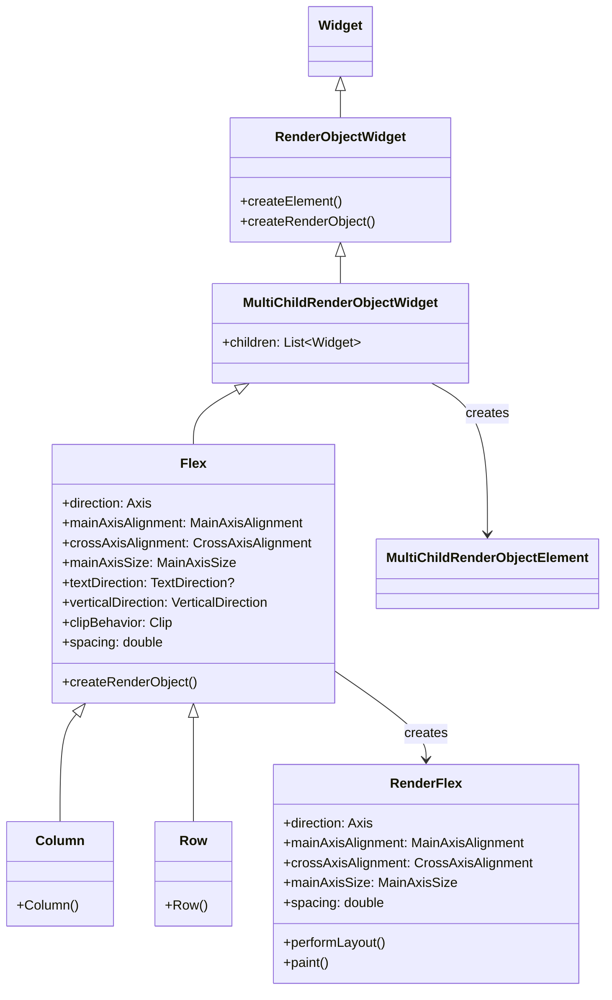
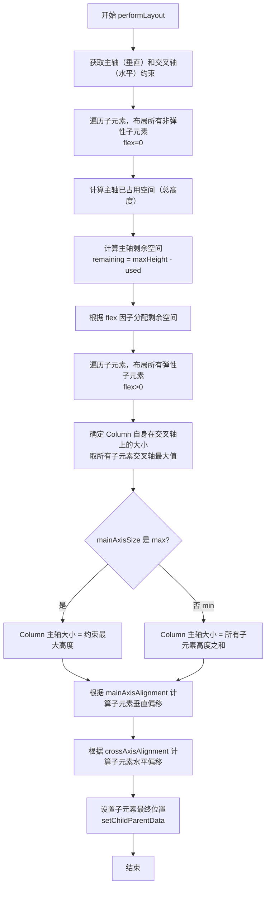
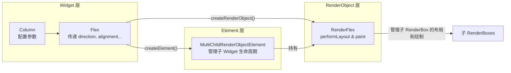

好的，遵照您提供的详细模板，我将对 Flutter 的 `Column` 组件进行一次全面、深入的讲解。

---

## 1. 架构设计

- **Widget 定位**：`Column` 是一个组合类的 `RenderObjectWidget`，更准确地说，它是一个 **MultiChildRenderObjectWidget**。它本身不持有状态，通过组合和配置底层 `RenderObject` 来实现布局。

- **组合与继承**：`Column` 是 `Flex` 类的子类，其核心布局逻辑完全由 `Flex` 提供。`Flex` 则是一个 `MultiChildRenderObjectWidget`。`Column` 和它的兄弟 `Row` 的唯一区别在于构造时传入的 `direction` 参数不同（`Axis.vertical` vs `Axis.horizontal`）。

- **类继承关系**：
  `Object` → `Diagnosticable` → `DiagnosticableTree` → `Widget` → `RenderObjectWidget` → `MultiChildRenderObjectWidget` → `Flex` → `Column`

- **设计意图**：
  1.  **专一性与复用性**：将垂直布局的通用逻辑（如主轴/交叉轴对齐、弹性分配）抽象到父类 `Flex` 和 `RenderFlex` 中，`Column` 和 `Row` 只作为特定方向的便捷入口，极大地提高了代码复用率。
  2.  **声明式与高性能**：遵循 Flutter 的声明式 UI 范式，开发者只需描述布局的"样子"，框架负责高效的"渲染"。通过 `MultiChildRenderObjectWidget`，它能高效地管理多个子 Widget 的 `RenderObject`。
  3.  **清晰的职责划分**：
      - `Widget` 层（`Column`, `Flex`）：负责接收配置参数，是不可变的。
      - `Element` 层（`MultiChildRenderObjectElement`）：负责 Widget 与 RenderObject 的桥接，管理子 Widget 的生命周期。
      - `RenderObject` 层（`RenderFlex`）：负责实际的布局计算和绘制，是性能敏感的核心部分。

## 2. 类关系图（Mermaid）



## 3. 流程图（Mermaid）

下图展示了 `RenderFlex` 中 `performLayout()` 方法的核心布局流程，这是 `Column` 布局逻辑的心脏。需要注意的是，与 `Row` 相比，`Column` 的"主轴"是垂直方向，"交叉轴"是水平方向。



### 包裹层级图（Widget → RenderObject）



## 4. 源码解析

`Column` 的源码非常简洁，它只是一个 `Flex` 的特定配置。

```dart
// flutter/packages/flutter/lib/src/widgets/basic.dart
class Column extends Flex {
  Column({
    super.key,
    super.mainAxisAlignment = MainAxisAlignment.start,
    super.mainAxisSize = MainAxisSize.max,
    super.crossAxisAlignment = CrossAxisAlignment.center,
    super.textDirection,
    super.verticalDirection = VerticalDirection.down,
    super.clipBehavior = Clip.none,
    super.spacing = 0.0,
    super.filterColor,
    List<Widget> children = const <Widget>[],
  }) : super(
          children: children,
          direction: Axis.vertical, // 关键：指定方向为垂直
        );
}
```

`Flex` 的 `createRenderObject` 方法创建了核心的 `RenderFlex` 对象，并将所有配置参数传递过去。

```dart
// flutter/packages/flutter/lib/src/widgets/basic.dart
class Flex extends MultiChildRenderObjectWidget {
  // ... 参数定义 ...

  @override
  RenderFlex createRenderObject(BuildContext context) {
    return RenderFlex(
      direction: direction,
      mainAxisAlignment: mainAxisAlignment,
      mainAxisSize: mainAxisSize,
      crossAxisAlignment: crossAxisAlignment,
      textDirection: textDirection ?? Directionality.of(context),
      verticalDirection: verticalDirection,
      clipBehavior: clipBehavior,
      spacing: spacing,
      filterColor: filterColor,
    );
  }

  @override
  void updateRenderObject(BuildContext context, RenderFlex renderObject) {
    // ... 在参数变化时更新 RenderObject 的属性 ...
    renderObject
      ..direction = direction
      ..mainAxisAlignment = mainAxisAlignment
      ..mainAxisSize = mainAxisSize
      ..crossAxisAlignment = crossAxisAlignment
      ..textDirection = textDirection ?? Directionality.of(context)
      ..verticalDirection = verticalDirection
      ..clipBehavior = clipBehavior
      ..spacing = spacing
      ..filterColor = filterColor;
  }
}
```

**`RenderFlex` 中的关键布局逻辑（伪代码）**

在 `RenderFlex.performLayout()` 中，核心步骤如下：

```dart
// 伪代码，展示核心流程
void performLayout() {
  // 1. 布局所有非弹性子元素 (flex == 0)
  double totalFlex = 0.0;
  double usedSpace = 0.0; // 已使用高度
  for (child in nonFlexChildren) {
    child.layout(constraints.loosen(), parentUsesSize: true);
    usedSpace += child.size.height; // 累加高度
  }

  // 2. 计算总 flex 值
  for (child in flexChildren) totalFlex += child.flex;

  // 3. 计算剩余空间并分配给弹性子元素
  final double remainingSpace = constraints.maxHeight - usedSpace;
  for (child in flexChildren) {
    final double childMaxHeight = remainingSpace * (child.flex / totalFlex);
    // 注意：当 FlexFit.tight 时，min=max; 当 FlexFit.loose 时，min=0, max=childMaxHeight
    child.layout(BoxConstraints(minHeight: 0, maxHeight: childMaxHeight), parentUsesSize: true);
  }

  // 4. 确定自身大小
  final double crossAxisSize = getMaxChildCrossAxisSize(); // 取子元素最大宽度
  final double mainAxisSize = mainAxisSize == MainAxisSize.max ? constraints.maxHeight : getTotalChildrenMainAxisSize(); // 总高度
  size = Size(crossAxisSize, mainAxisSize);

  // 5. 根据 MainAxisAlignment 和 CrossAxisAlignment 确定每个子元素的精确偏移
  alignChildren();
}
```

## 5. 使用场景

1.  **构建页面主体布局**
    - **场景**：从上到下排列头像、标题、内容、按钮等。
    - **原因**：`Column` 是垂直布局的核心，几乎所有页面的主体都是纵向排列的。
    - **代码**：
      ```dart
      Column(
        crossAxisAlignment: CrossAxisAlignment.center,
        children: [
          CircleAvatar(radius: 50),
          SizedBox(height: 16),
          Text('用户名', style: TextStyle(fontSize: 24)),
          SizedBox(height: 8),
          Text('用户简介信息'),
          SizedBox(height: 24),
          ElevatedButton(onPressed: () {}, child: Text('查看详情')),
        ],
      )
      ```

2.  **创建列表项（结合 Row）**
    - **场景**：左侧头像 + 右侧垂直排列的标题和副标题。
    - **原因**：`Column` 可以在 `Row` 内部使用，实现水平+垂直的复合布局。
    - **代码**：
      ```dart
      Row(
        children: [
          CircleAvatar(backgroundImage: NetworkImage(url)),
          SizedBox(width: 12),
          Expanded(
            child: Column(
              crossAxisAlignment: CrossAxisAlignment.start,
              children: [
                Text('主标题', style: TextStyle(fontWeight: FontWeight.bold)),
                Text('副标题，可能会很长，但会被截断'),
              ],
            ),
          ),
        ],
      )
      ```

3.  **表单布局**
    - **场景**：垂直排列多个表单项（标签+输入框）。
    - **原因**：`Column` 可以自然地从上到下排列表单项。
    - **代码**：
      ```dart
      Column(
        spacing: 16, // 统一间距
        children: [
          TextField(decoration: InputDecoration(labelText: '用户名')),
          TextField(decoration: InputDecoration(labelText: '密码')),
          Row(
            mainAxisAlignment: MainAxisAlignment.spaceEvenly,
            children: [
              ElevatedButton(onPressed: () {}, child: Text('登录')),
              TextButton(onPressed: () {}, child: Text('注册')),
            ],
          ),
        ],
      )
      ```

4.  **对话框/卡片内容**
    - **场景**：对话框中的标题、内容和操作按钮。
    - **原因**：`Column` 可以垂直排列这些元素，配合 `Expanded` 可以让内容区域填充剩余空间。
    - **代码**：
      ```dart
      AlertDialog(
        content: Column(
          mainAxisSize: MainAxisSize.min,
          children: [
            Text('标题', style: TextStyle(fontSize: 20)),
            SizedBox(height: 12),
            Expanded(
              child: Text('这里是一大段内容，可能会很长...'),
            ),
          ],
        ),
        actions: [
          TextButton(onPressed: () {}, child: Text('取消')),
          TextButton(onPressed: () {}, child: Text('确认')),
        ],
      )
      ```

5.  **垂直按钮组**
    - **场景**：垂直排列多个操作按钮。
    - **原因**：`Column` 可以轻松实现垂直按钮布局。
    - **代码**：
      ```dart
      Column(
        spacing: 8,
        children: [
          ElevatedButton(onPressed: () {}, child: Text('确认')),
          OutlinedButton(onPressed: () {}, child: Text('取消')),
          TextButton(onPressed: () {}, child: Text('跳过')),
        ],
      )
      ```

**选型对比：**
| 场景                           | 推荐组件                         | 原因                                                             |
| :----------------------------- | :------------------------------- | :--------------------------------------------------------------- |
| 垂直线性排列，子元素可能溢出   | `Column` + `Expanded`/`Flexible` | 精确控制剩余空间的分配，防止溢出。                               |
| 垂直排列，空间不足时自动换列   | `Wrap`                           | `Column` 本身不换列，`Wrap` 是更合适的选择。                     |
| 需要垂直滚动的大量或动态子元素 | `ListView.builder`               | `Column` 会一次性构建所有子元素，性能差；`ListView` 支持懒加载。 |

## 6. 优缺点

| 优点                                                                                                                                                 | 缺点                                                                                                                                     |
| :--------------------------------------------------------------------------------------------------------------------------------------------------- | :--------------------------------------------------------------------------------------------------------------------------------------- |
| **简单直观**：属性命名清晰（`mainAxisAlignment`, `crossAxisAlignment`），非常容易上手和实现垂直布局。                                                | **溢出问题**：默认行为是截断子元素并报错，而不是换列或滚动，对新手不友好。                                                               |
| **强大的弹性布局能力**：通过 `Expanded` 和 `Flexible` 可以灵活地按比例分配垂直空间，实现响应式设计。                                                 | **可能导致深层嵌套**：复杂 UI 容易堆叠多层 `Row`/`Column`，影响性能（虽然通常可接受）和代码可读性（易形成"金字塔"代码）。                |
| **高性能**：作为 `MultiChildRenderObjectWidget`，其布局算法（`RenderFlex`）经过高度优化，性能优于 `Wrap` 或 `ListView`（在子元素数量固定且不多时）。 | **不可滚动**：如果子元素总高度超过可用高度，内容会被截断，无法滚动查看。                                                                 |
| **声明式间距控制**：`spacing` 参数让子元素间距管理变得优雅且高效。                                                                                   | **缺乏网格对齐能力**：无法像 `Grid` 或 `Table` 那样，让不同列的元素在水平方向上拥有不同的对齐方式，所有子元素共享 `crossAxisAlignment`。 |

## 7. 常见坑

1.  **坑：Column 内容溢出，出现黄黑条纹**
    - **问题**：当 `Column` 中有一个或多个非弹性子元素（如 `Text`、`Image`），它们的高度总和超过了 `Column` 的约束高度。
    - **❌ 错误代码**：
      ```dart
      Column(
        children: [
          Text('这是一个很长的文本，没有任何约束，它会导致溢出'),
          Icon(Icons.star),
        ],
      )
      ```
    - **问题分析**：`Text` 没有高度约束，它会尽可能高，直到撑爆 `Column`。
    - **✅ 正确代码**（使用 `Expanded`）：
      ```dart
      Column(
        children: [
          Expanded(child: Text('这是一个很长的文本，它现在被限制在剩余空间内，不会溢出')),
          Icon(Icons.star),
        ],
      )
      ```

2.  **坑：`Expanded` 的 `flex` 因子与 `MainAxisAlignment.spaceEvenly` 冲突**
    - **问题**：当 `Column` 同时设置了 `mainAxisAlignment`（如 `spaceEvenly`）并且其子元素包含 `Expanded` 时，`Expanded` 会先"抢走"空间，剩余空间再按 `spaceEvenly` 分配，导致布局不符合预期。
    - **❌ 错误代码**：
      ```dart
      Column(
        mainAxisAlignment: MainAxisAlignment.spaceEvenly,
        children: [
          Expanded(flex: 1, child: Container(color: Colors.red, width: 50)),
          Expanded(flex: 2, child: Container(color: Colors.blue, width: 50)),
        ],
      )
      // 结果：红色和蓝色平分整个 Column 高度，spaceEvenly 基本失效。
      ```
    - **问题分析**：`Expanded` 强制其子元素填充主轴（垂直）的剩余空间。这里的"剩余空间"是在考虑 `mainAxisAlignment` **之前**计算出的整个主轴空间，因此两个 `Expanded` 直接按 `flex` 比例瓜分了整个高度。
    - **✅ 正确代码**：如果你需要 `spaceEvenly`，就不要使用 `Expanded`；或者使用 `Flexible`，但要注意其行为差异。
      ```dart
      // 方案1：不使用 Expanded，让子元素保持固有高度，由 spaceEvenly 控制间距
      Column(
        mainAxisAlignment: MainAxisAlignment.spaceEvenly,
        children: [
          Container(color: Colors.red, width: 50, height: 50),
          Container(color: Colors.blue, width: 50, height: 100),
        ],
      )
      ```

3.  **坑：在 `Column` 中直接使用 `ListView` 或 `GridView`**
    - **问题**：`ListView` 和 `GridView` 默认会尽可能占据主轴空间（`shrinkWrap: false`），这会导致 `Column` 的约束冲突，或者导致内部列表无法滚动。
    - **❌ 错误代码**：
      ```dart
      Column(
        children: [
          Text('上方标题'),
          ListView.builder(itemBuilder: (_, i) => Text('$i')), // 这里会报错
        ],
      )
      ```
    - **问题分析**：`ListView` 在垂直方向上会尝试无限扩展，导致 `Column` 无法确定自身高度，从而抛出 `BoxConstraints` 错误。
    - **✅ 正确代码**：
      ```dart
      Column(
        children: [
          Text('上方标题'),
          Expanded( // 必须用 Expanded 限制 ListView 的高度
            child: ListView.builder( //假设scrollDirectin主轴是水平
              itemBuilder: (_, i) => Text('$i'),
            ),
          ),
        ],
      )
      ```

4.  **坑：`Column` 的 `crossAxisAlignment` 与 `textDirection` 的关系**
    - **问题**：当 `crossAxisAlignment` 设置为 `start` 或 `end` 时，如果没有指定 `textDirection`，可能会导致对齐方向不确定（尤其是在 RTL 语言环境下）。
    - **❌ 错误代码**：
      ```dart
      Column(
        crossAxisAlignment: CrossAxisAlignment.start, // 在 RTL 环境下可能表现异常
        children: [
          Text('左对齐'),
          Text('右对齐'),
        ],
      )
      ```
    - **问题分析**：`textDirection` 控制的是水平方向的"开始"和"结束"的定义。在 RTL 语言中，"开始"是右侧，"结束"是左侧。
    - **✅ 正确代码**：
      ```dart
      Column(
        crossAxisAlignment: CrossAxisAlignment.start,
        textDirection: TextDirection.ltr, // 明确指定从左到右
        children: [
          Text('左对齐'),
          Text('右对齐'),
        ],
      )
      ```

## 8. 性能优化

1.  **尽量使用 `const` 构造函数**
    - 如果 `Column` 的子元素在构建过程中不会变化，尽量为其添加 `const` 关键字。这可以让 Flutter 在 rebuild 时复用之前构建的 Widget 对象，避免不必要的重建工作。
    - ```dart
      const Column(
        children: [
          Icon(Icons.star),
          Text('固定的文字'),
        ],
      )
      ```

2.  **避免在 `Column` 中使用 `Expanded` 包裹不必要的组件**
    - 如果某个子元素的高度是固定的，或者你希望它保持其固有大小，就不要用 `Expanded` 包裹。`Expanded` 会强制其子元素填充空间，这需要额外的布局计算。

3.  **使用 `spacing` 替代 `SizedBox`**
    - 在 `Column` 中，使用 `spacing` 参数来统一管理间距，比在每个子元素之间手动插入 `SizedBox` 更高效。因为 `spacing` 在 `RenderFlex` 层面处理，减少了 Widget 树中的节点数量。
    - ```dart
      // 性能稍好，代码更简洁
      Column(
        spacing: 10,
        children: [Icon(Icons.home), Icon(Icons.search), Icon(Icons.person)],
      )
      ```

4.  **控制嵌套层级**
    - Flutter 官方建议，尽可能将 `Row`/`Column` 的嵌套深度控制在 **10 层以内**。过深的嵌套会导致 `performLayout()` 的递归调用栈变长，影响 UI 渲染性能。当布局变得非常复杂时，考虑拆分出独立的 Widget 或使用更高效的布局组件（如 `CustomMultiChildLayout`）。

5.  **与 `RepaintBoundary` 结合使用**
    - 如果 `Column` 中的某个部分（如一个复杂的动画或视频播放器）频繁重绘，但它的变化不影响 `Column` 的其他部分，应该将该部分用 `RepaintBoundary` 包裹起来。这样可以隔离重绘区域，避免整个 `Column` 及其父 Widget 被重新绘制，从而显著提升性能。