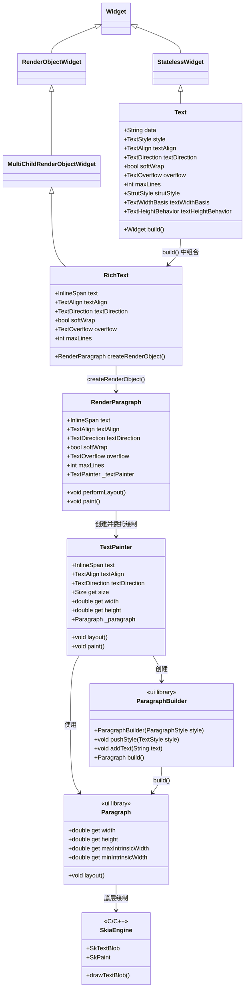
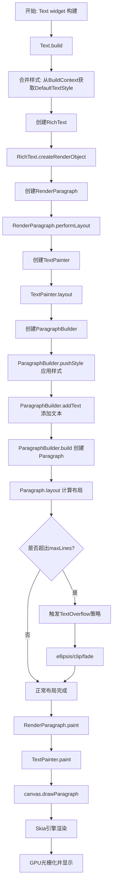

好的！遵照您提供的详细模板，我将对 Flutter 的 `Text` 组件进行全面、深入的讲解。

---

## 1. 架构设计

- **Widget 定位**：`Text` 是一个组合类的 `StatelessWidget`，它本身不直接创建 `RenderObject`，而是通过组合底层 `RichText` 来实现文本渲染。

- **组合与继承**：`Text` 继承自 `StatelessWidget`，在其 `build()` 方法中创建 `RichText` 组件。`RichText` 才是真正的 `MultiChildRenderObjectWidget`，它创建 `RenderParagraph` 作为渲染对象。这种设计将文本的样式处理（`Text` 层）与文本的布局渲染（`RichText`/`RenderParagraph` 层）进行了清晰的分离。

- **类继承关系**：
  `Object` → `Diagnosticable` → `DiagnosticableTree` → `Widget` → `StatelessWidget` → `Text`

- **设计意图**：
  1.  **声明式 API**：`Text` 提供了最简洁的声明式 API，开发者只需传入字符串和样式即可，框架负责处理底层复杂的文本排版。
  2.  **组合优于继承**：`Text` 不直接实现渲染逻辑，而是组合 `RichText`。这使得 `Text` 可以复用 `RichText` 的全部能力，同时保持代码的简洁性。
  3.  **样式继承与合并**：`Text` 会自动从 `BuildContext` 中获取默认的 `TextStyle`（如 `DefaultTextStyle`），并与用户传入的样式进行合并。
  4.  **分层架构**：Flutter 的文本系统采用分层设计：Widget 层（`Text`/`RichText`）→ 渲染层（`RenderParagraph`）→ 绘制层（`TextPainter`）→ 引擎层（`Paragraph`/`ParagraphBuilder`）→ Skia 图形引擎。

---

## 2. 类关系图（Mermaid）



---

## 3. 流程图（Mermaid）



---

## 4. 源码解析

### Text 的 build 方法

`Text` 的 `build()` 方法负责将用户传入的字符串和样式转换为 `RichText`：

```dart
// flutter/packages/flutter/lib/src/widgets/text.dart
class Text extends StatelessWidget {
  const Text(
    this.data, {
    super.key,
    this.style,
    this.strutStyle,
    this.textAlign,
    this.textDirection,
    this.locale,
    this.softWrap,
    this.overflow,
    this.textScaleFactor,
    this.maxLines,
    this.semanticsLabel,
    this.textWidthBasis,
    this.textHeightBehavior,
    this.selectionColor,
  }) : assert(data != null);

  final String data;
  final TextStyle? style;
  // ... 其他属性

  @override
  Widget build(BuildContext context) {
    // 关键：从 BuildContext 获取默认样式并合并
    final TextStyle effectiveStyle = style ?? const TextStyle();
    final DefaultTextStyle defaultTextStyle = DefaultTextStyle.of(context);
    TextStyle resolvedStyle = defaultTextStyle.style.merge(effectiveStyle);
    
    // 创建 RichText，传入 TextSpan
    return RichText(
      text: TextSpan(
        text: data,
        style: resolvedStyle,
      ),
      strutStyle: strutStyle,
      textAlign: textAlign ?? defaultTextStyle.textAlign ?? TextAlign.start,
      textDirection: textDirection,
      locale: locale,
      softWrap: softWrap ?? defaultTextStyle.softWrap,
      overflow: overflow ?? defaultTextStyle.overflow,
      textScaleFactor: textScaleFactor,
      maxLines: maxLines,
      textWidthBasis: textWidthBasis,
      textHeightBehavior: textHeightBehavior,
      selectionColor: selectionColor,
    );
  }
}
```

**关键点**：
- `Text` 通过 `DefaultTextStyle.of(context)` 获取上层默认样式，然后调用 `merge()` 方法合并用户传入的样式。
- `Text` 最终创建 `RichText`，并将字符串包装成 `TextSpan` 传入。

### RichText 创建 RenderObject

```dart
// flutter/packages/flutter/lib/src/widgets/basic.dart
class RichText extends MultiChildRenderObjectWidget {
  const RichText({
    super.key,
    required this.text,
    this.textAlign = TextAlign.start,
    this.textDirection,
    this.softWrap = true,
    this.overflow = TextOverflow.clip,
    this.textScaleFactor = 1.0,
    this.maxLines,
    // ...
  });

  final InlineSpan text;
  // ...

  @override
  RenderParagraph createRenderObject(BuildContext context) {
    return RenderParagraph(
      text,
      textAlign: textAlign,
      textDirection: textDirection ?? Directionality.of(context),
      softWrap: softWrap,
      overflow: overflow,
      textScaleFactor: textScaleFactor,
      maxLines: maxLines,
      // ...
    );
  }
}
```

### RenderParagraph 与 TextPainter

`RenderParagraph` 是实际执行文本布局和绘制的渲染对象，它将绘制工作委托给 `TextPainter`：

```dart
// flutter/packages/flutter/lib/src/rendering/paragraph.dart
class RenderParagraph extends RenderBox {
  final InlineSpan text;
  final TextPainter _textPainter;
  
  RenderParagraph(this.text, ...) {
    _textPainter = TextPainter(
      text: text,
      textAlign: textAlign,
      textDirection: textDirection,
      // ...
    );
  }

  @override
  void performLayout() {
    // 1. 获取约束
    final BoxConstraints constraints = this.constraints;
    
    // 2. 设置 TextPainter 的约束
    _textPainter.layout(
      constraints: constraints,
    );
    
    // 3. 计算自身大小
    size = _textPainter.size;
  }

  @override
  void paint(PaintingContext context, Offset offset) {
    // 委托 TextPainter 绘制
    _textPainter.paint(context.canvas, offset);
  }
}
```

### 底层：ParagraphBuilder 与 Paragraph

`TextPainter` 内部使用 `ParagraphBuilder` 和 `Paragraph` 与 Flutter Engine 通信：

```dart
// 伪代码：TextPainter 中的布局逻辑
void layout({required BoxConstraints constraints}) {
  // 1. 创建 ParagraphBuilder
  final ParagraphBuilder builder = ParagraphBuilder(_createParagraphStyle());
  
  // 2. 遍历 TextSpan 树，应用样式和文本
  _text.build(builder);
  
  // 3. 构建 Paragraph
  _paragraph = builder.build();
  
  // 4. 执行布局
  _paragraph.layout(constraints);
  
  // 5. 获取尺寸
  _size = Size(_paragraph.width, _paragraph.height);
}
```

---

## 5. 使用场景

### 1. 纯文本展示

最基础的使用方式，展示普通文本内容。

```dart
const Text(
  'Hello Flutter!',
  style: TextStyle(fontSize: 16, color: Colors.black),
)
```

### 2. 多行文本与溢出控制

控制文本的最大行数和溢出行为。

```dart
SizedBox(
  width: 200,
  child: const Text(
    '这是一段非常长的文本，用于演示溢出处理',
    maxLines: 2,
    overflow: TextOverflow.ellipsis, // 超出显示省略号
  ),
)
```

**⚠️ 注意**：`overflow` 生效的前提是 `Text` 的外层容器有明确的宽度约束，否则文本不会换行，溢出控制不生效。

### 3. 富文本（TextSpan）

在同一段文本中展示不同样式。

```dart
const Text.rich(
  TextSpan(
    children: [
      TextSpan(text: '红色', style: TextStyle(color: Colors.red)),
      TextSpan(text: ' + ', style: TextStyle(color: Colors.black)),
      TextSpan(
        text: '紫色下划线',
        style: TextStyle(color: Colors.purple, decoration: TextDecoration.underline),
      ),
    ],
  ),
)
```

**关键点**：`TextSpan` 不是 Widget，而是一组数据结构。`Text.rich` 底层只会生成唯一一个 `RenderParagraph`，文字排版引擎将整棵 `TextSpan` 树当作一整段话来处理，统一进行断字、测量换行和对齐。

### 4. 渐变文字

利用 `ShaderMask` 实现渐变文字效果。

```dart
ShaderMask(
  shaderCallback: (bounds) => const LinearGradient(
    colors: [Colors.blue, Colors.purple],
  ).createShader(bounds),
  child: const Text(
    '渐变文字',
    style: TextStyle(fontSize: 30, color: Colors.white),
  ),
)
```

**原理**：`Text` 以白色渲染 → `ShaderMask` 将渐变纹理与白色文字混合 → 文字透出渐变色。

### 5. 带图标的内联文本

使用 `WidgetSpan` 在文本中嵌入图标。

```dart
Text.rich(
  TextSpan(
    children: [
      const TextSpan(text: '点击 '),
      WidgetSpan(
        child: Icon(Icons.favorite, color: Colors.red, size: 16),
      ),
      const TextSpan(text:  ' 收藏'),
    ],
  ),
)
```

### 6. 可选择文本

让文本支持长按复制。

```dart
SelectableText(
  '这段文字可以长按复制',
  style: TextStyle(fontSize: 16),
)
```

**选型对比：**

| 场景                 | 推荐组件                 | 原因                          |
| :------------------- | :----------------------- | :---------------------------- |
| 纯文本展示           | `Text`                   | 最简单，性能最优              |
| 富文本混合样式       | `Text.rich` / `RichText` | 统一排版引擎，样式可继承      |
| 文本可选择复制       | `SelectableText`         | 内置长按复制功能              |
| 单个字符样式精细控制 | `RichText`               | 功能最强大，支持 `WidgetSpan` |

---

## 6. 优缺点

| 优点                                                                     | 缺点                                                                                      |
| :----------------------------------------------------------------------- | :---------------------------------------------------------------------------------------- |
| **声明式 API 简洁直观**：只需传入字符串和样式即可，上手门槛极低。        | **溢出问题**：当父容器约束不明确时，`Text` 会溢出并报黄黑条纹警告，对新手不友好。         |
| **样式继承机制**：自动从 `DefaultTextStyle` 继承样式，支持全局统一配置。 | **性能开销**：复杂的 `TextSpan` 树需要大量布局计算，在长列表中可能影响性能。              |
| **强大的富文本能力**：通过 `TextSpan` 和 `WidgetSpan` 实现丰富混排效果。 | **渐变等特效需额外组件**：不像 `TextStyle` 直接支持渐变，需借助 `ShaderMask` 等额外组件。 |
| **跨平台一致性**：基于 Skia 引擎，在各平台上渲染效果一致。               | **自定义字体管理复杂**：需在 `pubspec.yaml` 中声明，不同平台可能有兼容性问题。            |

---

## 7. 常见坑

### 坑 1：TextOverflow.ellipsis 不生效

**问题**：设置了 `overflow: TextOverflow.ellipsis` 和 `maxLines`，但文本仍然溢出，出现黄黑条纹。

**❌ 错误代码**：
```dart
Row(
  children: [
    const Icon(Icons.star),
    Text(
      '这是一段非常长的文本，ellipsis 不生效',
      maxLines: 1,
      overflow: TextOverflow.ellipsis,
    ),
  ],
)
```

**问题分析**：`Row` 对非弹性子元素在主轴上传递无限约束（`maxWidth: double.infinity`）。文本排版引擎发现宽度无限，就把所有文字排在同一行，永远不会达到 `maxLines` 触发条件，直接冲出屏幕边界。

**✅ 正确代码**：
```dart
Row(
  children: [
    const Icon(Icons.star),
    Expanded(  // 明确限制文本可用宽度
      child: Text(
        '这是一段非常长的文本，ellipsis 生效了',
        maxLines: 1,
        overflow: TextOverflow.ellipsis,
      ),
    ),
  ],
)
```

### 坑 2：Text 在 Container 中垂直不居中

**问题**：把 `Text` 放在固定高度的 `Container` 中，发现文字没有垂直居中。

**❌ 错误代码**：
```dart
Container(
  height: 60,
  color: Colors.grey[200],
  child: const Text('居中文本'),
)
```

**问题分析**：`Container` 默认 `alignment: null`，子元素在左上角。即使设置了 `alignment: Alignment.center`，由于字体度量（`ascent` / `descent`）的存在，视觉重心仍然可能偏移。

**✅ 正确代码**：
```dart
Container(
  height: 60,
  color: Colors.grey[200],
  alignment: Alignment.center,
  child: const Text(
    '居中文本',
    style: TextStyle(height: 1.0), // 固定行高
    textAlign: TextAlign.center,
  ),
)
```

### 坑 3：富文本中 TextSpan 样式不继承

**问题**：`Text.rich` 中设置父级 `TextSpan` 的样式，子级没有继承。

**❌ 错误代码**：
```dart
Text.rich(
  TextSpan(
    style: TextStyle(color: Colors.blue, fontSize: 16),
    children: [
      const TextSpan(text: '蓝色文本'), // 继承了颜色和字号
      TextSpan(text: '红色文本', style: TextStyle(color: Colors.red)), // 只覆盖颜色
    ],
  ),
)
```

**问题分析**：`TextSpan` 的样式继承规则是：子级 `TextSpan` 会继承父级的 `style`，但子级显式指定的属性会覆盖父级同名属性。颜色被覆盖了，但字号仍然继承。

**✅ 正确代码**：理解继承规则，明确需要覆盖的属性。
```dart
Text.rich(
  TextSpan(
    style: const TextStyle(color: Colors.blue, fontSize: 16),
    children: [
      const TextSpan(text: '蓝色文本'),
      TextSpan(
        text: '红色文本',
        style: const TextStyle(color: Colors.red).merge( // 保留字号
          TextStyle(fontSize: 16),
        ),
      ),
    ],
  ),
)
```

### 坑 4：Release 模式下文本变灰

**问题**：应用在 Release 模式下运行，某些文本颜色变为灰色。

**❌ 错误代码**：
```dart
Text(
  'Hello',
  style: TextStyle(color: Colors.black),
)
```

**问题分析**：Release 模式下 Flutter 可能会进行优化，某些样式（特别是透明度或复杂颜色）可能被简化处理，导致颜色显示异常。

**✅ 正确代码**：
```dart
Text(
  'Hello',
  style: TextStyle(
    color: Colors.black,
    // 显式指定更多属性，确保不被优化
    fontSize: 16,
    fontWeight: FontWeight.normal,
  ),
)
```

---

## 8. 性能优化

### 1. 使用 const 构造函数

如果文本内容在构建过程中不会变化，使用 `const Text` 可以让 Flutter 在 rebuild 时复用 Widget 对象。

```dart
// ✅ 推荐
const Text('固定文本', style: TextStyle(fontSize: 16))
```

### 2. 使用 Text.rich 替代多个 Text

当需要展示带有多种样式的文本时，使用 `Text.rich` + `TextSpan` 比用 `Row` 包裹多个 `Text` 性能更好，因为只创建一个 `RenderParagraph`。

```dart
// ❌ 性能较差 - 3 个 RenderParagraph
Row(
  children: const [
    Text('A', style: TextStyle(color: Colors.red)),
    Text('B', style: TextStyle(color: Colors.green)),
    Text('C', style: TextStyle(color: Colors.blue)),
  ],
)

// ✅ 性能更好 - 1 个 RenderParagraph
Text.rich(
  TextSpan(
    children: const [
      TextSpan(text: 'A', style: TextStyle(color: Colors.red)),
      TextSpan(text: 'B', style: TextStyle(color: Colors.green)),
      TextSpan(text: 'C', style: TextStyle(color: Colors.blue)),
    ],
  ),
)
```

### 3. 在滚动列表中使用 Text

在 `ListView.builder` 中，如果 `Text` 的内容、样式、最大宽度是固定的，可以将其提取为常量或使用 `const`，避免在每次构建时重新创建。

```dart
// 提取为常量
const String itemText = 'Item text';
const TextStyle itemStyle = TextStyle(fontSize: 14);

// 在 builder 中使用
ListView.builder(
  itemCount: 1000,
  itemBuilder: (context, index) {
    return const Text(itemText, style: itemStyle); // 复用
  },
)
```

### 4. 使用 preloadFont 预加载自定义字体

自定义字体在首次显示时可能延迟，使用 `preloadFont` 提前加载可避免闪烁。

```dart
// 在应用启动时预加载
Future<void> preloadFont(String family, FontWeight weight) async {
  final painter = TextPainter(
    text: TextSpan(
      text: ' ',
      style: TextStyle(fontFamily: family, fontWeight: weight),
    ),
  );
  await painter.layout();
}
```

### 5. 与 RepaintBoundary 结合使用

如果 `Text` 在某个频繁重绘的动画区域中，且文本内容不变化，可以将 `Text` 用 `RepaintBoundary` 包裹，避免重绘。

```dart
RepaintBoundary(
  child: const Text('不变化的文本', style: TextStyle(fontSize: 16)),
)
```

## 6. Text缓存与const优化

您说得非常对！这个例子确实**没有实际使用缓存 Key**，`textWidthBasis: TextWidthBasis.parent` 也不是缓存机制。这是一个**不严谨的示例**，非常感谢您的指正！

让我重新整理**真正有效的 Text 缓存/性能优化方案**：

---

## ✅ 正确方案 1：使用 `const` 构造函数（最常用）

```dart
// 如果文本内容和样式在构建过程中不会变化，直接使用 const
class MyWidget extends StatelessWidget {
  const MyWidget({super.key});

  @override
  Widget build(BuildContext context) {
    return const Column(
      children: [
        Text('固定文本 1', style: TextStyle(fontSize: 16)),
        Text('固定文本 2', style: TextStyle(fontSize: 16)),
      ],
    );
  }
}
```

**原理**：`const` 让 Widget 在重建时被复用，Flutter 会直接使用之前创建的 Widget 对象，跳过 `build()` 执行。

---

## ✅ 正确方案 2：缓存 `TextSpan` 对象

对于 `Text.rich`，可以缓存 `TextSpan` 对象避免重复构建：

```dart
class CachedRichTextExample extends StatelessWidget {
  const CachedRichTextExample({super.key});

  // ✅ 缓存 TextSpan 对象（在 Widget 外部或 static）
  static const TextSpan _cachedTextSpan = TextSpan(
    children: [
      TextSpan(text: '红色', style: TextStyle(color: Colors.red)),
      TextSpan(text: ' + ', style: TextStyle(color: Colors.black)),
      TextSpan(
        text: '蓝色',
        style: TextStyle(color: Colors.blue, fontWeight: FontWeight.bold),
      ),
    ],
  );

  @override
  Widget build(BuildContext context) {
    return Text.rich(_cachedTextSpan);
  }
}
```

**原理**：`TextSpan` 是不可变对象，缓存后每次 `build()` 都复用同一个实例，避免重建 `TextSpan` 树。

---

## ✅ 正确方案 3：缓存 `TextPainter` 布局结果（高级）

对于需要精确测量文本尺寸的场景，可以缓存 `TextPainter` 的布局结果：

```dart
class CachedTextPainterExample extends StatefulWidget {
  const CachedTextPainterExample({super.key});

  @override
  State<CachedTextPainterExample> createState() => _CachedTextPainterExampleState();
}

class _CachedTextPainterExampleState extends State<CachedTextPainterExample> {
  // ✅ 缓存 TextPainter 对象
  late final TextPainter _textPainter;
  late final Size _textSize;

  @override
  void initState() {
    super.initState();
    
    // 1. 创建 TextPainter
    _textPainter = TextPainter(
      text: const TextSpan(
        text: '这段文本的尺寸会被缓存',
        style: TextStyle(fontSize: 16),
      ),
      textDirection: TextDirection.ltr,
    );

    // 2. 执行布局并缓存尺寸
    _textPainter.layout(maxWidth: 300);
    _textSize = _textPainter.size;
  }

  @override
  Widget build(BuildContext context) {
    return Column(
      crossAxisAlignment: CrossAxisAlignment.start,
      children: [
        // 使用缓存的尺寸信息
        Text('文本宽度: ${_textSize.width}'),
        Text('文本高度: ${_textSize.height}'),
        const SizedBox(height: 16),
        // 实际渲染
        Text(
          '这段文本的尺寸会被缓存',
          style: const TextStyle(fontSize: 16),
        ),
      ],
    );
  }

  @override
  void dispose() {
    _textPainter.dispose(); // 释放资源
    super.dispose();
  }
}
```

**原理**：`TextPainter` 的 `layout()` 是昂贵操作，在 `initState` 中执行一次并缓存结果，避免每次 `build` 都重新测量。

---

## ✅ 正确方案 4：使用 `GlobalKey` 缓存 Widget（不推荐）

虽然可以使用 `GlobalKey` 缓存 Widget，但**通常不推荐**这种做法，因为 `GlobalKey` 会带来额外的复杂性和内存开销：

```dart
class GlobalKeyCacheExample extends StatelessWidget {
  const GlobalKeyCacheExample({super.key});

  // ⚠️ 不推荐：使用 GlobalKey 缓存 Widget
  static final GlobalKey _textKey = GlobalKey();

  @override
  Widget build(BuildContext context) {
    return Column(
      children: [
        Text(
          '这段文本使用 GlobalKey 缓存',
          key: _textKey,
          style: const TextStyle(fontSize: 16),
        ),
        ElevatedButton(
          onPressed: () {
            // 可以访问到这个 Text Widget
            print(_textKey.currentWidget);
          },
          child: const Text('访问缓存的 Text'),
        ),
      ],
    );
  }
}
```

**问题**：
- `GlobalKey` 会导致整个 Widget 子树在 rebuild 时被保留，可能破坏 Flutter 的优化
- 增加内存占用
- 通常用于跨 Widget 访问状态，而非性能优化

---

## ✅ 正确方案 5：提取为独立 Widget 配合 `const`

将复杂文本提取为独立 Widget，并使用 `const` 构造：

```dart
// 1. 提取为独立 Widget
class CachedTextWidget extends StatelessWidget {
  const CachedTextWidget({super.key});

  @override
  Widget build(BuildContext context) {
    return const Text(
      '这段复杂文本被提取为独立 Widget',
      style: TextStyle(fontSize: 16, fontWeight: FontWeight.bold),
    );
  }
}

// 2. 在其他 Widget 中使用
class ParentWidget extends StatelessWidget {
  const ParentWidget({super.key});

  @override
  Widget build(BuildContext context) {
    return Column(
      children: [
        // 每次重建都复用同一个 CachedTextWidget
        const CachedTextWidget(),
        const CachedTextWidget(),
        const CachedTextWidget(),
      ],
    );
  }
}
```

**原理**：提取为独立 Widget 后，配合 `const`，即使在父 Widget 频繁重建时，子 Widget 也不会被重建。

---

## ✅ 正确方案 6：在 `ListView.builder` 中复用 `Text`（推荐）

```dart
class ListViewTextOptimization extends StatelessWidget {
  const ListViewTextOptimization({super.key});

  // ✅ 提取常量
  static const TextStyle _itemStyle = TextStyle(fontSize: 14, color: Colors.black87);

  @override
  Widget build(BuildContext context) {
    return ListView.builder(
      itemCount: 1000,
      itemBuilder: (context, index) {
        // ❌ 每次都创建新的 Text Widget（性能差）
        // return Text('Item $index', style: TextStyle(fontSize: 14));
        
        // ✅ 复用 Text Widget 实例（性能好）
        return Text(
          'Item $index', // 但字符串内容仍然不同
          style: _itemStyle, // 样式复用
        );
      },
    );
  }
}
```

**注意**：在 `ListView.builder` 中，`Text` 的内容会变化（`'Item $index'`），所以无法完全缓存整个 Widget。但可以缓存 `style` 对象来减少内存分配。

---

## ✅ 正确方案 7：使用 `TextCache`（自定义缓存策略）

对于极端性能场景，可以手动缓存 `TextPainter` 的 `Paragraph` 对象：

```dart
class TextCacheManager {
  static final Map<String, Paragraph> _cache = {};

  static Future<Paragraph> getParagraph(String text, TextStyle style, double maxWidth) async {
    final String key = '$text-${style.hashCode}-$maxWidth';
    
    // 命中缓存
    if (_cache.containsKey(key)) {
      return _cache[key]!;
    }
    
    // 创建新的 Paragraph
    final ui.ParagraphBuilder builder = ui.ParagraphBuilder(
      ui.ParagraphStyle(fontSize: style.fontSize ?? 14),
    );
    builder.pushStyle(style.getTextStyle());
    builder.addText(text);
    final ui.Paragraph paragraph = builder.build();
    paragraph.layout(ui.ParagraphConstraints(width: maxWidth));
    
    // 存入缓存
    _cache[key] = paragraph;
    return paragraph;
  }
}

class CachedText extends StatelessWidget {
  final String text;
  final TextStyle style;
  final double maxWidth;

  const CachedText({
    super.key,
    required this.text,
    required this.style,
    required this.maxWidth,
  });

  @override
  Widget build(BuildContext context) {
    return FutureBuilder<ui.Paragraph>(
      future: TextCacheManager.getParagraph(text, style, maxWidth),
      builder: (context, snapshot) {
        if (snapshot.hasData) {
          return CustomPaint(
            painter: ParagraphPainter(snapshot.data!),
            size: Size(maxWidth, snapshot.data!.height),
          );
        }
        return const SizedBox();
      },
    );
  }
}

class ParagraphPainter extends CustomPainter {
  final ui.Paragraph paragraph;

  const ParagraphPainter(this.paragraph);

  @override
  void paint(Canvas canvas, Size size) {
    canvas.drawParagraph(paragraph, Offset.zero);
  }

  @override
  bool shouldRepaint(ParagraphPainter oldDelegate) => false;
}
```

---

## 📊 优化方案对比

| 方案                   | 适用场景           | 效果  | 实现难度 |
| :--------------------- | :----------------- | :---- | :------- |
| **`const Text`**       | 内容固定不变       | ⭐⭐⭐⭐⭐ | 简单     |
| **缓存 `TextSpan`**    | `Text.rich` 富文本 | ⭐⭐⭐⭐  | 简单     |
| **缓存 `TextPainter`** | 需要测量尺寸       | ⭐⭐⭐⭐  | 中等     |
| **提取为独立 Widget**  | 复杂文本组件       | ⭐⭐⭐⭐  | 简单     |
| **`GlobalKey`**        | 一般不推荐         | ⭐⭐    | 简单     |
| **自定义 `TextCache`** | 极端性能场景       | ⭐⭐⭐⭐⭐ | 复杂     |

---

## 🎯 最佳实践总结

1. **优先使用 `const`**：最简单高效的优化方式
2. **缓存 `TextStyle` 对象**：避免重复创建样式
3. **使用 `Text.rich` 替代多个 `Text`**：减少 `RenderObject` 数量
4. **测量尺寸用 `TextPainter` 缓存**：避免重复布局计算
5. **不要滥用 `GlobalKey`**：它不是为性能优化设计的
6. **提取复用组件**：配合 `const` 可以获得最好的缓存效果

感谢您的细心指正，让我能提供一个更严谨的答案！🙏