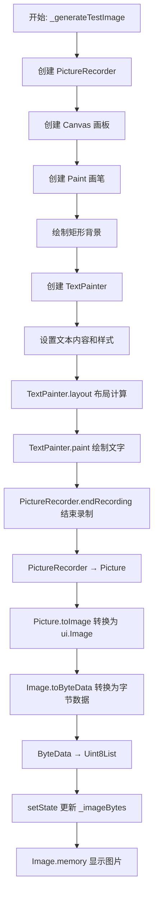
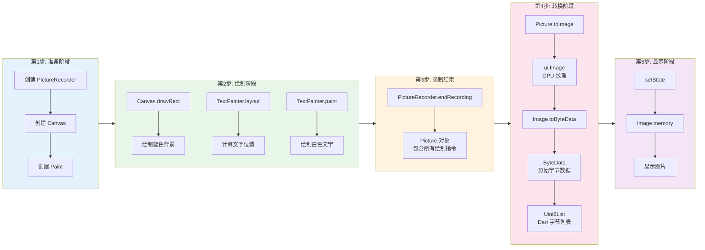
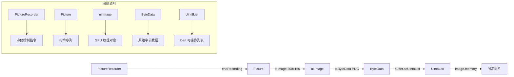

## 🎨 图片绘制完整流程图



---

## 📐 关键绘制类关系图

```mermaid
classDiagram
    class PictureRecorder {
        +Canvas beginRecording()
        +Picture endRecording()
        -Picture _picture
    }
    
    class Canvas {
        +Canvas(PictureRecorder recorder, Rect rect)
        +void drawRect(Rect rect, Paint paint)
        +void drawCircle(Offset center, double radius, Paint paint)
        +void drawPath(Path path, Paint paint)
        +void drawImage(Image image, Offset offset, Paint paint)
        +void drawParagraph(Paragraph paragraph, Offset offset)
    }
    
    class Paint {
        +Color color
        +double strokeWidth
        +BlendMode blendMode
        +Shader shader
        +Style style
        +bool isAntiAlias
    }
    
    class TextPainter {
        +TextSpan text
        +TextDirection textDirection
        +TextAlign textAlign
        +double maxWidth
        +void layout()
        +void paint(Canvas canvas, Offset offset)
        +Size get size
        +double get width
        +double get height
    }
    
    class Picture {
        +void draw(Canvas canvas)
        +Future~Image~ toImage(int width, int height)
        +void dispose()
    }
    
    class Image {
        +int width
        +int height
        +Future~ByteData~ toByteData({ImageByteFormat format})
        +void dispose()
    }
    
    class ByteData {
        +Uint8List buffer
        +int lengthInBytes
        +getUint8()
        +setUint8()
    }
    
    class Uint8List {
        +List~int~ bytes
        +int length
    }
    
    PictureRecorder --> Canvas : 创建
    Canvas --> Paint : 使用
    Canvas --> TextPainter : 接收绘制
    PictureRecorder --> Picture : 生成
    Picture --> Image : 转换为
    Image --> ByteData : 转换
    ByteData --> Uint8List : 转换
    
    note for PictureRecorder "记录所有绘制指令\n相当于"录像机""
    note for Canvas "绘制操作的执行环境\n相当于"画板""
    note for Paint "定义绘制样式\n相当于"画笔""
    note for TextPainter "专门绘制文字的助手"
    note for Picture "存储绘制指令序列\n相当于"录像带""
    note for Image "GPU 纹理对象\n可直接用于渲染"
```

---

## 🔄 数据流转详细图



---

## 🖌️ 绘制类详细说明

### 1. PictureRecorder（录制器）

```dart
/// PictureRecorder 是"录像机"，记录所有绘制指令
/// 它不会立即绘制到屏幕，而是保存绘制操作序列
final recorder = ui.PictureRecorder();
```

**作用**：
- 开始录制绘制操作
- 结束时生成 `Picture` 对象
- 不占用 GPU 内存，只存储指令

---

### 2. Canvas（画板）

```dart
/// Canvas 是"画板"，提供绘制方法
/// 所有绘制操作都通过 Canvas 执行
final canvas = Canvas(
  recorder,  // 绑定录制器
  Rect.fromLTWH(0, 0, 200, 150),  // 绘制区域
);
```

**作用**：
- 执行实际的绘制操作
- 提供 `drawRect`、`drawCircle`、`drawPath` 等方法
- 绑定到 `PictureRecorder`

---

### 3. Paint（画笔）

```dart
/// Paint 是"画笔"，定义绘制样式
final paint = Paint()..color = Colors.blue;
```

**作用**：
- 定义颜色、粗细、透明度、混合模式等
- 每个绘制操作都需要传入

---

### 4. TextPainter（文字绘制器）

```dart
/// TextPainter 是"文字绘制助手"
/// 专门处理文字的布局和绘制
final textPainter = TextPainter(
  text: TextSpan(text: 'Test'),
  textDirection: TextDirection.ltr,
);
```

**作用**：
- 计算文字布局（`layout`）
- 绘制文字（`paint`）
- 提供文字尺寸信息

---

## 📊 绘制步骤详细流程图

```mermaid
flowchart TD
    subgraph Step1["1. 准备绘制环境"]
        S1[PictureRecorder recorder] --> S2[绑定]
        S2 --> S3[Canvas canvas]
        S3 --> S4[Paint paint]
        S4 --> S5[设置颜色: #2196F3]
    end
    
    subgraph Step2["2. 绘制背景"]
        S6[canvas.drawRect] --> S7[绘制矩形 200x150]
        S7 --> S8[填充蓝色]
    end
    
    subgraph Step3["3. 准备文字"]
        S9[TextPainter textPainter] --> S10[设置: TextSpan + TextStyle]
        S10 --> S11[textPainter.layout]
        S11 --> S12[计算文字尺寸和位置]
    end
    
    subgraph Step4["4. 绘制文字"]
        S13[textPainter.paint] --> S14[在 (70,60) 位置绘制]
        S14 --> S15[白色文字 'Test']
    end
    
    subgraph Step5["5. 结束录制"]
        S16[recorder.endRecording] --> S17[生成 Picture]
    end
    
    subgraph Step6["6. 转换"]
        S18[Picture → ui.Image] --> S19[ui.Image → ByteData]
        S19 --> S20[ByteData → Uint8List]
    end
    
    Step1 --> Step2 --> Step3 --> Step4 --> Step5 --> Step6
```

---

## 🔍 数据转换关系图



---

## 🎯 完整代码与流程图对应

```dart
// 1. 准备阶段
final ui.PictureRecorder recorder = ui.PictureRecorder();  // 创建"录像机"
final Canvas canvas = Canvas(recorder);                    // 创建"画板"

// 2. 绘制背景
final Paint paint = Paint()..color = Colors.blue;          // 创建"画笔"
canvas.drawRect(rect, paint);                              // 绘制矩形

// 3. 绘制文字
final textPainter = TextPainter(...);                      // 创建"文字助手"
textPainter.layout();                                      // 计算布局
textPainter.paint(canvas, offset);                         // 绘制文字

// 4. 结束录制 → 转换
final ui.Picture picture = recorder.endRecording();        // PictureRecorder → Picture
final ui.Image image = await picture.toImage(200, 150);   // Picture → Image
final ByteData byteData = await image.toByteData(format: ui.ImageByteFormat.png);
final Uint8List bytes = byteData.buffer.asUint8List();     // ByteData → Uint8List

// 5. 显示
Image.memory(bytes)                                         // 显示图片
```

---

## 📋 关键类职责总结

| 类名              | 职责             | 类比       |
| :---------------- | :--------------- | :--------- |
| `PictureRecorder` | 记录绘制指令序列 | 🎥 录像机   |
| `Canvas`          | 执行绘制操作     | 🎨 画板     |
| `Paint`           | 定义绘制样式     | 🖌️ 画笔     |
| `TextPainter`     | 文字的布局和绘制 | 🔤 文字助手 |
| `Picture`         | 存储绘制指令     | 📼 录像带   |
| `Image`           | GPU 纹理对象     | 🖼️ 图片     |
| `ByteData`        | 原始字节数据     | 📊 数据流   |
| `Uint8List`       | Dart 字节列表    | 📦 字节数组 |