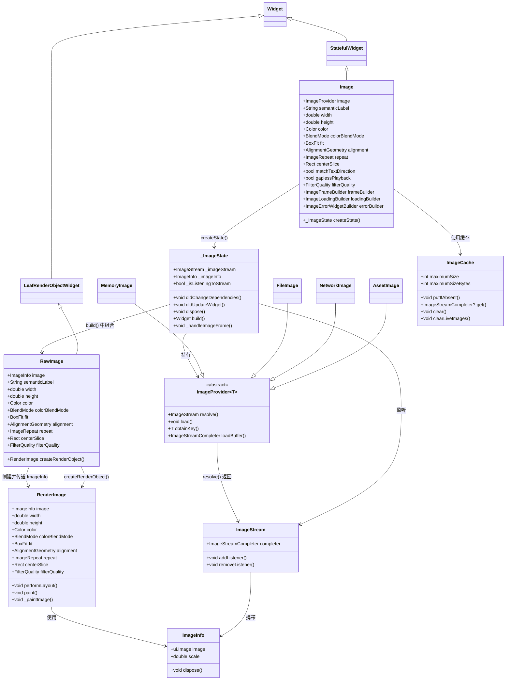
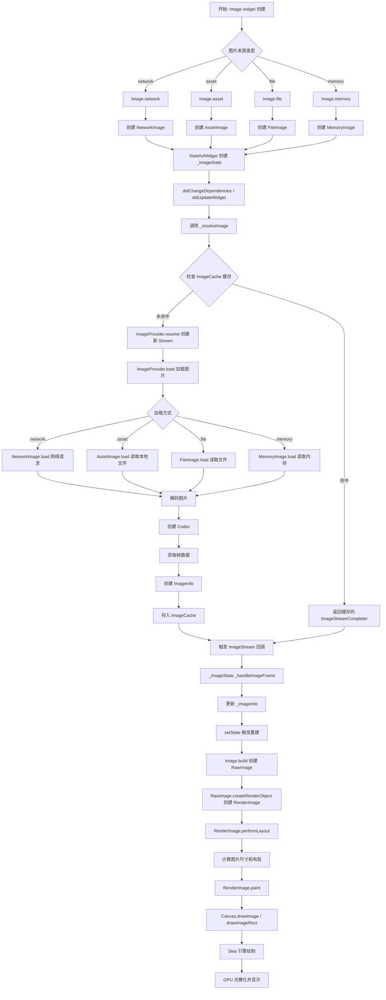
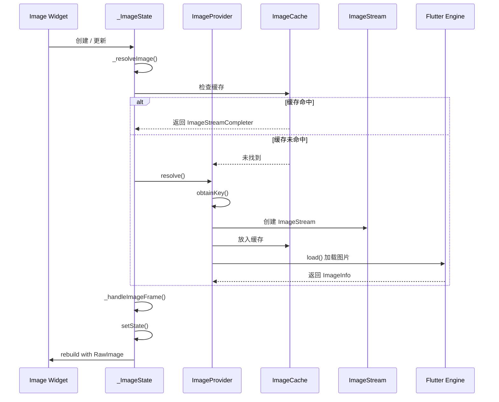
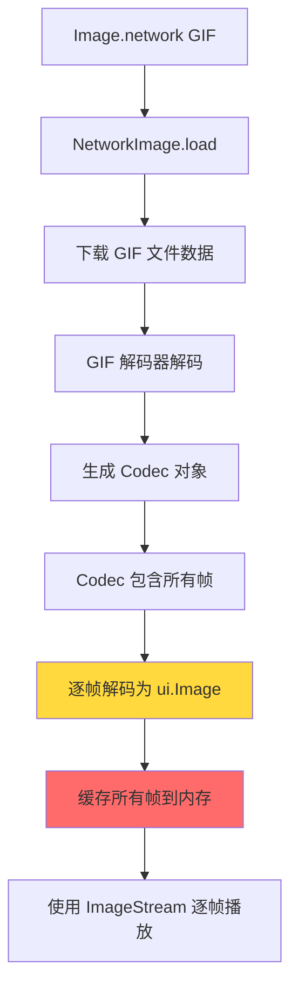
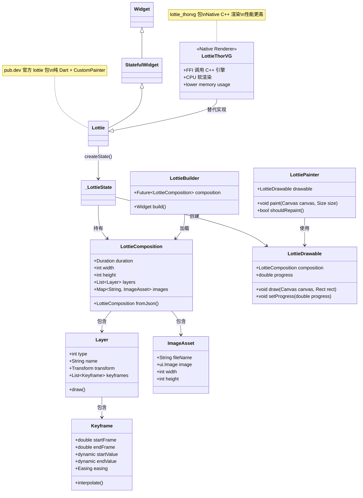
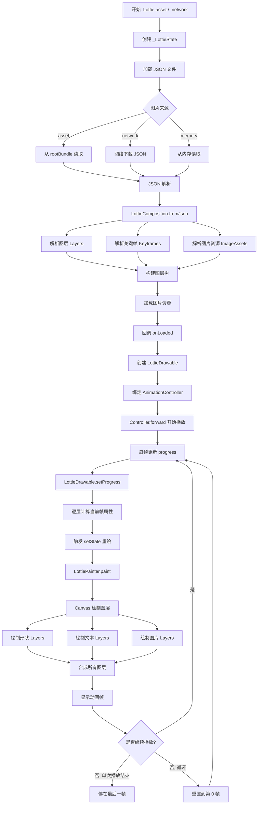

好的！遵照您提供的详细模板，我将对 Flutter 的 `Image` 组件进行全面、深入的讲解。

---

## 1. 架构设计

- **Widget 定位**：`Image` 是一个组合类的 `StatefulWidget`，它本身不直接创建 `RenderObject`，而是通过组合 `RawImage` 来实现图片渲染。`RawImage` 才是真正的 `LeafRenderObjectWidget`（叶子节点），它创建 `RenderImage` 作为渲染对象。

- **组合与继承**：`Image` 继承自 `StatefulWidget`，其状态类 `_ImageState` 负责管理图片的加载、缓存和生命周期。`RawImage` 是一个 `LeafRenderObjectWidget`，直接创建 `RenderImage` 进行绘制。

- **类继承关系**：
  `Object` → `Diagnosticable` → `DiagnosticableTree` → `Widget` → `StatefulWidget` → `Image`

- **设计意图**：
  1. **分层架构**：`Image` 负责图片加载、缓存管理、状态处理；`RawImage` 负责纯渲染，职责清晰分离。
  2. **多种图片来源**：通过工厂构造函数（`Image.network`、`Image.asset`、`Image.file`、`Image.memory`）统一不同图片来源的 API，底层最终都转换为 `ImageProvider`。
  3. **缓存机制**：通过 `ImageCache` 全局缓存已解码的图片，提升性能。
  4. **渐进式加载**：支持 `frameBuilder` 和 `loadingBuilder`，实现占位图、加载动画等用户体验优化。
  5. **分层架构**：Flutter 的图片系统采用分层设计：
     - Widget 层：`Image` / `RawImage`
     - 渲染层：`RenderImage`
     - 绘制层：`ImageStream` / `ImageInfo`
     - 解码层：`Codec` / `FrameInfo`
     - 引擎层：Skia 图形引擎

---

## 2. 类关系图（Mermaid）



---

## 3. 流程图（Mermaid）

### 图片加载完整流程



### 图片加载生命周期详解



---

## 4. 源码解析

### Image 构造函数

`Image` 提供了多个工厂构造函数，最终都调用私有构造函数：

```dart
// flutter/packages/flutter/lib/src/widgets/image.dart

// 1. 网络图片
Image.network(
  String src, {
  double? scale,
  Map<String, String>? headers,
  // ...
}) : this(
      image: NetworkImage(src, scale: scale, headers: headers),
      // ...
    );

// 2. 本地资源图片
Image.asset(
  String name, {
  AssetBundle? bundle,
  String? package,
  // ...
}) : this(
      image: AssetImage(name, bundle: bundle, package: package),
      // ...
    );

// 3. 文件图片
Image.file(
  File file, {
  double scale = 1.0,
  // ...
}) : this(
      image: FileImage(file, scale: scale),
      // ...
    );

// 4. 内存图片
Image.memory(
  Uint8List bytes, {
  double scale = 1.0,
  // ...
}) : this(
      image: MemoryImage(bytes, scale: scale),
      // ...
    );
```

### _ImageState 核心逻辑

`_ImageState` 是 `Image` 的状态管理类，负责图片的加载和生命周期管理：

```dart
// flutter/packages/flutter/lib/src/widgets/image.dart
class _ImageState extends State<Image> {
  ImageStream? _imageStream;
  ImageInfo? _imageInfo;
  bool _isListeningToStream = false;
  bool _invertColors = false;

  @override
  void didChangeDependencies() {
    super.didChangeDependencies();
    _resolveImage(); // 依赖变化时重新解析图片
  }

  @override
  void didUpdateWidget(Image oldWidget) {
    super.didUpdateWidget(oldWidget);
    if (widget.image != oldWidget.image) {
      _resolveImage(); // 图片来源变化时重新加载
    }
  }

  void _resolveImage() {
    // 1. 取消旧的监听
    _stopListeningToStream();
    
    // 2. 获取 ImageStream
    _imageStream = widget.image.resolve(createLocalImageConfiguration(context));
    
    // 3. 监听图片加载结果
    _isListeningToStream = true;
    _imageStream!.addListener(_handleImageFrame);
  }

  void _handleImageFrame(ImageInfo imageInfo, bool synchronousCall) {
    // 更新图片信息并触发重建
    setState(() {
      _imageInfo = imageInfo;
    });
  }

  @override
  Widget build(BuildContext context) {
    // 如果图片尚未加载完成，显示占位图或透明
    if (_imageInfo == null) {
      // 如果有 frameBuilder，使用它构建占位
      if (widget.frameBuilder != null) {
        return widget.frameBuilder!(
          context,
          null, // 没有图片信息
          null, // 没有帧
          true, // 正在加载
        );
      }
      // 否则返回一个空的 SizedBox（不可见）
      return const SizedBox();
    }

    // 图片加载完成，创建 RawImage
    return RawImage(
      image: _imageInfo!.image,
      scale: _imageInfo!.scale,
      width: widget.width,
      height: widget.height,
      color: widget.color,
      colorBlendMode: widget.colorBlendMode,
      fit: widget.fit,
      alignment: widget.alignment,
      repeat: widget.repeat,
      centerSlice: widget.centerSlice,
      matchTextDirection: widget.matchTextDirection,
      invertColors: _invertColors,
      filterQuality: widget.filterQuality,
    );
  }

  @override
  void dispose() {
    _stopListeningToStream();
    _imageInfo?.dispose(); // 释放图片资源
    super.dispose();
  }
}
```

### RawImage 与 RenderImage

`RawImage` 是一个 `LeafRenderObjectWidget`，创建 `RenderImage`：

```dart
// flutter/packages/flutter/lib/src/widgets/image.dart
class RawImage extends LeafRenderObjectWidget {
  final ui.Image? image;
  final double scale;
  final double? width;
  final double? height;
  final Color? color;
  final BlendMode? colorBlendMode;
  final BoxFit? fit;
  final AlignmentGeometry alignment;
  final ImageRepeat repeat;
  final Rect? centerSlice;
  final FilterQuality filterQuality;

  @override
  RenderImage createRenderObject(BuildContext context) {
    return RenderImage(
      image: image,
      scale: scale,
      width: width,
      height: height,
      color: color,
      colorBlendMode: colorBlendMode,
      fit: fit,
      alignment: alignment,
      repeat: repeat,
      centerSlice: centerSlice,
      filterQuality: filterQuality,
    );
  }

  @override
  void updateRenderObject(BuildContext context, RenderImage renderObject) {
    // 更新 RenderImage 的属性
    renderObject
      ..image = image
      ..scale = scale
      ..width = width
      ..height = height
      ..color = color
      ..colorBlendMode = colorBlendMode
      ..fit = fit
      ..alignment = alignment
      ..repeat = repeat
      ..centerSlice = centerSlice
      ..filterQuality = filterQuality;
  }
}
```

### RenderImage 的布局和绘制

```dart
// flutter/packages/flutter/lib/src/rendering/image.dart
class RenderImage extends RenderBox {
  ui.Image? _image;
  double _scale = 1.0;
  BoxFit? _fit;
  // ...

  @override
  void performLayout() {
    if (_image == null) {
      // 无图片，尺寸为 0
      size = constraints.smallest;
      return;
    }

    // 1. 计算图片的固有尺寸（像素 / scale）
    final Size imageSize = Size(_image!.width / _scale, _image!.height / _scale);
    
    // 2. 根据 BoxFit 计算最终尺寸
    if (width != null && height != null) {
      // 固定尺寸
      size = constraints.constrain(Size(width!, height!));
    } else if (width != null) {
      // 固定宽度，按比例计算高度
      final double height = imageSize.height * width! / imageSize.width;
      size = constraints.constrain(Size(width!, height));
    } else if (height != null) {
      // 固定高度，按比例计算宽度
      final double width = imageSize.width * height! / imageSize.height;
      size = constraints.constrain(Size(width, height));
    } else {
      // 无固定尺寸，使用图片固有尺寸
      size = constraints.constrain(imageSize);
    }
  }

  @override
  void paint(PaintingContext context, Offset offset) {
    if (_image == null) return;
    
    // 使用 paintImage 函数绘制
    paintImage(
      canvas: context.canvas,
      rect: offset & size,
      image: _image!,
      scale: _scale,
      colorFilter: _colorFilter,
      fit: _fit,
      alignment: _alignment,
      repeat: _repeat,
      centerSlice: _centerSlice,
      filterQuality: _filterQuality,
    );
  }
}
```

### ImageCache 缓存机制

```dart
// flutter/packages/flutter/lib/src/painting/image_cache.dart
class ImageCache {
  final Map<Object, _PendingImage> _pendingImages = <Object, _PendingImage>{};
  final Map<Object, _CachedImage> _cache = <Object, _CachedImage>{};

  int maximumSize = 1000; // 最大缓存图片数量
  int maximumSizeBytes = 100 << 20; // 最大缓存内存 100MB

  ImageStreamCompleter? putIfAbsent(
    Object key,
    ImageStreamCompleter Function() loader, {
    ImageErrorListener? onError,
  }) {
    // 1. 检查缓存中是否有该 key
    if (_cache.containsKey(key)) {
      final _CachedImage image = _cache[key]!;
      return image.completer;
    }

    // 2. 检查是否正在加载
    if (_pendingImages.containsKey(key)) {
      // 复用正在加载的流
      return _pendingImages[key]!.completer;
    }

    // 3. 加载新图片
    final ImageStreamCompleter completer = loader();
    completer.addListener(_handleLoadComplete(key));
    _pendingImages[key] = _PendingImage(completer);
    return completer;
  }
}
```

---

## 5. 使用场景

### 1. 网络图片加载

最常用的场景，从网络 URL 加载图片。

```dart
Image.network(
  'https://example.com/image.jpg',
  width: 200,
  height: 200,
  fit: BoxFit.cover,
)

// 带缓存头
Image.network(
  'https://example.com/image.jpg',
  headers: {
    'Authorization': 'Bearer your_token',
  },
)
```

### 2. 本地资源图片

从项目 assets 目录加载图片。

```dart
Image.asset(
  'assets/images/logo.png',
  width: 100,
  height: 100,
)

// 从 package 加载
Image.asset(
  'assets/images/icon.png',
  package: 'your_package_name',
)
```

### 3. 文件图片

从设备文件系统加载图片。

```dart
import 'dart:io';

Image.file(
  File('/path/to/image.jpg'),
  width: 200,
  height: 200,
  fit: BoxFit.cover,
)
```

### 4. 内存图片

从 Uint8List 字节数据加载图片。

```dart
import 'dart:typed_data';

Image.memory(
  bytes, // Uint8List
  width: 200,
  height: 200,
)
```

### 5. 带占位图和加载状态

使用 `loadingBuilder` 显示加载进度。

```dart
Image.network(
  'https://example.com/large_image.jpg',
  loadingBuilder: (context, child, loadingProgress) {
    if (loadingProgress == null) {
      return child; // 加载完成
    }
    return Center(
      child: CircularProgressIndicator(
        value: loadingProgress.expectedTotalBytes != null
            ? loadingProgress.cumulativeBytesLoaded /
                loadingProgress.expectedTotalBytes!
            : null,
      ),
    );
  },
  errorBuilder: (context, error, stackTrace) {
    return Container(
      color: Colors.grey[200],
      child: Icon(Icons.broken_image, size: 50, color: Colors.grey[400]),
    );
  },
)
```

### 6. 帧动画（GIF）

使用 `frameBuilder` 控制动画播放。

```dart
Image.network(
  'https://example.com/animation.gif',
  frameBuilder: (context, child, frame, wasSynchronouslyLoaded) {
    // frame 为当前帧索引，首次加载为 null
    if (wasSynchronouslyLoaded) {
      return child; // 同步加载完成，直接显示
    }
    return AnimatedOpacity(
      opacity: frame == null ? 0 : 1,
      duration: const Duration(milliseconds: 200),
      child: child,
    );
  },
)
```

### 7. 圆形头像

结合 `ClipOval` 实现圆形图片。

```dart
ClipOval(
  child: Image.network(
    'https://example.com/avatar.jpg',
    width: 80,
    height: 80,
    fit: BoxFit.cover,
  ),
)

// 或使用 CircleAvatar
CircleAvatar(
  radius: 40,
  backgroundImage: NetworkImage('https://example.com/avatar.jpg'),
)
```

### 8. 圆角图片

使用 `ClipRRect` 实现圆角。

```dart
ClipRRect(
  borderRadius: BorderRadius.circular(12),
  child: Image.network(
    'https://example.com/image.jpg',
    width: 200,
    height: 150,
    fit: BoxFit.cover,
  ),
)
```

### 9. 渐变叠加

使用 `color` 和 `colorBlendMode` 实现颜色叠加。

```dart
Image.network(
  'https://example.com/image.jpg',
  color: Colors.blue.withOpacity(0.3),
  colorBlendMode: BlendMode.modulate,
  width: 200,
  height: 200,
  fit: BoxFit.cover,
)
```

### 10. 9宫格拉伸（.9图）

使用 `centerSlice` 实现 9 宫格拉伸。

```dart
Image.asset(
  'assets/images/button_bg.9.png',
  centerSlice: Rect.fromLTRB(20, 20, 80, 80),
  width: 200,
  height: 60,
)
```

**选型对比：**

| 场景         | 推荐方式                  | 原因                 |
| :----------- | :------------------------ | :------------------- |
| 网络图片     | `Image.network`           | 最简单，支持缓存     |
| 本地资源     | `Image.asset`             | 打包到应用中         |
| 设备文件     | `Image.file`              | 访问文件系统         |
| 字节数据     | `Image.memory`            | 适用于 base64 等场景 |
| 需要精细控制 | `FadeInImage`             | 支持占位图动画       |
| 大量图片列表 | `cached_network_image` 包 | 更强大的磁盘缓存     |

---

## 6. 优缺点

| 优点                                                                                  | 缺点                                                                       |
| :------------------------------------------------------------------------------------ | :------------------------------------------------------------------------- |
| **多种图片来源统一 API**：`network`、`asset`、`file`、`memory` 四种来源使用方式一致。 | **缓存策略有限**：默认只缓存内存，应用重启后丢失，大图可能 OOM。           |
| **自动缓存管理**：`ImageCache` 自动管理内存缓存，支持 LRU 淘汰策略。                  | **网络图片无磁盘缓存**：`Image.network` 没有磁盘缓存，重复加载会重新下载。 |
| **丰富的配置选项**：`BoxFit`、`alignment`、`repeat`、`color` 等满足绝大多数场景。     | **调试困难**：图片加载失败时错误信息不够详细，排查问题较困难。             |
| **支持加载状态**：`loadingBuilder` 和 `errorBuilder` 提供完整的加载状态管理。         | **内存占用大**：未压缩图片占用大量内存，大图可能导致 OOM。                 |
| **支持帧动画**：GIF 和 WebP 动画支持 `frameBuilder` 精细控制。                        | **不支持渐进式加载**：需要等完整图片下载完成后才能显示。                   |
| **性能优化**：`FilterQuality` 控制渲染质量，`cacheWidth`/`cacheHeight` 减少内存。     | **图片缩放性能**：频繁缩放大图可能影响性能。                               |

---

## 7. 常见坑

### 坑 1：Image.network 重复加载不缓存

**问题**：使用 `Image.network` 时，每次 Widget 重建都会重新下载图片。

**❌ 错误代码**：
```dart
Widget build(BuildContext context) {
  return Image.network('https://example.com/image.jpg');
}
```

**问题分析**：`Image.network` 内部使用 `NetworkImage`，`NetworkImage` 的缓存 key 默认是 URL，但 `Image` Widget 重建时会重新创建 `NetworkImage` 对象，虽然会命中内存缓存，但如果是首次加载或内存缓存被清除，会重新下载。

**✅ 正确代码**：
```dart
// 方案1：使用缓存的 NetworkImage 实例
final NetworkImage _cachedImage = NetworkImage('https://example.com/image.jpg');

Widget build(BuildContext context) {
  return Image(image: _cachedImage);
}

// 方案2：使用 cached_network_image 包（推荐）
CachedNetworkImage(
  imageUrl: 'https://example.com/image.jpg',
  placeholder: (context, url) => CircularProgressIndicator(),
  errorWidget: (context, url, error) => Icon(Icons.error),
)
```

### 坑 2：图片溢出/布局异常

**问题**：图片尺寸超出父容器，导致布局溢出或变形。

**❌ 错误代码**：
```dart
Row(
  children: [
    Image.network('https://example.com/large_image.jpg'),
    Text('右侧文本'),
  ],
)
```

**问题分析**：`Image` 默认大小是图片的原始尺寸，如果图片很大，会撑爆 `Row`。

**✅ 正确代码**：
```dart
Row(
  children: [
    Expanded(
      child: Image.network(
        'https://example.com/large_image.jpg',
        fit: BoxFit.cover, // 或 contain
      ),
    ),
    Text('右侧文本'),
  ],
)

// 或限制固定尺寸
Row(
  children: [
    SizedBox(
      width: 100,
      height: 100,
      child: Image.network(
        'https://example.com/large_image.jpg',
        fit: BoxFit.cover,
      ),
    ),
    Text('右侧文本'),
  ],
)
```

### 坑 3：内存泄漏和 OOM

**问题**：大量图片加载导致内存溢出。

**❌ 错误代码**：
```dart
ListView.builder(
  itemCount: 1000,
  itemBuilder: (context, index) {
    return Image.network('https://example.com/image_$index.jpg');
  },
)
```

**问题分析**：`ListView.builder` 虽然懒加载 Widget，但 `Image` 加载后会占用内存，默认缓存所有已加载的图片。

**✅ 正确代码**：
```dart
// 方案1：使用 cacheWidth/cacheHeight 控制解码尺寸
ListView.builder(
  itemCount: 1000,
  itemBuilder: (context, index) {
    return Image.network(
      'https://example.com/image_$index.jpg',
      cacheWidth: 200, // 解码时缩放到 200px 宽度
      cacheHeight: 200, // 解码时缩放到 200px 高度
      fit: BoxFit.cover,
    );
  },
)

// 方案2：使用 cached_network_image 配置缓存大小
CachedNetworkImage(
  imageUrl: 'https://example.com/image.jpg',
  memCacheWidth: 200,
  memCacheHeight: 200,
  maxHeightDiskCache: 200,
  maxWidthDiskCache: 200,
)

// 方案3：降低 ImageCache 缓存上限
void main() {
  WidgetsFlutterBinding.ensureInitialized();
  PaintingBinding.instance.imageCache.maximumSize = 100; // 最多缓存 100 张
  PaintingBinding.instance.imageCache.maximumSizeBytes = 50 << 20; // 50MB
  runApp(MyApp());
}
```

### 坑 4：GIF 动画不播放或内存飙升

**问题**：GIF 图片加载后不播放，或播放时内存占用过高。

**❌ 错误代码**：
```dart
Image.network('https://example.com/animation.gif')
```

**问题分析**：GIF 每一帧都是完整的图片，大量帧会占用大量内存。

**✅ 正确代码**：
```dart
// 方案1：使用 frameBuilder 控制播放
Image.network(
  'https://example.com/animation.gif',
  frameBuilder: (context, child, frame, wasSynchronouslyLoaded) {
    // frame 为当前帧索引
    return child;
  },
)

// 方案2：限制缓存帧数（自定义 ImageProvider）
// 注意：Flutter 默认缓存所有帧，如需限制需自定义 ImageProvider
```

### 坑 5：图片加载失败无反馈

**问题**：图片加载失败时没有任何提示，用户体验差。

**❌ 错误代码**：
```dart
Image.network('https://example.com/maybe_not_exist.jpg')
```

**✅ 正确代码**：
```dart
Image.network(
  'https://example.com/maybe_not_exist.jpg',
  errorBuilder: (context, error, stackTrace) {
    return Container(
      width: 200,
      height: 200,
      color: Colors.grey[200],
      child: Column(
        mainAxisAlignment: MainAxisAlignment.center,
        children: [
          Icon(Icons.broken_image, size: 50, color: Colors.grey[400]),
          const SizedBox(height: 8),
          Text(
            '图片加载失败',
            style: TextStyle(color: Colors.grey[600]),
          ),
        ],
      ),
    );
  },
)
```

---

## 8. 性能优化

### 1. 使用 cacheWidth/cacheHeight 控制解码尺寸

解码时将图片缩放到指定尺寸，减少内存占用。

```dart
Image.network(
  'https://example.com/large_image.jpg',
  cacheWidth: 200, // 解码为宽度 200px
  cacheHeight: 200, // 解码为高度 200px
)
```

**原理**：`cacheWidth` 和 `cacheHeight` 会传递给解码器，在解码时就完成缩放，而不是先解码再缩放。

### 2. 使用 FilterQuality 控制渲染质量

```dart
Image.network(
  'https://example.com/image.jpg',
  filterQuality: FilterQuality.medium, // 默认是 low
)
```

**不同 FilterQuality 的性能差异**：
- `FilterQuality.none`：最快，但锯齿明显
- `FilterQuality.low`：较快，轻微锯齿
- `FilterQuality.medium`：平衡
- `FilterQuality.high`：质量最好，性能最差

### 3. 使用 FadeInImage 实现淡入效果

```dart
FadeInImage.assetNetwork(
  placeholder: 'assets/images/placeholder.png',
  image: 'https://example.com/image.jpg',
  width: 200,
  height: 200,
  fit: BoxFit.cover,
)
```

### 4. 使用 RepaintBoundary 隔离重绘

如果图片在动画区域频繁重建，使用 `RepaintBoundary` 隔离。

```dart
RepaintBoundary(
  child: Image.network(
    'https://example.com/image.jpg',
    width: 200,
    height: 200,
  ),
)
```

### 5. 预加载图片

在需要显示前提前加载图片，减少等待时间。

```dart
// 使用 precacheImage 预加载
class MyPage extends StatefulWidget {
  @override
  _MyPageState createState() => _MyPageState();
}

class _MyPageState extends State<MyPage> {
  @override
  void initState() {
    super.initState();
    // 预加载图片
    precacheImage(
      const NetworkImage('https://example.com/large_image.jpg'),
      context,
    );
  }

  @override
  Widget build(BuildContext context) {
    return Image.network('https://example.com/large_image.jpg');
  }
}
```

### 6. 使用 const 构造函数

如果图片参数不变，使用 `const` 减少重建。

```dart
const Image(
  image: AssetImage('assets/images/logo.png'),
  width: 100,
  height: 100,
)
```

### 7. 避免频繁创建 ImageProvider

将 `ImageProvider` 缓存为变量，避免重建。

```dart
// ❌ 每次重建都创建新的 NetworkImage
Widget build(BuildContext context) {
  return Image(image: NetworkImage('https://example.com/image.jpg'));
}

// ✅ 缓存 ImageProvider
final NetworkImage _image = NetworkImage('https://example.com/image.jpg');
Widget build(BuildContext context) {
  return Image(image: _image);
}
```

### 8. 清理图片缓存

在应用内存紧张时清理缓存。

```dart
// 清理所有缓存
PaintingBinding.instance.imageCache.clear();

// 清理所有正在使用的缓存
PaintingBinding.instance.imageCache.clearLiveImages();

// 设置缓存上限
PaintingBinding.instance.imageCache.maximumSize = 100; // 最多 100 张
PaintingBinding.instance.imageCache.maximumSizeBytes = 50 << 20; // 50MB
```

### 9. 使用适当的 BoxFit

根据场景选择合适的 `BoxFit`，避免不必要的计算。

| BoxFit      | 性能 | 适用场景               |
| :---------- | :--- | :--------------------- |
| `cover`     | 中等 | 填满容器，裁剪溢出部分 |
| `contain`   | 中等 | 完整显示图片，留白     |
| `fill`      | 最快 | 拉伸填满，可能变形     |
| `fitWidth`  | 中等 | 填满宽度               |
| `fitHeight` | 中等 | 填满高度               |
| `scaleDown` | 中等 | 仅当图片大于容器时缩放 |
| `none`      | 最快 | 原始尺寸，可能溢出     |

这是一个非常好的问题！让我从 **GIF 的原理**、**Flutter 的处理机制** 和 **实际内存占用** 三个层面来深入解析。

---

## 1. GIF 的基本原理

### GIF 的数据结构

GIF (Graphics Interchange Format) 是一种位图图像格式，支持**多帧动画**。它的核心结构是：

```
┌─────────────────────────────────────────────────────┐
│                    GIF 文件结构                      │
├─────────────────────────────────────────────────────┤
│  Header (6 bytes)          - 文件头，标识 "GIF89a" │
│  Logical Screen Descriptor - 画布尺寸、全局颜色表   │
│  Global Color Table        - 全局颜色表 (可选)      │
│  ┌─────────────────────────────────────────────┐   │
│  │  Frame 1 (图像数据 + 局部颜色表)            │   │
│  │  ────────────────────────────────────────── │   │
│  │  Frame 2 (图像数据 + 局部颜色表)            │   │
│  │  ────────────────────────────────────────── │   │
│  │  Frame N (图像数据 + 局部颜色表)            │   │
│  └─────────────────────────────────────────────┘   │
│  Trailer (1 byte)          - 文件结束标记 0x3B    │
└─────────────────────────────────────────────────────┘
```

### 关键特点

1. **每一帧都是完整的位图**：GIF 的每一帧都包含完整的像素数据（虽然可以使用帧间优化，但解码后每一帧都是完整图像）。
2. **帧间差异优化**：GIF 支持"帧间"优化，只记录与上一帧的差异部分，减少文件大小。
3. **解码后每帧都是完整图像**：无论文件如何压缩，解码后每帧都是完整的 `ui.Image` 对象。

---

## Flutter 中 GIF 的加载和播放机制

### 解码流程



### Flutter 源码中的 GIF 处理

```dart
// flutter/lib/ui/painting.dart - Codec 相关
class Codec {
  // 帧数量
  int get frameCount;
  
  // 重复次数 (0 = 无限循环)
  int get repetitionCount;
  
  // 获取下一帧
  Future<FrameInfo> getNextFrame();
}

class FrameInfo {
  // 帧图像
  ui.Image get image;
  
  // 帧持续时间 (毫秒)
  Duration get duration;
}
```

### GIF 播放的核心机制

```dart
// Flutter 内部处理 GIF 播放的简化流程
class _GifAnimationController {
  List<ui.Image> _frames = []; // 存储所有帧
  int _currentFrame = 0;
  Timer? _timer;
  
  void decodeGif(Uint8List data) async {
    // 1. 解码 GIF
    final Codec codec = await instantiateImageCodec(data);
    
    // 2. 提取所有帧
    for (int i = 0; i < codec.frameCount; i++) {
      final FrameInfo frame = await codec.getNextFrame();
      _frames.add(frame.image); // ⚠️ 每一帧都保存在内存中！
    }
    
    // 3. 开始播放
    _play();
  }
  
  void _play() {
    // 按照每帧的 duration 切换显示
    _timer = Timer.periodic(_frames[_currentFrame].duration, (timer) {
      _currentFrame = (_currentFrame + 1) % _frames.length;
      // 触发 UI 更新
      setState(() {});
    });
  }
}
```

---

## 3. 为什么 GIF 内存占用高？

### 内存计算示例

假设一个 GIF：
- 尺寸：500 × 500 像素
- 帧数：30 帧
- 颜色格式：RGBA (4 bytes per pixel)

**单帧内存计算**：
```
500 × 500 × 4 = 1,000,000 bytes ≈ 1 MB
```

**全部帧内存计算**：
```
1 MB × 30 帧 = 30 MB
```

**这就是为什么一个简单的 GIF 可能占用 30-50 MB 内存！**

### 对比其他动画格式

| 格式       | 原理         | 内存占用               | 文件大小 |
| :--------- | :----------- | :--------------------- | :------- |
| **GIF**    | 每帧完整位图 | 极高 (帧数 × 单帧大小) | 较大     |
| **WebP**   | 支持帧间压缩 | 中等                   | 较小     |
| **APNG**   | 类似 GIF     | 高                     | 中等     |
| **Lottie** | JSON + 矢量  | 低 (矢量化)            | 小       |
| **MP4**    | 视频编码     | 低 (GPU 解码)          | 小       |

---

## 4. GIF 不播放的原因

### 原因 1：未正确设置帧监听

**❌ 错误代码**：
```dart
Image.network(
  'https://example.com/animation.gif',
  // 没有 frameBuilder，使用默认行为
)
```

**问题分析**：默认情况下，`Image` 会使用 `frameBuilder` 为 `null`，这会使用内置的默认帧构建器。但在某些情况下（如 `Image` 被重建），帧动画可能被重置或停止。

**✅ 正确代码**：
```dart
Image.network(
  'https://example.com/animation.gif',
  frameBuilder: (context, child, frame, wasSynchronouslyLoaded) {
    // frame 为当前帧索引，如果是 null 表示正在加载
    // 返回 child 即可正常播放
    return child;
  },
)
```

### 原因 2：Widget 重建导致动画重置

**❌ 错误代码**：
```dart
class MyWidget extends StatelessWidget {
  final bool showGif;
  
  @override
  Widget build(BuildContext context) {
    return Column(
      children: [
        if (showGif)
          Image.network('https://example.com/animation.gif'),
        // 每次 showGif 变化，Image 都会被重建，动画重置
      ],
    );
  }
}
```

**问题分析**：当父 Widget 重建时，`Image` Widget 也会重建，导致 GIF 从头开始播放。

**✅ 正确代码**：
```dart
class MyWidget extends StatefulWidget {
  const MyWidget({super.key});
  
  @override
  State<MyWidget> createState() => _MyWidgetState();
}

class _MyWidgetState extends State<MyWidget> {
  // 缓存 ImageProvider，避免重复创建
  final ImageProvider _gifProvider = NetworkImage('https://example.com/animation.gif');
  
  @override
  Widget build(BuildContext context) {
    return Column(
      children: [
        Image(
          image: _gifProvider,
          frameBuilder: (context, child, frame, wasSynchronouslyLoaded) {
            return child;
          },
        ),
      ],
    );
  }
}
```

### 原因 3：图片缓存被清除

```dart
// 在某些情况下调用 clear() 会清除所有缓存
PaintingBinding.instance.imageCache.clear();

// 重新加载 GIF 时，需要重新解码所有帧
Image.network('https://example.com/animation.gif');
```

---

## 5. 内存优化方案

### 方案 1：使用 cacheWidth/cacheHeight 降低分辨率

```dart
Image.network(
  'https://example.com/animation.gif',
  cacheWidth: 200, // 解码时缩放到 200px 宽度
  cacheHeight: 200, // 解码时缩放到 200px 高度
  frameBuilder: (context, child, frame, wasSynchronouslyLoaded) {
    return child;
  },
)
```

**内存变化**：
```
原始内存：500 × 500 × 4 × 30 = 30 MB
优化后：200 × 200 × 4 × 30 = 4.8 MB ✅ (减少 84%)
```

### 方案 2：使用自定义帧缓存策略

```dart
class OptimizedGifImage extends StatefulWidget {
  final String url;
  final int maxCachedFrames; // 最多缓存帧数
  
  const OptimizedGifImage({
    super.key,
    required this.url,
    this.maxCachedFrames = 5, // 只缓存 5 帧
  });
  
  @override
  State<OptimizedGifImage> createState() => _OptimizedGifImageState();
}

class _OptimizedGifImageState extends State<OptimizedGifImage> {
  late ImageProvider _provider;
  ImageStream? _stream;
  List<ui.Image> _cachedFrames = [];
  int _currentFrame = 0;
  Timer? _timer;
  
  @override
  void initState() {
    super.initState();
    _loadGif();
  }
  
  void _loadGif() async {
    _provider = NetworkImage(widget.url);
    _stream = _provider.resolve(const ImageConfiguration());
    
    // 监听帧
    _stream!.addListener((ImageInfo info, bool syncCall) {
      // 使用 LRU 策略缓存帧
      _cachedFrames.add(info.image);
      if (_cachedFrames.length > widget.maxCachedFrames) {
        // 移除最旧的帧
        final oldest = _cachedFrames.removeAt(0);
        oldest.dispose(); // 释放内存
      }
      setState(() {});
    });
  }
  
  @override
  Widget build(BuildContext context) {
    if (_cachedFrames.isEmpty) {
      return const CircularProgressIndicator();
    }
    
    // 显示当前帧
    return Image(
      image: _cachedFrames[_currentFrame] as ImageProvider,
    );
  }
  
  @override
  void dispose() {
    _timer?.cancel();
    _stream?.removeListener((_) {});
    for (final frame in _cachedFrames) {
      frame.dispose();
    }
    super.dispose();
  }
}
```

### 方案 3：使用 FadeInImage 替代

```dart
// FadeInImage 在缓存策略上做了优化
FadeInImage.network(
  'https://example.com/animation.gif',
  placeholder: 'assets/images/placeholder.png',
  imageCacheWidth: 200,
  imageCacheHeight: 200,
)
```

### 方案 4：使用 WebP 替代 GIF

```dart
// WebP 支持更好的压缩和帧间优化
Image.network(
  'https://example.com/animation.webp', // 文件更小，内存占用更低
)
```

### 方案 5：使用 Lottie 动画替代 GIF

```dart
// Lottie 使用矢量动画，内存占用极低
import 'package:lottie/lottie.dart';

Lottie.network(
  'https://example.com/animation.json',
  width: 200,
  height: 200,
)
```

---

## 6. 内存占用对比实际测试

### 测试代码

```dart
class GifMemoryTest extends StatefulWidget {
  const GifMemoryTest({super.key});

  @override
  State<GifMemoryTest> createState() => _GifMemoryTestState();
}

class _GifMemoryTestState extends State<GifMemoryTest> {
  String _memoryInfo = '点击按钮测试';
  
  @override
  Widget build(BuildContext context) {
    return Column(
      children: [
        ElevatedButton(
          onPressed: () {
            final info = _getMemoryInfo();
            setState(() {
              _memoryInfo = info;
            });
          },
          child: const Text('检查内存'),
        ),
        const SizedBox(height: 8),
        Text(_memoryInfo),
        const SizedBox(height: 16),
        
        // 不加优化的 GIF
        Image.network(
          'https://example.com/large_animation.gif',
          frameBuilder: (context, child, frame, wasSynchronouslyLoaded) {
            return child;
          },
        ),
        
        // 优化的 GIF
        Image.network(
          'https://example.com/large_animation.gif',
          cacheWidth: 200,
          cacheHeight: 200,
          frameBuilder: (context, child, frame, wasSynchronouslyLoaded) {
            return child;
          },
        ),
      ],
    );
  }
  
  String _getMemoryInfo() {
    final cache = PaintingBinding.instance.imageCache;
    return '''
    缓存图片数: ${cache.currentSize}
    缓存大小: ${(cache.currentSizeBytes / (1024 * 1024)).toStringAsFixed(2)} MB
    最大缓存数: ${cache.maximumSize}
    最大缓存大小: ${(cache.maximumSizeBytes / (1024 * 1024)).toStringAsFixed(2)} MB
    ''';
  }
}
```

---

## 7. 最佳实践总结

| 场景             | 推荐方案                        | 原因                 |
| :--------------- | :------------------------------ | :------------------- |
| **简单图标动画** | WebP 或 APNG                    | 文件小，内存占用低   |
| **复杂动画**     | Lottie                          | 矢量化，内存占用极低 |
| **必须用 GIF**   | 使用 `cacheWidth`/`cacheHeight` | 降低解码尺寸         |
| **GIF 不播放**   | 添加 `frameBuilder`             | 确保帧监听正确       |
| **大量 GIF**     | 自定义帧缓存策略                | 控制内存峰值         |
| **GIF 重复加载** | 缓存 `ImageProvider`            | 避免重复解码         |

### 核心要点

1. **GIF 不播放**：通常是因为 `Image` 没有正确监听帧更新，使用 `frameBuilder` 可以解决。
2. **内存占用高**：GIF 的每一帧都是完整的位图，帧数 × 分辨率 × 4 bytes = 内存占用。
3. **优化方向**：降低分辨率 (`cacheWidth`/`cacheHeight`)、限制缓存帧数、使用替代格式。
4. **最佳实践**：如果必须使用 GIF，考虑使用 `FadeInImage` 或 `cached_network_image` 包的缓存策略。

## 补充说明Lottie

遵照您提供的详细模板，我对 Flutter 生态中的 **Lottie** 动画方案进行深入解析。需要说明的是，Lottie 本身是一个由 Airbnb 开源的跨平台动画方案，而非 Flutter 官方组件。在 Flutter 中，它通过 `lottie` 等社区包实现。

---

## 1. 架构设计

- **Widget 定位**：Lottie 在 Flutter 中是一个**组合类 StatefulWidget**。它本身不直接绘制，而是通过解析 JSON 文件生成 `LottieComposition` 对象，再使用 `CustomPainter` 或自定义 `RenderObject` 将动画绘制到 Canvas 上。

- **核心设计**：
  1. **数据驱动**：将 AE 动画导出为 JSON 格式，通过 Bodymovin 插件生成。JSON 描述了图层、关键帧、变换、路径等所有动画信息。
  2. **纯 Dart 实现**：主流的 `lottie` 包是 pure Dart 实现，不依赖 Native 桥接，避免了平台差异问题。
  3. **分层渲染**：与 AE 的图层结构对应，每个图层（形状、文本、图片等）独立绘制，按顺序叠加。

- **类继承关系**：
  `Object` → `Diagnosticable` → `DiagnosticableTree` → `Widget` → `StatefulWidget` → `Lottie`

- **设计意图**：
  1. **降低动画开发成本**：设计师用 AE 制作动画，开发直接使用 JSON，无需代码实现复杂动画。
  2. **跨平台一致性**：一份 JSON 可在 Android、iOS、Web 等平台渲染效果一致。
  3. **矢量特性**：Lottie 主要基于矢量图形，理论上可无限放大不失真，文件体积相对较小。
  4. **性能优势**：相比 GIF 等逐帧位图格式，Lottie 通过矢量绘制和帧间插值实现动画，内存占用更低。

---

## 2. 类关系图（Mermaid）



---

## 3. 流程图（Mermaid）

### Lottie 动画加载与播放完整流程



---

## 4. 源码解析

### lottie 包的核心实现

#### Lottie Widget

`Lottie` Widget 提供多种工厂构造函数，统一加载不同来源的 JSON：

```dart
// pub.dev lottie 包
class Lottie extends StatefulWidget {
  const Lottie({
    super.key,
    required this.composition,  // 预加载的 Composition
    this.controller,
    this.animate = true,
    this.repeat = true,
    this.fit = BoxFit.contain,
    this.width,
    this.height,
    this.filterQuality = FilterQuality.low,  // ⚠️ 默认低质量
    // ...
  });

  // 从 assets 加载
  Lottie.asset(String name, { ... }) : this(
    composition: AssetLottie(name).load(),
    // ...
  );

  // 从网络加载
  Lottie.network(String url, { ... }) : this(
    composition: NetworkLottie(url).load(),
    // ...
  );

  // 从内存加载
  Lottie.memory(Uint8List bytes, { ... }) : this(
    composition: MemoryLottie(bytes).load(),
    // ...
  );
}
```

#### 数据解析：LottieComposition

`LottieComposition` 是整个动画的数据模型，承载 JSON 解析后的所有信息：

```dart
// 简化版 LottieComposition
class LottieComposition {
  final Duration duration;
  final int width;
  final int height;
  final List<Layer> layers;
  final Map<String, ImageAsset> images;
  final Map<String, TextFont> fonts;

  factory LottieComposition.fromJson(Map<String, dynamic> json) {
    // 解析图层、关键帧、图片引用等
    final layers = _parseLayers(json['layers']);
    final images = _parseImages(json['assets']);
    return LottieComposition(
      duration: Duration(milliseconds: json['op'] ?? 0),
      layers: layers,
      images: images,
    );
  }
}
```

#### 绘制引擎：LottieDrawable

`LottieDrawable` 是绘制核心，负责将 `LottieComposition` 绘制到 Canvas 上：

```dart
class LottieDrawable {
  final LottieComposition composition;
  double _progress = 0.0;

  void setProgress(double progress) {
    _progress = progress.clamp(0.0, 1.0);
    _isDirty = true;  // 标记需要重绘
  }

  void draw(Canvas canvas, Rect rect) {
    // 1. 遍历所有图层
    for (final layer in composition.layers) {
      // 2. 计算当前进度下的属性值
      final transform = layer.transform.interpolate(_progress);
      
      // 3. 应用变换
      canvas.save();
      canvas.translate(rect.left, rect.top);
      canvas.transform(transform.matrix.storage);
      
      // 4. 绘制图层内容
      layer.draw(canvas, _progress);
      
      canvas.restore();
    }
  }
}
```

#### 关键帧插值

动画的核心是**关键帧插值**。每个属性（位置、旋转、缩放、颜色等）都有一组关键帧，`setProgress` 时计算当前帧的插值结果：

```dart
class KeyframeAnimation<T> {
  final List<Keyframe<T>> keyframes;

  T getValue(double progress) {
    // 1. 找到当前 progress 所在的关键帧区间
    // 2. 计算区间内的插值进度
    // 3. 应用缓动函数 (Easing)
    // 4. 返回插值结果
    final start = keyframes[i];
    final end = keyframes[i + 1];
    final interpolated = _interpolate(start.value, end.value, t);
    return _easing.apply(interpolated);
  }
}
```

#### 渲染质量与模糊问题

Flutter 的 Lottie 实现默认使用 `FilterQuality.low` 进行图片纹理采样，这是导致**图片模糊**的主要原因。低质量滤波会导致高分辨率图片在绘制时出现边缘锯齿和像素化。

```dart
// 源码中默认使用低质量滤波
@override
void paint(Canvas canvas, Size size) {
  _animation?.draw(
    canvas,
    size,
    filterQuality: FilterQuality.low,  // ⚠️ 默认低质量
  );
}
```

---

## 5. 使用场景

### 1. 基础动画：从 Assets 加载

最简单的方式，直接加载 JSON 文件并自动播放。

```dart
import 'package:lottie/lottie.dart';

Lottie.asset('assets/animations/loading.json')
```

### 2. 网络动画

从远程 URL 加载 Lottie JSON。

```dart
Lottie.network(
  'https://example.com/animation.json',
  width: 200,
  height: 200,
)
```

### 3. 自定义 AnimationController

精确控制动画的播放、暂停、循环、速度等。

```dart
class MyAnimation extends StatefulWidget {
  @override
  State<MyAnimation> createState() => _MyAnimationState();
}

class _MyAnimationState extends State<MyAnimation>
    with SingleTickerProviderStateMixin {
  late final AnimationController _controller;

  @override
  void initState() {
    super.initState();
    _controller = AnimationController(vsync: this);
  }

  @override
  Widget build(BuildContext context) {
    return Lottie.asset(
      'assets/animation.json',
      controller: _controller,
      onLoaded: (composition) {
        _controller
          ..duration = composition.duration
          ..forward();  // 开始播放
      },
    );
  }

  @override
  void dispose() {
    _controller.dispose();
    super.dispose();
  }
}
```

### 4. 运行时修改属性

通过 `LottieDelegates` 在运行时动态修改动画中的颜色、文本、位置等属性。

```dart
Lottie.asset(
  'assets/animation.json',
  delegates: LottieDelegates(
    // 修改文本内容
    text: (initialText) => '动态文本',
    // 修改颜色
    values: [
      ValueDelegate.color(
        ['Shape Layer', 'Fill 1'],
        value: Colors.red,
      ),
      // 动态计算透明度
      ValueDelegate.opacity(
        ['Shape Layer'],
        callback: (frameInfo) => (frameInfo.progress * 100).round(),
      ),
    ],
  ),
)
```

### 5. 图片模糊问题修复

强制使用高质量渲染解决模糊问题。

```dart
Lottie.asset(
  'assets/animation.json',
  options: LottieOptions(
    filterQuality: FilterQuality.high,  // ✅ 关键修复
    renderMode: LottieRenderMode.hardware, // 启用硬件加速
  ),
)
```

### 6. 使用高

### 5. 动画文件过大

**问题**：Lottie JSON 文件过大，影响加载速度和包体积。

**❌ 错误代码**：
```dart
// 直接加载未经优化的 JSON
Lottie.asset('assets/animations/complex_unoptimized.json')
```

**问题分析**：AE 动画中过多关键帧、复杂路径、高分辨率图片等会导致 JSON 文件膨胀。

**✅ 正确代码**：
```dart
// 优化后加载
Lottie.asset('assets/animations/optimized.json')

// 或从网络加载（不增加包体积）
Lottie.network('https://cdn.example.com/animation.json')

// 使用 JSON 压缩（如 lottie-compress）
```

**优化建议**：
- 在 AE 中减少不必要的关键帧
- 使用"修剪路径"减少路径复杂度
- 对图片素材进行压缩
- 使用 `lottie-compress` 等工具压缩 JSON

---

## 8. 性能优化

### 1. 使用高渲染质量

Lottie 默认使用 `FilterQuality.low`，会导致模糊。设置 `FilterQuality.high` 提升清晰度。

```dart
Lottie.asset(
  'assets/animation.json',
  options: LottieOptions(
    filterQuality: FilterQuality.high,  // ✅ 高质量
  ),
)
```

### 2. 使用 ThorVG 渲染器

`lottie_thorvg` 基于 C++ Native 渲染，性能优于纯 Dart 实现。

```dart
import 'package:lottie_thorvg/lottie_thorvg.dart';

LottieThorVG.asset(
  'assets/animation.json',
  width: 300,
  height: 300,
)
```

**性能对比**：
- 帧率提升约 12%
- 内存占用更低
- CPU 使用更少

### 3. 控制缓存大小

限制 `LottieComposition` 缓存数量，避免内存泄漏。

```dart
// 设置缓存上限
LottieCompositionCache.instance.maxSize = 10;  // 最多缓存 10 个

// 手动清除缓存
LottieCompositionCache.instance.clear();
```

### 4. 异步加载

在后台线程加载 JSON，避免阻塞 UI。

```dart
class AsyncLottie extends StatelessWidget {
  final Future<LottieComposition> composition;

  const AsyncLottie(this.composition, {super.key});

  @override
  Widget build(BuildContext context) {
    return FutureBuilder<LottieComposition>(
      future: composition,
      builder: (context, snapshot) {
        if (snapshot.hasData) {
          return Lottie(composition: snapshot.data!);
        }
        return const CircularProgressIndicator();
      },
    );
  }
}

// 使用
AsyncLottie(AssetLottie('assets/animation.json').load())
```

### 5. 使用 RepaintBoundary

隔离 Lottie 动画的重绘区域，避免影响其他 Widget。

```dart
RepaintBoundary(
  child: Lottie.asset('assets/animation.json'),
)
```

---

## 总结

| 维度         | 说明                                                |
| :----------- | :-------------------------------------------------- |
| **核心理念** | JSON 驱动的跨平台矢量动画                           |
| **渲染方式** | 纯 Dart CustomPainter 或 Native ThorVG              |
| **典型场景** | 启动页、加载动画、交互反馈、营销动画                |
| **主要优点** | 跨平台一致、矢量质量、开发效率高                    |
| **主要缺点** | 默认渲染质量低、JSON 可能过大、复杂动画性能挑战     |
| **优化方向** | 提升 FilterQuality、使用 ThorVG、异步加载、缓存管理 |

## 补充说明GIF加载

这是一个非常好的问题！让我从 **GIF 的原理**、**Flutter 的处理机制** 和 **实际内存占用** 三个层面来深入解析。

---

## 1. GIF 的基本原理

### GIF 的数据结构

GIF (Graphics Interchange Format) 是一种位图图像格式，支持**多帧动画**。它的核心结构是：

```
┌─────────────────────────────────────────────────────┐
│                    GIF 文件结构                      │
├─────────────────────────────────────────────────────┤
│  Header (6 bytes)          - 文件头，标识 "GIF89a" │
│  Logical Screen Descriptor - 画布尺寸、全局颜色表   │
│  Global Color Table        - 全局颜色表 (可选)      │
│  ┌─────────────────────────────────────────────┐   │
│  │  Frame 1 (图像数据 + 局部颜色表)            │   │
│  │  ────────────────────────────────────────── │   │
│  │  Frame 2 (图像数据 + 局部颜色表)            │   │
│  │  ────────────────────────────────────────── │   │
│  │  Frame N (图像数据 + 局部颜色表)            │   │
│  └─────────────────────────────────────────────┘   │
│  Trailer (1 byte)          - 文件结束标记 0x3B    │
└─────────────────────────────────────────────────────┘
```

### 关键特点

1. **每一帧都是完整的位图**：GIF 的每一帧都包含完整的像素数据（虽然可以使用帧间优化，但解码后每一帧都是完整图像）。
2. **帧间差异优化**：GIF 支持"帧间"优化，只记录与上一帧的差异部分，减少文件大小。
3. **解码后每帧都是完整图像**：无论文件如何压缩，解码后每帧都是完整的 `ui.Image` 对象。

---

## 2. Flutter 中 GIF 的加载和播放机制

### 解码流程


### Flutter 源码中的 GIF 处理

```dart
// flutter/lib/ui/painting.dart - Codec 相关
class Codec {
  // 帧数量
  int get frameCount;
  
  // 重复次数 (0 = 无限循环)
  int get repetitionCount;
  
  // 获取下一帧
  Future<FrameInfo> getNextFrame();
}

class FrameInfo {
  // 帧图像
  ui.Image get image;
  
  // 帧持续时间 (毫秒)
  Duration get duration;
}
```

### GIF 播放的核心机制

```dart
// Flutter 内部处理 GIF 播放的简化流程
class _GifAnimationController {
  List<ui.Image> _frames = []; // 存储所有帧
  int _currentFrame = 0;
  Timer? _timer;
  
  void decodeGif(Uint8List data) async {
    // 1. 解码 GIF
    final Codec codec = await instantiateImageCodec(data);
    
    // 2. 提取所有帧
    for (int i = 0; i < codec.frameCount; i++) {
      final FrameInfo frame = await codec.getNextFrame();
      _frames.add(frame.image); // ⚠️ 每一帧都保存在内存中！
    }
    
    // 3. 开始播放
    _play();
  }
  
  void _play() {
    // 按照每帧的 duration 切换显示
    _timer = Timer.periodic(_frames[_currentFrame].duration, (timer) {
      _currentFrame = (_currentFrame + 1) % _frames.length;
      // 触发 UI 更新
      setState(() {});
    });
  }
}
```

---

## 3. 为什么 GIF 内存占用高？

### 内存计算示例

假设一个 GIF：
- 尺寸：500 × 500 像素
- 帧数：30 帧
- 颜色格式：RGBA (4 bytes per pixel)

**单帧内存计算**：
```
500 × 500 × 4 = 1,000,000 bytes ≈ 1 MB
```

**全部帧内存计算**：
```
1 MB × 30 帧 = 30 MB
```

**这就是为什么一个简单的 GIF 可能占用 30-50 MB 内存！**

### 对比其他动画格式

| 格式       | 原理         | 内存占用               | 文件大小 |
| :--------- | :----------- | :--------------------- | :------- |
| **GIF**    | 每帧完整位图 | 极高 (帧数 × 单帧大小) | 较大     |
| **WebP**   | 支持帧间压缩 | 中等                   | 较小     |
| **APNG**   | 类似 GIF     | 高                     | 中等     |
| **Lottie** | JSON + 矢量  | 低 (矢量化)            | 小       |
| **MP4**    | 视频编码     | 低 (GPU 解码)          | 小       |

---

## 4. GIF 不播放的原因

### 原因 1：未正确设置帧监听

**❌ 错误代码**：
```dart
Image.network(
  'https://example.com/animation.gif',
  // 没有 frameBuilder，使用默认行为
)
```

**问题分析**：默认情况下，`Image` 会使用 `frameBuilder` 为 `null`，这会使用内置的默认帧构建器。但在某些情况下（如 `Image` 被重建），帧动画可能被重置或停止。

**✅ 正确代码**：
```dart
Image.network(
  'https://example.com/animation.gif',
  frameBuilder: (context, child, frame, wasSynchronouslyLoaded) {
    // frame 为当前帧索引，如果是 null 表示正在加载
    // 返回 child 即可正常播放
    return child;
  },
)
```

### 原因 2：Widget 重建导致动画重置

**❌ 错误代码**：
```dart
class MyWidget extends StatelessWidget {
  final bool showGif;
  
  @override
  Widget build(BuildContext context) {
    return Column(
      children: [
        if (showGif)
          Image.network('https://example.com/animation.gif'),
        // 每次 showGif 变化，Image 都会被重建，动画重置
      ],
    );
  }
}
```

**问题分析**：当父 Widget 重建时，`Image` Widget 也会重建，导致 GIF 从头开始播放。

**✅ 正确代码**：
```dart
class MyWidget extends StatefulWidget {
  const MyWidget({super.key});
  
  @override
  State<MyWidget> createState() => _MyWidgetState();
}

class _MyWidgetState extends State<MyWidget> {
  // 缓存 ImageProvider，避免重复创建
  final ImageProvider _gifProvider = NetworkImage('https://example.com/animation.gif');
  
  @override
  Widget build(BuildContext context) {
    return Column(
      children: [
        Image(
          image: _gifProvider,
          frameBuilder: (context, child, frame, wasSynchronouslyLoaded) {
            return child;
          },
        ),
      ],
    );
  }
}
```

### 原因 3：图片缓存被清除

```dart
// 在某些情况下调用 clear() 会清除所有缓存
PaintingBinding.instance.imageCache.clear();

// 重新加载 GIF 时，需要重新解码所有帧
Image.network('https://example.com/animation.gif');
```

---

## 5. 内存优化方案

### 方案 1：使用 cacheWidth/cacheHeight 降低分辨率

```dart
Image.network(
  'https://example.com/animation.gif',
  cacheWidth: 200, // 解码时缩放到 200px 宽度
  cacheHeight: 200, // 解码时缩放到 200px 高度
  frameBuilder: (context, child, frame, wasSynchronouslyLoaded) {
    return child;
  },
)
```

**内存变化**：
```
原始内存：500 × 500 × 4 × 30 = 30 MB
优化后：200 × 200 × 4 × 30 = 4.8 MB ✅ (减少 84%)
```

### 方案 2：使用自定义帧缓存策略

```dart
class OptimizedGifImage extends StatefulWidget {
  final String url;
  final int maxCachedFrames; // 最多缓存帧数
  
  const OptimizedGifImage({
    super.key,
    required this.url,
    this.maxCachedFrames = 5, // 只缓存 5 帧
  });
  
  @override
  State<OptimizedGifImage> createState() => _OptimizedGifImageState();
}

class _OptimizedGifImageState extends State<OptimizedGifImage> {
  late ImageProvider _provider;
  ImageStream? _stream;
  List<ui.Image> _cachedFrames = [];
  int _currentFrame = 0;
  Timer? _timer;
  
  @override
  void initState() {
    super.initState();
    _loadGif();
  }
  
  void _loadGif() async {
    _provider = NetworkImage(widget.url);
    _stream = _provider.resolve(const ImageConfiguration());
    
    // 监听帧
    _stream!.addListener((ImageInfo info, bool syncCall) {
      // 使用 LRU 策略缓存帧
      _cachedFrames.add(info.image);
      if (_cachedFrames.length > widget.maxCachedFrames) {
        // 移除最旧的帧
        final oldest = _cachedFrames.removeAt(0);
        oldest.dispose(); // 释放内存
      }
      setState(() {});
    });
  }
  
  @override
  Widget build(BuildContext context) {
    if (_cachedFrames.isEmpty) {
      return const CircularProgressIndicator();
    }
    
    // 显示当前帧
    return Image(
      image: _cachedFrames[_currentFrame] as ImageProvider,
    );
  }
  
  @override
  void dispose() {
    _timer?.cancel();
    _stream?.removeListener((_) {});
    for (final frame in _cachedFrames) {
      frame.dispose();
    }
    super.dispose();
  }
}
```

### 方案 3：使用 FadeInImage 替代

```dart
// FadeInImage 在缓存策略上做了优化
FadeInImage.network(
  'https://example.com/animation.gif',
  placeholder: 'assets/images/placeholder.png',
  imageCacheWidth: 200,
  imageCacheHeight: 200,
)
```

### 方案 4：使用 WebP 替代 GIF

```dart
// WebP 支持更好的压缩和帧间优化
Image.network(
  'https://example.com/animation.webp', // 文件更小，内存占用更低
)
```

### 方案 5：使用 Lottie 动画替代 GIF

```dart
// Lottie 使用矢量动画，内存占用极低
import 'package:lottie/lottie.dart';

Lottie.network(
  'https://example.com/animation.json',
  width: 200,
  height: 200,
)
```

---

## 6. 内存占用对比实际测试

### 测试代码

```dart
class GifMemoryTest extends StatefulWidget {
  const GifMemoryTest({super.key});

  @override
  State<GifMemoryTest> createState() => _GifMemoryTestState();
}

class _GifMemoryTestState extends State<GifMemoryTest> {
  String _memoryInfo = '点击按钮测试';
  
  @override
  Widget build(BuildContext context) {
    return Column(
      children: [
        ElevatedButton(
          onPressed: () {
            final info = _getMemoryInfo();
            setState(() {
              _memoryInfo = info;
            });
          },
          child: const Text('检查内存'),
        ),
        const SizedBox(height: 8),
        Text(_memoryInfo),
        const SizedBox(height: 16),
        
        // 不加优化的 GIF
        Image.network(
          'https://example.com/large_animation.gif',
          frameBuilder: (context, child, frame, wasSynchronouslyLoaded) {
            return child;
          },
        ),
        
        // 优化的 GIF
        Image.network(
          'https://example.com/large_animation.gif',
          cacheWidth: 200,
          cacheHeight: 200,
          frameBuilder: (context, child, frame, wasSynchronouslyLoaded) {
            return child;
          },
        ),
      ],
    );
  }
  
  String _getMemoryInfo() {
    final cache = PaintingBinding.instance.imageCache;
    return '''
    缓存图片数: ${cache.currentSize}
    缓存大小: ${(cache.currentSizeBytes / (1024 * 1024)).toStringAsFixed(2)} MB
    最大缓存数: ${cache.maximumSize}
    最大缓存大小: ${(cache.maximumSizeBytes / (1024 * 1024)).toStringAsFixed(2)} MB
    ''';
  }
}
```

---

## 7. 最佳实践总结

| 场景             | 推荐方案                        | 原因                 |
| :--------------- | :------------------------------ | :------------------- |
| **简单图标动画** | WebP 或 APNG                    | 文件小，内存占用低   |
| **复杂动画**     | Lottie                          | 矢量化，内存占用极低 |
| **必须用 GIF**   | 使用 `cacheWidth`/`cacheHeight` | 降低解码尺寸         |
| **GIF 不播放**   | 添加 `frameBuilder`             | 确保帧监听正确       |
| **大量 GIF**     | 自定义帧缓存策略$$              | 控制内存峰值         |
| **GIF 重复加载** | 缓存 `ImageProvider`            | 避免重复解码         |

### 核心要点
$$
1. **GIF 不播放**：通常是因为 `Image` 没有正确监听帧更新，使用 `frameBuilder` 可以解决。
2. **内存占用高**：GIF 的每一帧都是完整的位图，帧数 × 分辨率 × 4 bytes = 内存占用。
3. **优化方向**：降低分辨率 (`cacheWidth`/`cacheHeight`)、限制缓存帧数、使用替代格式。
4. **最佳实践**：如果必须使用 GIF，考虑使用 `FadeInImage` 或 `cached_network_image` 包的缓存策略。