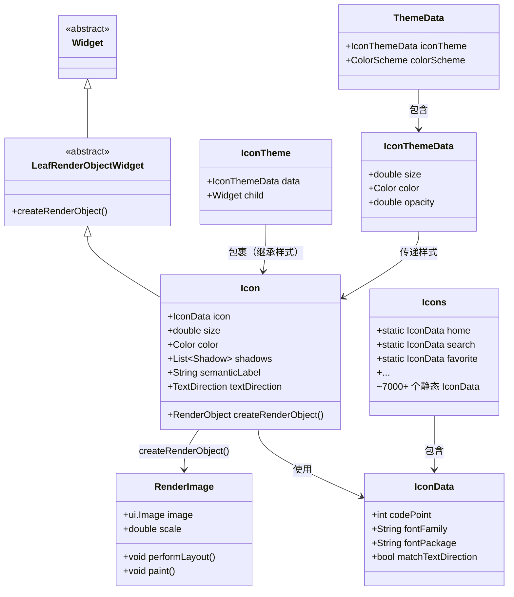
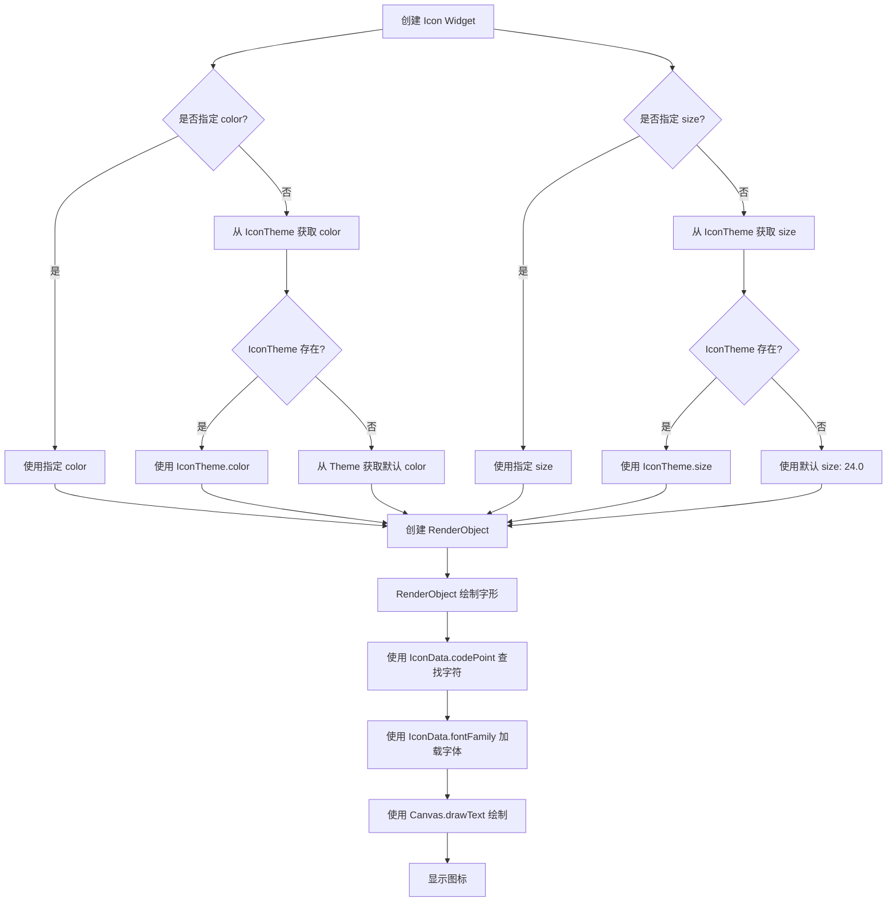

# Flutter 的 `Icon` 组件进行全面、深入的讲解。

## 1. 架构设计

- **Widget 定位**：`Icon` 是一个 **LeafRenderObjectWidget**（叶子节点），它本身不包含子 Widget，直接创建 `RenderObject` 进行绘制。这与 `Image` 需要 `StatefulWidget` 管理加载状态不同，`Icon` 是纯粹的展示型组件。

- **继承关系**：
  `Object` → `Diagnosticable` → `DiagnosticableTree` → `Widget` → `LeafRenderObjectWidget` → `Icon`

- **设计意图**：
  1. **矢量字体图标**：`Icon` 的本质是一个**字体文件中的字符**（glyph），而不是位图图片。这意味着它可以无限缩放不失真，颜色随意变换，内存占用极低。
  2. **与文本共享渲染管线**：因为 `Icon` 是字体字符，它的渲染与 `Text` 使用相同的底层机制，可以复用文本渲染的优化。
  3. **主题继承**：`Icon` 会自动从 `IconTheme` 和 `Theme` 中继承颜色和大小，确保与 App 的整体视觉风格保持一致。

---

## 2. 类关系图（Mermaid）



---

## 3. 流程图（Mermaid）

### Icon 渲染与主题继承流程



---

## 4. 源码解析

### Icon 核心属性

`Icon` 的构造函数接收以下核心参数：

```dart
// flutter/packages/flutter/lib/src/widgets/icon.dart
class Icon extends LeafRenderObjectWidget {
  const Icon(
    this.icon, {
    super.key,
    this.size,
    this.color,
    this.shadows,
    this.semanticLabel,
    this.textDirection,
  });

  final IconData? icon;
  final double? size;
  final Color? color;
  final List<Shadow>? shadows;
  final String? semanticLabel;
  final TextDirection? textDirection;
}
```

**关键参数说明**：

| 参数            | 类型            | 说明                                          |
| :-------------- | :-------------- | :-------------------------------------------- |
| `icon`          | `IconData`      | 要显示的图标，通常使用 `Icons.xxx` 预定义常量 |
| `size`          | `double?`       | 图标大小，默认从 `IconTheme` 获取，默认 24.0  |
| `color`         | `Color?`        | 图标颜色，默认从 `IconTheme` 获取             |
| `shadows`       | `List<Shadow>?` | 阴影效果，可实现发光或立体感                  |
| `semanticLabel` | `String?`       | 语义标签，辅助功能（屏幕朗读）使用            |

### 主题继承机制

`Icon` 的颜色和大小会从 `IconTheme` 继承，类似于 `Text` 从 `DefaultTextStyle` 继承样式：

```dart
// 主题继承示例
IconTheme(
  data: const IconThemeData(
    size: 40,
    color: Colors.teal,
  ),
  child: Row(
    children: const [
      Icon(Icons.home),   // 继承 size:40, color:teal
      Icon(Icons.star),   // 继承 size:40, color:teal
      Icon(Icons.settings), // 继承 size:40, color:teal
    ],
  ),
)
```

---

## 5. 使用场景

### 1. 基本图标展示

使用 Material Design 预定义图标：

```dart
const Icon(
  Icons.favorite,
  size: 30.0,
  color: Colors.red,
  semanticLabel: 'Favorite',
)
```

### 2. 在 AppBar 中使用

```dart
AppBar(
  title: const Text('My App'),
  leading: const Icon(Icons.menu),
  actions: const [
    Padding(
      padding: EdgeInsets.only(right: 8.0),
      child: Icon(Icons.search),
    ),
  ],
)
```

### 3. 可点击图标（IconButton）

`IconButton` 提供了水波纹点击反馈、tooltip 和合理的点击区域（约 48×48 dp）：

```dart
IconButton(
  icon: const Icon(Icons.favorite),
  tooltip: 'Like',
  onPressed: () {},
)
```

### 4. 使用自定义字体图标

导入阿里 Iconfont 等第三方字体库：

**pubspec.yaml 配置**：
```yaml
fonts:
  - family: MyIcons
    fonts:
      - asset: fonts/iconfont.ttf
```

**定义 IconData**：
```dart
class MyIcons {
  static const IconData home = IconData(0xe601, fontFamily: 'MyIcons');
  static const IconData search = IconData(0xe602, fontFamily: 'MyIcons');
}
```

**使用**：
```dart
Icon(MyIcons.home, size: 30, color: Colors.blue)
```

### 5. 带阴影的图标

```dart
Icon(
  Icons.bolt,
  size: 48,
  shadows: [
    Shadow(offset: Offset(2, 2), blurRadius: 4.0, color: Colors.amber),
  ],
)
```

### 6. 图标主题统一配置

通过 `ThemeData.iconTheme` 全局配置图标样式：

```dart
ThemeData(
  iconTheme: const IconThemeData(
    size: 28,
    color: Colors.blue,
  ),
)
```

### 7. 自定义 SVG 图标（ImageIcon）

当需要使用公司 Logo 等自定义图标时，可用 `ImageIcon` 配合自动染色：

```dart
ImageIcon(
  AssetImage('assets/logo.png'),
  color: Colors.blue,
  size: 24,
)
```

---

## 6. 优缺点

| 优点                                                               | 缺点                                                                     |
| :----------------------------------------------------------------- | :----------------------------------------------------------------------- |
| **无限缩放不失真**：基于矢量字体，适配任意屏幕密度                 | **仅支持单色**：无法像图片一样显示渐变色，只能通过 `ShaderMask` 间接实现 |
| **内存占用极低**：加载一个字体文件的开销远小于几十张不同尺寸的图片 | **需要导入完整字体包**：如果不做裁剪，会引入所有图标，增加包体积         |
| **颜色随意变换**：像文字一样修改 `color` 属性即可                  | **设计门槛**：需要设计师输出规范的 SVG 图标用于生成字体文件              |
| **主题继承**：自动适配 Light/Dark Mode，无需手动处理               | **字体文件依赖**：需要额外配置 `pubspec.yaml`                            |
| **与文字混排天然支持**：可通过 `TextSpan` 在文本中嵌入图标         | **图标风格受限**：只能使用打包进字体文件的图标                           |

---

## 7. 常见坑

### 坑 1：颜色写死导致 Dark Mode 下不可见

**问题**：直接使用 `Colors.black` 写死图标颜色，Dark Mode 下图标消失在深色背景中。

**❌ 错误代码**：
```dart
const Icon(Icons.home, color: Colors.black)
```

**✅ 正确代码**：
```dart
// 让 Theme 管理颜色
const Icon(Icons.home)

// 或使用 Theme 颜色
Icon(Icons.home, color: Theme.of(context).colorScheme.primary)
```

### 坑 2：Icon 点击区域太小

**问题**：使用 `GestureDetector + Icon` 时，点击区域只有图标本身大小，在移动设备上难以点击。

**❌ 错误代码**：
```dart
GestureDetector(
  onTap: () {},
  child: const Icon(Icons.favorite, size: 18),
)
```

**✅ 正确代码**：
```dart
// 使用 IconButton（内置 48dp 点击区域）
IconButton(
  icon: const Icon(Icons.favorite, size: 24),
  onPressed: () {},
)

// 或用 Padding 撑大点击区域
InkWell(
  onTap: () {},
  child: const Padding(
    padding: EdgeInsets.all(12.0),
    child: Icon(Icons.favorite, size: 24),
  ),
)
```

### 坑 3：Icons 导入导致包体积过大

**问题**：`import 'package:flutter/material.dart'` 会引入所有 Material Icons（约 7000+ 个），增大 APK 体积。

**✅ 正确代码**：
```dart
// 仅导入需要使用的图标
import 'package:flutter/material.dart' show Icons, Icon;

// 或使用 FlutterIcon 生成自定义字体包
// 只打包项目中实际使用的图标
```

### 坑 4：自定义字体图标在模拟器不显示

**问题**：使用自定义 `iconfont.ttf` 在模拟器上不显示，真机正常。

**原因**：模拟器可能缺少字体渲染支持或存在缓存问题。

**✅ 解决方案**：
1. 在真机上测试
2. 执行 `flutter clean` 后重新运行
3. 确保 `pubspec.yaml` 中字体路径正确且已执行 `flutter pub get`

---

## 8. 性能优化

### 1. 使用 const 构造函数

```dart
// ✅ 推荐
const Icon(Icons.home, size: 24)
```

### 2. 使用 IconTheme 统一配置

避免在每个 Icon 上重复设置 `color` 和 `size`：

```dart
IconTheme(
  data: const IconThemeData(size: 24, color: Colors.grey),
  child: Row(
    children: const [
      Icon(Icons.home),
      Icon(Icons.search),
      Icon(Icons.settings),
    ],
  ),
)
```

### 3. 自定义字体包裁剪

使用 [fluttericon.com](https://fluttericon.com) 只打包项目中实际使用的图标，减少包体积。

### 4. 使用 Font-based Icon 而非 SVG

相比 `flutter_svg` 包解析并渲染 SVG 图标，基于字体的 `Icon` 性能更好，因为它与渲染文本一样简单高效。

---

## 9. 业内项目中小图标从设计到应用的完整方案

### 1. 设计师产出 SVG 图标

设计师使用 Sketch/Figma/Adobe Illustrator 产出**纯色、清晰、规范的 SVG 图标**。需要确保：
- 图标为纯色（方便染色）
- 路径简洁（减少字体文件体积）
- 统一尺寸（如 24×24 dp）

### 2. 使用 iconfont 平台管理图标

国内最常用的是[阿里巴巴 Iconfont](https://www.iconfont.cn/)：
1. 设计师上传 SVG 图标到 Iconfont 项目
2. 团队成员在线预览、管理图标
3. 将选中的图标加入“购物车”，生成字体包

### 3. 生成字体文件（.ttf）

从 Iconfont 下载包含选定图标的字体包，解压后得到：
- `iconfont.ttf` - 字体文件
- `iconfont.css` / `demo.html` - 查看图标对应的 Unicode 码

### 4. Flutter 工程集成

**Step 1: 将字体文件放入项目**
```bash
# 放置到项目目录
your_project/assets/fonts/iconfont.ttf
```

**Step 2: 配置 pubspec.yaml**
```yaml
flutter:
  fonts:
    - family: MyIcons
      fonts:
        - asset: assets/fonts/iconfont.ttf
```

**Step 3: 创建 IconData 类**
```dart
class MyIcons {
  // 从 Iconfont demo.html 获取 Unicode 码
  static const IconData home = IconData(0xe601, fontFamily: 'MyIcons');
  static const IconData search = IconData(0xe602, fontFamily: 'MyIcons');
  static const IconData user = IconData(0xe603, fontFamily: 'MyIcons');
  // ... 更多图标
}
```

**Step 4: 使用**
```dart
Icon(MyIcons.home, size: 24, color: Colors.blue)
```

### 5. 最佳实践总结

| 阶段     | 关键动作                             | 工具/平台                       |
| :------- | :----------------------------------- | :------------------------------ |
| **设计** | 产出纯色 SVG 图标                    | Sketch/Figma/Illustrator        |
| **管理** | 上传、管理、团队协作                 | Iconfont / FlutterIcon          |
| **生成** | 生成字体文件（.ttf）                 | Iconfont 下载 / fluttericon.com |
| **集成** | 配置 pubspec.yaml + 创建 IconData 类 | Flutter                         |
| **使用** | `Icon(MyIcons.xxx)`                  | Flutter                         |

### 6. 为什么推荐这套方案？

1. **包体积最优**：只打包项目中实际使用的图标，避免引入整个 Material Icons 字体包
2. **设计协同**：设计师可独立管理图标库，开发者直接使用
3. **性能最优**：基于字体的图标渲染性能高于 SVG 解析
4. **风格统一**：所有图标来自同一设计体系，保证视觉一致性