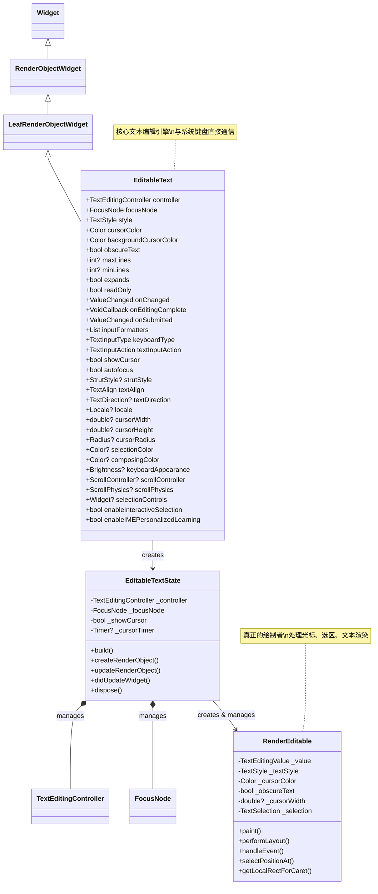
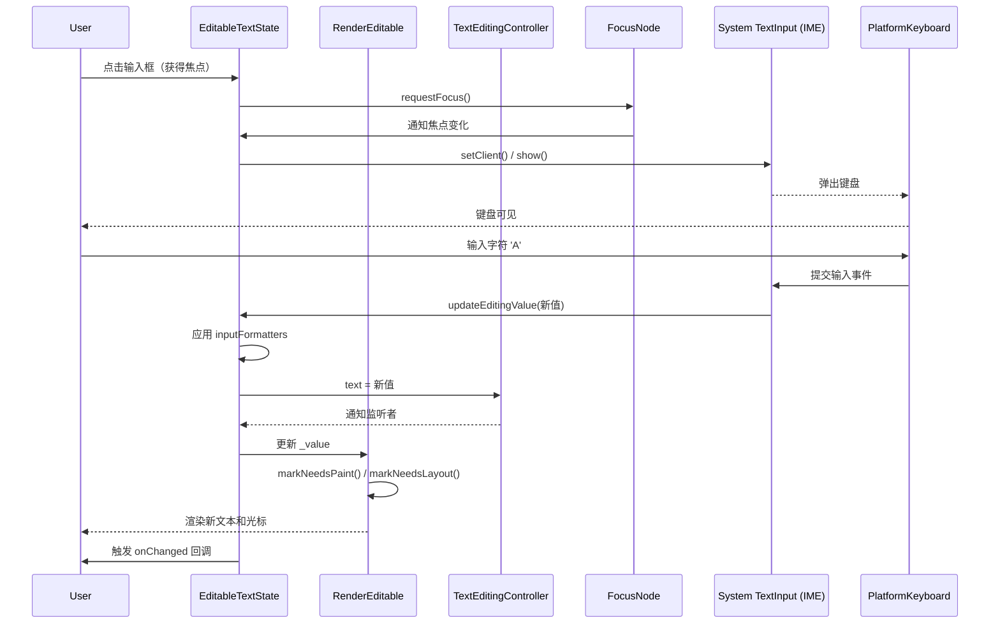
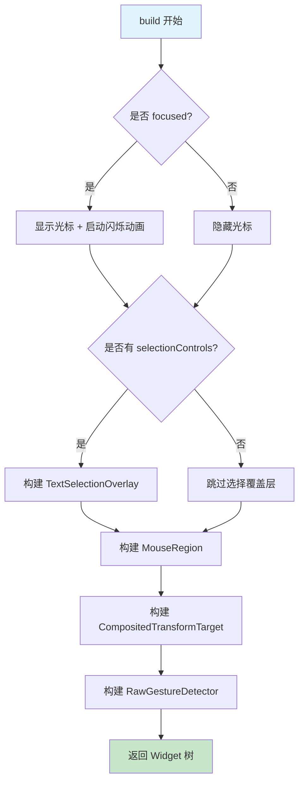

# EditableText 

## 1. 架构设计

`EditableText` 是 Flutter 中所有文本输入功能的**底层基础设施**，它直接与平台的 `TextInput` 服务（系统键盘）通信，负责处理文本的编辑、光标、选区、滚动等所有核心功能。

- **类继承关系**：`Widget` → `RenderObjectWidget` → `LeafRenderObjectWidget` → `EditableText`
- **设计意图**：提供一个纯粹的、功能完整的文本编辑引擎，作为 `TextField` 和 `CupertinoTextField` 的底层实现基础，而不是供开发者日常直接使用的组件。
- **核心组合**：`EditableText` 本身不组合其他 Widget，它直接创建并管理 `RenderEditable` 这个 RenderObject，负责所有布局和绘制工作。
- **与高层组件的关系**：`TextField` 和 `CupertinoTextField` 都是在 `EditableText` 外层包裹了不同的装饰层（`InputDecorator` 或 Cupertino 风格装饰）和手势处理逻辑，但最终都构建 `EditableText` 作为核心引擎。

### 设计意图解析

`EditableText` 的设计遵循了**单一职责原则**，它将文本编辑的复杂逻辑（与键盘通信、文本渲染、光标管理、输入格式化等）封装在一个独立的组件中，使得：
1. 高层组件（如 `TextField`）可以专注于装饰和交互体验，而不需要关心底层实现细节。
2. 开发者可以在需要时，直接使用 `EditableText` 构建完全自定义的输入组件。

## 2. 类关系图（Mermaid）



## 3. 流程图（Mermaid）

### 3.1 完整的输入流程（从用户操作到 UI 更新）



### 3.2 build 方法内部流程



### 3.3 包裹层级图（从外到内）

```
┌─────────────────────────────────────────────────────────────┐
│                       FocusScope                            │
│  ┌───────────────────────────────────────────────────────┐  │
│  │               _EditableTextFocusDetector              │  │
│  │  ┌─────────────────────────────────────────────────┐  │  │
│  │  │            _EditableTextKeyboardHandler         │  │  │
│  │  │  ┌───────────────────────────────────────────┐  │  │  │
│  │  │  │           TextSelectionOverlay             │  │  │  │
│  │  │  │  ┌─────────────────────────────────────┐  │  │  │  │
│  │  │  │  │        MouseRegion (Hover)          │  │  │  │  │
│  │  │  │  │  ┌───────────────────────────────┐  │  │  │  │  │
│  │  │  │  │  │   CompositedTransformTarget   │  │  │  │  │  │
│  │  │  │  │  │  ┌─────────────────────────┐  │  │  │  │  │  │
│  │  │  │  │  │  │   RawGestureDetector    │  │  │  │  │  │  │
│  │  │  │  │  │  │  ┌───────────────────┐  │  │  │  │  │  │  │
│  │  │  │  │  │  │  │  RenderEditable   │  │  │  │  │  │  │  │
│  │  │  │  │  │  │  │  (实际绘制者)     │  │  │  │  │  │  │  │
│  │  │  │  │  │  │  └───────────────────┘  │  │  │  │  │  │  │
│  │  │  │  │  │  └─────────────────────────┘  │  │  │  │  │  │
│  │  │  │  │  └───────────────────────────────┘  │  │  │  │  │
│  │  │  │  └─────────────────────────────────────┘  │  │  │  │
│  │  │  └───────────────────────────────────────────┘  │  │  │
│  │  └─────────────────────────────────────────────────┘  │  │
│  └───────────────────────────────────────────────────────┘  │
└─────────────────────────────────────────────────────────────┘

> 说明：每一层都包裹在下一层之外，最内层是 RenderEditable（实际绘制文本、光标、选区）
```

## 4. 源码解析

### 4.1 核心状态管理

```dart
// EditableText 的 State 类
class EditableTextState extends State<EditableText> 
    with AutomaticKeepAliveClientMixin, TextInputClient, ScrollableStateMixin {
  
  // 核心状态
  TextEditingController get _controller => widget.controller;
  FocusNode get _focusNode => widget.focusNode;
  
  late final TextEditingValue _value = _controller.value;
  bool _showCursor = false;
  Timer? _cursorTimer;
  
  // 滚动控制器（用于多行输入）
  late ScrollController _scrollController;
  
  // ============ 核心方法 ============
  
  @override
  Widget build(BuildContext context) {
    // 1. 如果获得焦点，启动光标闪烁
    if (_focusNode.hasFocus) {
      _startCursorTimer();
    } else {
      _stopCursorTimer();
    }
    
    // 2. 构建文本选择覆盖层（复制/粘贴工具栏）
    final Widget textSelectionOverlay = _selectionOverlay?.build(context) ?? const SizedBox.shrink();
    
    // 3. 核心：构建可编辑文本区域
    return _EditableTextFocusDetector(
      onFocusChange: _handleFocusChange,
      child: _EditableTextKeyboardHandler(
        onKeyEvent: _handleKeyEvent,
        child: RawGestureDetector(
          gestures: _gestureRecognizers,
          child: MouseRegion(
            cursor: SystemMouseCursors.text,
            child: CompositedTransformTarget(
              link: _layerLink,
              child: _textSelectionOverlayWrapper(
                textSelectionOverlay,
                child: _ScrollableWithDetails(
                  controller: _scrollController,
                  viewportBuilder: (context, offset) {
                    return RenderEditable(
                      // 关键参数传递
                      value: _value,
                      textStyle: widget.style,
                      cursorColor: widget.cursorColor,
                      cursorWidth: widget.cursorWidth ?? 2.0,
                      cursorHeight: widget.cursorHeight,
                      showCursor: _showCursor,
                      selectionColor: widget.selectionColor,
                      // ... 其他参数
                    );
                  },
                ),
              ),
            ),
          ),
        ),
      ),
    );
  }
  
  // ============ 创建 RenderObject ============
  @override
  RenderEditable createRenderObject(BuildContext context) {
    return RenderEditable(
      value: _value,
      textStyle: widget.style,
      cursorColor: widget.cursorColor,
      backgroundCursorColor: widget.backgroundCursorColor,
      // ... 其他初始化参数
    );
  }
  
  // ============ 更新 RenderObject ============
  @override
  void updateRenderObject(BuildContext context, RenderEditable renderObject) {
    renderObject
      ..value = _value
      ..textStyle = widget.style
      ..cursorColor = widget.cursorColor
      ..showCursor = _showCursor
      ..selection = _value.selection;
    // ... 更新其他属性
  }
  
  // ============ 与系统输入法通信 ============
  @override
  void updateEditingValue(TextEditingValue value) {
    // 1. 应用输入格式化
    final TextEditingValue formatted = _applyInputFormatters(value);
    
    // 2. 更新控制器
    _controller.value = formatted;
    
    // 3. 通知监听者
    setState(() {
      _value = formatted;
    });
    
    // 4. 触发 onChanged 回调
    widget.onChanged?.call(formatted.text);
  }
  
  @override
  void performAction(TextInputAction action) {
    switch (action) {
      case TextInputAction.done:
      case TextInputAction.search:
      case TextInputAction.send:
        widget.onSubmitted?.call(_value.text);
        _focusNode.unfocus();
        break;
      default:
        // 其他动作的处理
        break;
    }
  }
  
  // ============ 生命周期管理 ============
  @override
  void dispose() {
    _stopCursorTimer();
    _scrollController.dispose();
    super.dispose();
  }
  
  // ============ 自动保持存活（焦点时不被销毁） ============
  @override
  bool get wantKeepAlive => _focusNode.hasFocus;
}
```

### 4.2 关键参数解析

| 参数              | 类型                       | 作用                         | 默认值                 |
| ----------------- | -------------------------- | ---------------------------- | ---------------------- |
| `controller`      | `TextEditingController`    | 管理文本内容和选区           | 必须提供               |
| `focusNode`       | `FocusNode`                | 管理焦点状态                 | 必须提供               |
| `style`           | `TextStyle`                | 文本样式（字体、大小、颜色） | 必须提供               |
| `cursorColor`     | `Color`                    | 光标颜色                     | 必须提供               |
| `obscureText`     | `bool`                     | 是否隐藏文本（密码模式）     | `false`                |
| `maxLines`        | `int?`                     | 最大行数，`null` 表示无限    | `1`                    |
| `minLines`        | `int?`                     | 最小行数                     | `null`                 |
| `expands`         | `bool`                     | 是否扩展填充父级高度         | `false`                |
| `readOnly`        | `bool`                     | 是否只读                     | `false`                |
| `inputFormatters` | `List<TextInputFormatter>` | 输入格式化器列表             | `const []`             |
| `keyboardType`    | `TextInputType`            | 键盘类型                     | `TextInputType.text`   |
| `textInputAction` | `TextInputAction`          | 键盘动作按钮                 | `TextInputAction.done` |

### 4.3 核心流程：输入格式化器的应用

```dart
TextEditingValue _applyInputFormatters(TextEditingValue value) {
  // 遍历所有格式化器，依次处理
  for (final formatter in widget.inputFormatters) {
    value = formatter.formatEditUpdate(
      _value, // 旧值
      value,  // 新值
    );
  }
  return value;
}
```

## 5. 使用场景

虽然 `EditableText` 通常不直接使用，但在以下场景中它是最佳选择：

### 场景 1：完全自定义的文本输入组件

当需要实现一套完全自定义设计语言（非 Material 也非 Cupertino）的输入组件时，直接使用 `EditableText` 作为核心引擎，外围包裹自定义装饰。

```dart
class CustomInputField extends StatefulWidget {
  final String label;
  final String? hint;
  final TextEditingController controller;
  final FocusNode focusNode;
  final ValueChanged<String>? onChanged;
  
  const CustomInputField({
    required this.label,
    this.hint,
    required this.controller,
    required this.focusNode,
    this.onChanged,
  });
  
  @override
  State<CustomInputField> createState() => _CustomInputFieldState();
}

class _CustomInputFieldState extends State<CustomInputField> {
  @override
  Widget build(BuildContext context) {
    return Column(
      crossAxisAlignment: CrossAxisAlignment.start,
      children: [
        // 自定义标签
        Text(
          widget.label,
          style: TextStyle(
            fontSize: 14,
            fontWeight: FontWeight.w600,
            color: Colors.grey.shade700,
          ),
        ),
        const SizedBox(height: 8),
        // 自定义装饰容器
        Container(
          decoration: BoxDecoration(
            border: Border.all(
              color: widget.focusNode.hasFocus ? Colors.blue : Colors.grey.shade300,
              width: 2,
            ),
            borderRadius: BorderRadius.circular(8),
            color: Colors.grey.shade50,
          ),
          padding: const EdgeInsets.symmetric(horizontal: 12, vertical: 8),
          child: EditableText(
            controller: widget.controller,
            focusNode: widget.focusNode,
            style: const TextStyle(fontSize: 16, color: Colors.black87),
            cursorColor: Colors.blue,
            backgroundCursorColor: Colors.grey,
            onChanged: widget.onChanged,
            onSubmitted: (value) {
              print('提交: $value');
            },
            // 完全自定义的配置
            maxLines: 1,
            textAlign: TextAlign.start,
            keyboardType: TextInputType.text,
          ),
        ),
        // 自定义错误提示或辅助信息
        if (widget.controller.text.isEmpty)
          Padding(
            padding: const EdgeInsets.only(top: 4),
            child: Text(
              widget.hint ?? '',
              style: TextStyle(fontSize: 12, color: Colors.grey.shade500),
            ),
          ),
      ],
    );
  }
  
  @override
  void dispose() {
    // 注意：controller 和 focusNode 应该在父级管理，这里不释放
    super.dispose();
  }
}
```

### 场景 2：实现特定交互逻辑的输入框

比如实现一个代码编辑器风格的输入框，需要特殊的键盘事件处理或自定义手势。

```dart
class CodeEditorInput extends StatefulWidget {
  const CodeEditorInput({super.key});
  
  @override
  State<CodeEditorInput> createState() => _CodeEditorInputState();
}

class _CodeEditorInputState extends State<CodeEditorInput> {
  late final TextEditingController _controller;
  late final FocusNode _focusNode;
  
  @override
  void initState() {
    super.initState();
    _controller = TextEditingController(text: 'void main() {\n  print("Hello");\n}');
    _focusNode = FocusNode();
  }
  
  @override
  void dispose() {
    _controller.dispose();
    _focusNode.dispose();
    super.dispose();
  }
  
  @override
  Widget build(BuildContext context) {
    return Container(
      decoration: BoxDecoration(
        color: Colors.grey.shade900,
        borderRadius: BorderRadius.circular(12),
      ),
      padding: const EdgeInsets.all(16),
      child: EditableText(
        controller: _controller,
        focusNode: _focusNode,
        style: const TextStyle(
          fontSize: 14,
          fontFamily: 'Courier New',
          color: Colors.greenAccent,
          height: 1.8,
        ),
        cursorColor: Colors.white,
        backgroundCursorColor: Colors.grey,
        maxLines: null, // 无限行
        minLines: 10,
        textAlign: TextAlign.start,
        keyboardType: TextInputType.multiline,
        textInputAction: TextInputAction.newline,
        selectionColor: Colors.blue.withOpacity(0.3),
        onChanged: (value) {
          // 实现代码高亮或实时语法检查
          print('代码变化: $value');
        },
        onSubmitted: (value) {
          print('提交代码: $value');
        },
      ),
    );
  }
}
```

### 场景 3：自定义渲染层级的富文本编辑器

`EditableText` 的 `RenderEditable` 支持 `TextSpan`，可以用来实现简单的富文本编辑。

```dart
class RichEditableText extends StatefulWidget {
  const RichEditableText({super.key});
  
  @override
  State<RichEditableText> createState() => _RichEditableTextState();
}

class _RichEditableTextState extends State<RichEditableText> {
  late final TextEditingController _controller;
  late final FocusNode _focusNode;
  
  @override
  void initState() {
    super.initState();
    _controller = TextEditingController(text: 'Hello Flutter!');
    _focusNode = FocusNode();
  }
  
  @override
  void dispose() {
    _controller.dispose();
    _focusNode.dispose();
    super.dispose();
  }
  
  @override
  Widget build(BuildContext context) {
    // 将文本解析为 TextSpan（简化示例）
    final text = _controller.text;
    final List<TextSpan> spans = [];
    
    // 简单的关键词高亮
    final keywords = ['Flutter', 'Dart', 'Widget'];
    int start = 0;
    
    for (final keyword in keywords) {
      final index = text.indexOf(keyword, start);
      if (index != -1) {
        // 普通文本
        if (start < index) {
          spans.add(TextSpan(
            text: text.substring(start, index),
            style: const TextStyle(color: Colors.white),
          ));
        }
        // 高亮关键词
        spans.add(TextSpan(
          text: keyword,
          style: const TextStyle(
            color: Colors.blueAccent,
            fontWeight: FontWeight.bold,
          ),
        ));
        start = index + keyword.length;
      }
    }
    
    // 剩余文本
    if (start < text.length) {
      spans.add(TextSpan(
        text: text.substring(start),
        style: const TextStyle(color: Colors.white),
      ));
    }
    
    return Container(
      decoration: BoxDecoration(
        color: Colors.grey.shade800,
        borderRadius: BorderRadius.circular(8),
      ),
      padding: const EdgeInsets.all(16),
      child: EditableText(
        controller: _controller,
        focusNode: _focusNode,
        style: const TextStyle(fontSize: 16, color: Colors.white),
        cursorColor: Colors.white,
        backgroundCursorColor: Colors.grey,
        // 使用 TextSpan 构建富文本
        selectionColor: Colors.blue.withOpacity(0.3),
        onChanged: (value) => setState(() {}),
        // 注意：直接修改 controller 会导致重建
        // 实际场景中应该使用更复杂的文本解析逻辑
      ),
    );
  }
}
```

### 场景对比：何时使用 EditableText vs TextField

| 场景                       | 推荐组件                           | 原因                          |
| -------------------------- | ---------------------------------- | ----------------------------- |
| 标准 Material 设计输入框   | `TextField`                        | 开箱即用，无需额外装饰        |
| 标准 iOS 风格输入框        | `CupertinoTextField`               | 开箱即用，iOS 风格            |
| 完全自定义视觉风格         | `EditableText`                     | 无预设装饰，完全可控          |
| 需要特殊键盘事件处理       | `EditableText`                     | 更底层，可自定义 `onKeyEvent` |
| 需要富文本编辑（部分高亮） | `EditableText` + 自定义 `TextSpan` | 更灵活的控制                  |
| 表单验证                   | `TextFormField`                    | 与 `Form` 集成更好            |
| 快速原型开发               | `TextField`                        | 功能完整，配置简单            |

## 6. 优缺点

| 优点                                                                                | 缺点                                                                                 |
| ----------------------------------------------------------------------------------- | ------------------------------------------------------------------------------------ |
| **完全无样式依赖**：不强制任何 Material 或 Cupertino 设计，完全由开发者控制视觉表现 | **功能相对较少**：缺少 `TextField` 的装饰功能（边框、标签、图标等），需要自行实现    |
| **更轻量**：没有额外的装饰层，性能开销更小                                          | **使用复杂**：必须自行管理 `controller` 和 `focusNode`，并且需要处理更多的底层细节   |
| **更高的灵活性**：可以直接访问 `RenderEditable`，实现高度定制化的渲染逻辑           | **缺少现成的交互**：如自动显示清除按钮、`InputDecoration` 的丰富配置等都需要手动实现 |
| **底层控制力强**：可以自定义键盘事件处理、手势识别等底层行为                        | **容易出问题**：自行管理生命周期、焦点、滚动等，稍有不慎容易导致内存泄漏或行为异常   |
| **富文本支持更好**：可以直接操作 `TextSpan`，实现部分文本高亮等效果                 | **学习成本高**：需要深入理解 Flutter 的 `RenderObject` 体系                          |

## 7. 常见坑

### 坑 1：忘记在 dispose 中释放资源 ❌

```dart
// ❌ 错误：没有释放 controller 和 focusNode
class MyEditableTextWidget extends StatefulWidget {
  const MyEditableTextWidget({super.key});
  
  @override
  State<MyEditableTextWidget> createState() => _MyEditableTextWidgetState();
}

class _MyEditableTextWidgetState extends State<MyEditableTextWidget> {
  late final TextEditingController _controller;
  late final FocusNode _focusNode;
  
  @override
  void initState() {
    super.initState();
    _controller = TextEditingController();
    _focusNode = FocusNode();
  }
  // ❌ 缺少 dispose 方法！
  
  @override
  Widget build(BuildContext context) {
    return EditableText(
      controller: _controller,
      focusNode: _focusNode,
      style: const TextStyle(fontSize: 16, color: Colors.black),
      cursorColor: Colors.blue,
      backgroundCursorColor: Colors.grey,
    );
  }
}
```

**问题分析**：`TextEditingController` 和 `FocusNode` 都是 `ChangeNotifier`，它们持有监听器。如果不调用 `dispose()`，监听器不会被移除，Widget 被销毁后仍被引用，造成内存泄漏。

**✅ 正确做法**：

```dart
class _MyEditableTextWidgetState extends State<MyEditableTextWidget> {
  late final TextEditingController _controller;
  late final FocusNode _focusNode;
  
  @override
  void initState() {
    super.initState();
    _controller = TextEditingController();
    _focusNode = FocusNode();
  }
  
  @override
  void dispose() {
    _controller.dispose(); // ✅ 释放
    _focusNode.dispose();  // ✅ 释放
    super.dispose();
  }
  
  // ... build 方法
}
```

### 坑 2：在 build 方法中创建 controller 或 focusNode ❌

```dart
// ❌ 错误：每次 build 都创建新的实例
@override
Widget build(BuildContext context) {
  final controller = TextEditingController(); // 每次重建都会创建新实例
  final focusNode = FocusNode();
  return EditableText(
    controller: controller,
    focusNode: focusNode,
    // ...
  );
}
```

**问题分析**：每次 `build` 运行都会创建新的 `TextEditingController` 和 `FocusNode`，导致：
- 输入内容丢失
- 焦点状态重置
- 旧实例无法释放导致内存泄漏

**✅ 正确做法**：在 `State` 中作为成员变量创建。

### 坑 3：没有正确处理 `expands` 和 `maxLines` 的组合 ❌

```dart
// ❌ 错误：expands 为 true 但父级没有给足够空间
EditableText(
  controller: _controller,
  focusNode: _focusNode,
  style: const TextStyle(fontSize: 16, color: Colors.black),
  cursorColor: Colors.blue,
  backgroundCursorColor: Colors.grey,
  maxLines: null,
  expands: true, // 要求父级提供无限高度
  // 如果父级是 Column 或没有约束高度的容器，会报错
)
```

**问题分析**：`expands: true` 表示 `EditableText` 会尝试填充父级的所有可用高度。如果父级没有提供明确的高度约束（如 `Column` 中的 `Expanded` 或 `SizedBox` 指定高度），会导致布局错误。

**✅ 正确做法**：

```dart
// 方案 1：使用 Expanded 提供约束
Expanded(
  child: EditableText(
    controller: _controller,
    focusNode: _focusNode,
    style: const TextStyle(fontSize: 16, color: Colors.black),
    cursorColor: Colors.blue,
    backgroundCursorColor: Colors.grey,
    maxLines: null,
    expands: true,
  ),
)

// 方案 2：不设置 expands，让 maxLines 控制高度
EditableText(
  controller: _controller,
  focusNode: _focusNode,
  style: const TextStyle(fontSize: 16, color: Colors.black),
  cursorColor: Colors.blue,
  backgroundCursorColor: Colors.grey,
  maxLines: 5, // 固定 5 行高度
  // expands: false (默认)
)
```

### 坑 4：忘记处理 `onSubmitted` 中的焦点释放 ❌

```dart
// ❌ 错误：提交后键盘不会自动收起
EditableText(
  controller: _controller,
  focusNode: _focusNode,
  style: const TextStyle(fontSize: 16, color: Colors.black),
  cursorColor: Colors.blue,
  backgroundCursorColor: Colors.grey,
  textInputAction: TextInputAction.done,
  onSubmitted: (value) {
    print('提交: $value');
    // ❌ 没有释放焦点，键盘仍然显示
  },
)
```

**问题分析**：用户点击键盘上的"完成"按钮后，`onSubmitted` 被调用，但焦点没有释放，键盘仍然保持显示状态。

**✅ 正确做法**：

```dart
EditableText(
  controller: _controller,
  focusNode: _focusNode,
  style: const TextStyle(fontSize: 16, color: Colors.black),
  cursorColor: Colors.blue,
  backgroundCursorColor: Colors.grey,
  textInputAction: TextInputAction.done,
  onSubmitted: (value) {
    print('提交: $value');
    _focusNode.unfocus(); // ✅ 释放焦点，隐藏键盘
  },
)
```

### 坑 5：`obscureText` 与自定义输入格式冲突 ❌

```dart
// ❌ 错误：密码模式下的格式化可能暴露敏感信息
EditableText(
  controller: _controller,
  focusNode: _focusNode,
  style: const TextStyle(fontSize: 16, color: Colors.black),
  cursorColor: Colors.blue,
  backgroundCursorColor: Colors.grey,
  obscureText: true,
  inputFormatters: [
    // 某些格式化器可能将文本作为普通字符串处理
    LengthLimitingTextInputFormatter(20),
    // ❌ 自定义格式化可能泄露密码信息到日志或 UI
  ],
)
```

**问题分析**：在 `obscureText: true` 模式下，文本内容应被隐藏。但如果自定义 `TextInputFormatter` 将文本作为普通字符串处理并输出到日志或 UI，可能会泄露密码信息。

**✅ 正确做法**：

```dart
// ✅ 密码模式下，格式化器应该只做必要的限制
EditableText(
  controller: _controller,
  focusNode: _focusNode,
  style: const TextStyle(fontSize: 16, color: Colors.black),
  cursorColor: Colors.blue,
  backgroundCursorColor: Colors.grey,
  obscureText: true,
  inputFormatters: [
    // ✅ 只使用不涉及内容分析的格式化器
    LengthLimitingTextInputFormatter(20),
    // ✅ 自定义格式化器要避免记录或显示原始文本
    _SafePasswordFormatter(),
  ],
)
```

## 8. 性能优化

### 1. 使用 `const` 构造函数

虽然 `EditableText` 本身不是 `const` 可构造的（因为它依赖运行时状态），但它的父级 Widget 可以使用 `const` 来减少重建开销：

```dart
// ✅ 使用 const 包装
const MyEditableTextContainer(); // 如果可能
```

### 2. 合理使用 `RepaintBoundary`

`EditableText` 内部已经使用了 `RepaintBoundary` 来隔离绘制。如果你在自定义组件中使用 `EditableText`，确保不要在外层破坏这个优化：

```dart
// ✅ EditableText 内部已有 RepaintBoundary
// 注意：不要在父子之间使用会影响绘制隔离的 Widget
```

### 3. 避免在 `onChanged` 中执行昂贵操作

`onChanged` 会在每次键盘输入时触发。如果在此回调中执行复杂计算或触发频繁的 `setState`，会导致 UI 卡顿。

```dart
// ❌ 错误：在 onChanged 中执行昂贵操作
EditableText(
  // ...
  onChanged: (value) {
    // ❌ 每次输入都重建整个列表
    _filterResults(value); // 假设这会重建大量 Widget
    setState(() {});
  },
)

// ✅ 正确：使用防抖或节流
import 'dart:async';

class _MyState extends State<MyWidget> {
  Timer? _debounceTimer;
  
  EditableText(
    // ...
    onChanged: (value) {
      _debounceTimer?.cancel();
      _debounceTimer = Timer(const Duration(milliseconds: 300), () {
        _filterResults(value); // 延迟执行
      });
    },
  )
  
  @override
  void dispose() {
    _debounceTimer?.cancel();
    super.dispose();
  }
}
```

### 4. 使用 `inputFormatters` 代替手动修改文本

如果需要对输入内容进行格式化或限制，应优先使用 `inputFormatters` 属性。它在输入流程的更底层生效，比在 `onChanged` 中修改 `controller.text` 更高效，且不会引起额外的光标跳动问题。

```dart
// ✅ 使用 inputFormatters
EditableText(
  // ...
  inputFormatters: [
    FilteringTextInputFormatter.digitsOnly,
    LengthLimitingTextInputFormatter(11),
    _PhoneNumberFormatter(), // 自定义格式化器
  ],
)

// ❌ 不推荐：在 onChanged 中手动修改
EditableText(
  // ...
  onChanged: (value) {
    // ❌ 可能导致光标位置错误和性能问题
    final filtered = value.replaceAll(RegExp(r'[^0-9]'), '');
    if (filtered != value) {
      _controller.text = filtered;
    }
  },
)
```

### 5. 缓存 `TextStyle` 和其他不变的对象

如果 `EditableText` 的样式不会改变，将其提取为常量，避免每次 `build` 时重新创建。

```dart
// ✅ 缓存样式
const _kEditableTextStyle = TextStyle(
  fontSize: 16,
  color: Colors.black,
  fontFamily: 'Roboto',
);

// 在 build 中使用
EditableText(
  // ...
  style: _kEditableTextStyle, // 重复使用同一个实例
)
```

### 6. 使用 `addListener` 代替 `setState` 更新 UI

如果只需要监听文本变化来更新某个外部的 UI 元素（如字符计数），可以在 `initState` 中添加监听器，而不是在 `onChanged` 中调用 `setState`。

```dart
class _MyState extends State<MyWidget> {
  late final TextEditingController _controller;
  int _charCount = 0;
  
  @override
  void initState() {
    super.initState();
    _controller = TextEditingController();
    _controller.addListener(() {
      // ✅ 在监听器中更新计数，避免额外的 setState
      final newCount = _controller.text.length;
      if (newCount != _charCount) {
        setState(() {
          _charCount = newCount;
        });
      }
    });
  }
  
  @override
  Widget build(BuildContext context) {
    return Column(
      children: [
        EditableText(
          controller: _controller,
          // ... 其他参数
        ),
        Text('字符数: $_charCount'),
      ],
    );
  }
}
```

### 7. 使用 `FocusNode` 和 `TextEditingController` 的复用

在列表中使用多个 `EditableText` 时，可以考虑复用 `FocusNode` 和 `TextEditingController` 的实例，但要注意每个输入框的状态独立性。

```dart
// ✅ 复用控制器（如果输入框相互独立，但共享同一个控制器会导致内容同步）