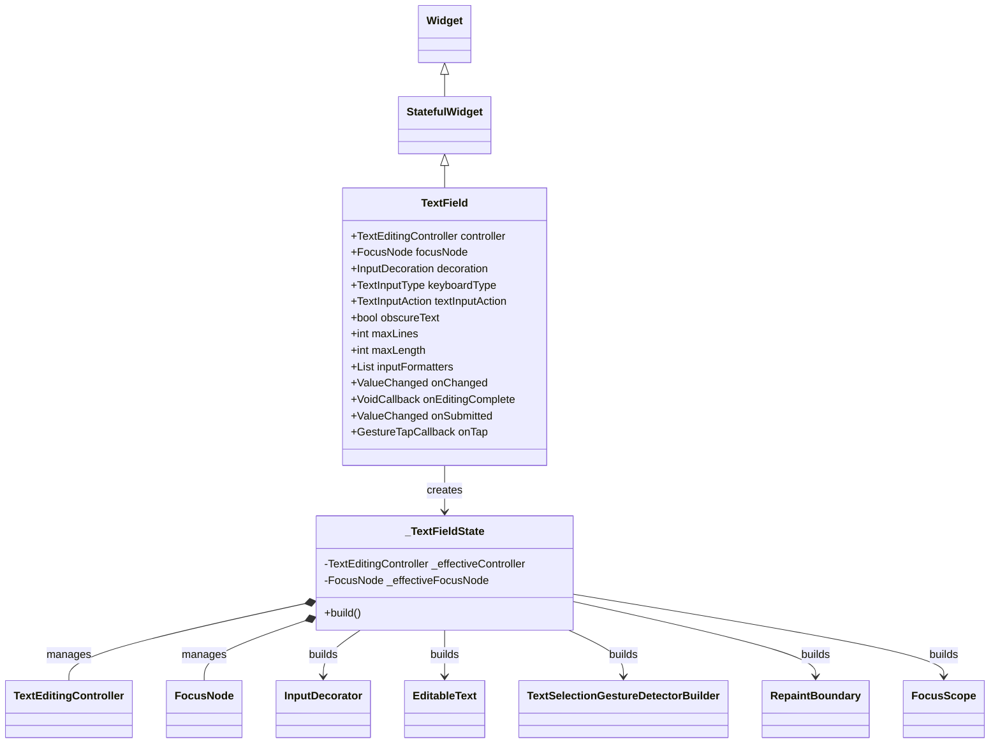
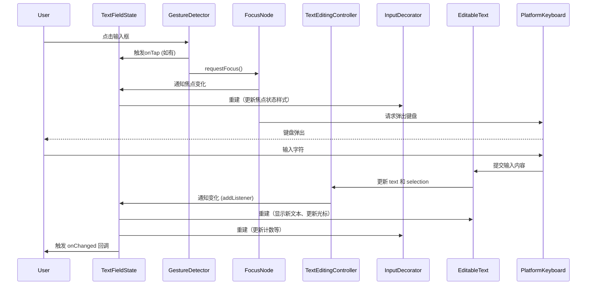

好的，收到你的指令。我将按照你提供的“Flutter Widget 深度讲解”模版，为你全面、深入地解析 `TextField` 这个极其核心的 Widget。

---

## 1. 架构设计

`TextField` 是 Flutter 中用于接收用户文本输入的基础且功能强大的组件。它是一个有状态的 `StatefulWidget`，其设计意图是为开发者提供一个高度可定制的、遵循 Material Design 规范的文本输入解决方案。它本身是一个组合型 Widget，并不直接进行绘制，而是通过组合和协调多个底层 Widget 来实现复杂的交互和视觉功能。

- **类继承关系**：`Widget` → `StatefulWidget` → `TextField`。
- **核心设计思想**：将复杂的文本输入功能拆分为独立的、可复用的模块。`TextField` 负责协调这些模块（如焦点管理、手势处理、视觉装饰、文本编辑核心）的状态和交互，从而提供完整的输入体验。
- **组合核心组件**：
    - **EditableText**：这是 `TextField` 最底层的核心，负责与系统键盘通信、处理文本编辑（光标、选择、输入/删除）、以及文本的最终绘制。`TextField` 和 `CupertinoTextField` 最终都会构建 `EditableText`。
    - **InputDecorator**：负责 `TextField` 的视觉装饰，如边框、标签（`labelText`）、提示文本（`hintText`）、图标、错误信息等，根据焦点和状态改变外观。
    - **Focus/TextSelection 管理**：通过 `FocusNode` 和 `TextEditingController` 分别管理焦点状态和文本内容与选区，并通过 `AnimatedBuilder` 将它们的变动高效地映射到 UI 更新上。
    - **手势处理**：通过 `TextSelectionGestureDetector` 处理点击、长按等手势，以弹出键盘或显示复制/粘贴工具栏。
    - **性能优化**：内置 `RepaintBoundary` 将自身绘制隔离，避免因输入变化引起父级 Widget 不必要的重绘。
    - **状态恢复**：通过集成 `RestorationMixin` 和 `RestorableTextEditingController`，能在应用被系统回收后恢复输入内容。

## 2. 类关系图（Mermaid）



## 3. 流程图（Mermaid）

**核心交互与状态更新流程：**



**`build()` 方法内部包裹层级（简化）：**

```
┐
├─ FocusScope (管理焦点范围)
│ ┐
│ ├─ RepaintBoundary (隔离绘制，优化性能)
│ │ ┐
│ │ ├─ AnimatedBuilder (监听焦点和控制器变化)
│ │ │ ┐
│ │ │ ├─ InputDecorator (渲染边框、标签、图标等)
│ │ │ │ ┐
│ │ │ │ ├─ Row/Column (布局装饰元素)
│ │ │ │ │ ┐
│ │ │ │ │ ├─ _TextFieldSelectionGestureDetectorBuilder (处理手势)
│ │ │ │ │ │ ┐
│ │ │ │ │ │ ├─ EditableText (核心文本编辑与绘制)
│ │ │ │ │ │ └─ ...
│ │ │ │ │ └─ ...
│ │ │ │ └─ ...
│ │ │ └─ ...
│ │ └─ ...
│ └─ ...
┘
```

## 4. 源码解析

`TextField` 的核心在于其 `build()` 方法如何协调各个组件。虽然源码细节会随版本更新，但其核心逻辑保持不变。

```dart
// 源码片段 (基于 Flutter 框架逻辑重构)
class _TextFieldState extends State<TextField> with RestorationMixin {
  // 1. 管理核心资源
  late TextEditingController _effectiveController; // 有效控制器
  late FocusNode _effectiveFocusNode; // 有效焦点节点

  @override
  Widget build(BuildContext context) {
    // 2. 构建手势检测器 (处理点击、长按)
    final TextSelectionGestureDetectorBuilder gestureBuilder =
        _createGestureDetectorBuilder();

    // 3. 返回核心结构
    return FocusScope(
      node: widget.focusNode ?? _effectiveFocusNode,
      // 4. 性能优化：隔离重绘边界
      child: RepaintBoundary(
        child: UnmanagedRestorationScope(
          bucket: _bucket,
          child: AnimatedBuilder(
            // 5. 监听变化：当 controller 或 focusNode 变化时重建装饰器
            animation: Listenable.merge(<Listenable>[
              _effectiveFocusNode,
              _effectiveController,
            ]),
            builder: (BuildContext context, Widget? child) {
              return InputDecorator(
                decoration: _getEffectiveDecoration(),
                // 6. 核心：嵌入手势检测器和 EditableText
                child: gestureBuilder.build(
                  child: EditableText(
                    controller: _effectiveController,
                    focusNode: _effectiveFocusNode,
                    // ... 众多配置参数
                  ),
                ),
              );
            },
          ),
        ),
      ),
    );
  }
}
```

**关键解析：**

- **资源管理**：`TextField` 强烈建议外部传入 `controller` 和 `focusNode`，以便父组件控制。如果未提供，`_TextFieldState` 会创建自己的实例，但会在 `dispose` 时释放，防止内存泄漏。
- **`AnimatedBuilder` 的作用**：它监听了 `FocusNode`（焦点变化）和 `TextEditingController`（文本内容变化）。当这些变化发生时，它会触发 `builder` 重建，但只重建 `InputDecorator` 部分，而 `EditableText` 作为 `child` 传递，在特定条件下可以避免重建，这是一种性能优化手段。
- **`InputDecorator` 的复杂性**：`InputDecorator` 负责将 `InputDecoration` 中定义的`labelText`、`hintText`、`prefixIcon`、`border` 等众多属性，通过复杂的布局逻辑（约600行布局代码）渲染出来。`TextField` 的大部分视觉外观都由它控制。
- **`EditableText` 是本体**：所有实际的文本输入、编辑、光标闪烁、文本选择、与软键盘通信等底层操作都在 `EditableText` 中完成。

## 5. 使用场景

`TextField` 的应用场景极为广泛，几乎是所有需要用户输入文本的地方。

**1. 登录/注册表单**
最常见的场景，用于收集用户名、密码、邮箱等信息。

```dart
// 使用 TextFormField (包装了 TextField，更易与 Form 结合)
TextFormField(
  controller: _usernameController,
  decoration: const InputDecoration(
    labelText: '用户名',
    prefixIcon: Icon(Icons.person),
    border: OutlineInputBorder(),
  ),
  validator: (value) {
    if (value == null || value.isEmpty) {
      return '请输入用户名';
    }
    return null;
  },
)
```

**2. 搜索框**
通常需要配置键盘为搜索类型，并监听提交事件。

```dart
TextField(
  onChanged: (value) {
    // 实时搜索，可以根据输入内容更新搜索建议列表
    _filterResults(value);
  },
  onSubmitted: (value) {
    // 点击键盘上的“搜索”按钮执行搜索
    _performSearch(value);
  },
  decoration: InputDecoration(
    hintText: '搜索...',
    prefixIcon: const Icon(Icons.search),
    border: const OutlineInputBorder(),
    // 如果有内容，显示清空按钮
    suffixIcon: IconButton(
      icon: const Icon(Icons.clear),
      onPressed: () => _searchController.clear(),
    ),
  ),
  textInputAction: TextInputAction.search,
  keyboardType: TextInputType.text,
)
```

**3. 多行文本输入（如评论、聊天）**
通过设置 `maxLines` 为 `null` 或指定一个大于1的值来允许换行。

```dart
TextField(
  maxLines: null, // 允许无限换行，输入框会随内容增高
  minLines: 1,    // 最小行数
  decoration: InputDecoration(
    hintText: '请输入您的评论...',
    border: OutlineInputBorder(),
  ),
  onChanged: (text) {
    // 可以在此处动态调整输入框高度或更新UI
  },
)
```

**4. 密码输入**
`obscureText: true` 让输入内容不可见，通常配合一个切换可见性的按钮。

```dart
bool _obscureText = true;
// ...
TextField(
  obscureText: _obscureText,
  decoration: InputDecoration(
    labelText: '密码',
    suffixIcon: IconButton(
      icon: Icon(_obscureText ? Icons.visibility_off : Icons.visibility),
      onPressed: () {
        setState(() {
          _obscureText = !_obscureText;
        });
      },
    ),
    border: OutlineInputBorder(),
  ),
)
```

**5. 格式化输入（如手机号、身份证）**
使用 `inputFormatters` 对输入内容进行格式化和限制。

```dart
import 'package:flutter/services.dart';

TextField(
  inputFormatters: [
    // 只允许输入数字
    FilteringTextInputFormatter.digitsOnly,
    // 限制长度为11位
    LengthLimitingTextInputFormatter(11),
    // 自定义格式化，例如自动添加 "-"
    _PhoneNumberFormatter(),
  ],
  keyboardType: TextInputType.phone,
  decoration: InputDecoration(
    hintText: '请输入手机号码',
    border: OutlineInputBorder(),
  ),
)
```

**6. 带状态恢复的输入**
利用 `RestorableTextEditingController` 让输入框在应用被系统杀死后能恢复内容。通常和 `RestorationMixin` 一起使用，但 `RestorableTextEditingController` 可以简化部分操作。

```dart
class MyStatefulWidget extends StatefulWidget {
  // ...
}
class _MyStatefulWidgetState extends State<MyStatefulWidget> with RestorationMixin {
  final RestorableTextEditingController _controller = RestorableTextEditingController();

  @override
  String? get restorationId => 'my_text_field';

  @override
  void restoreState(RestorationBucket? oldBucket, bool initialRestore) {
    registerForRestoration(_controller, 'text_controller');
  }

  @override
  void dispose() {
    _controller.dispose();
    super.dispose();
  }

  @override
  Widget build(BuildContext context) {
    return TextField(controller: _controller);
  }
}
```

## 6. 优缺点

| 优点                                                                                                                | 缺点                                                                                                                     |
| :------------------------------------------------------------------------------------------------------------------ | :----------------------------------------------------------------------------------------------------------------------- |
| **功能极其丰富**：提供了几乎所有你能想到的文本输入相关功能，如焦点管理、输入格式化、多种键盘类型、自定义装饰等。    | **复杂性高**：源码和内部实现非常复杂，包含众多组件和数百行布局逻辑，导致学习曲线陡峭，自定义深度行为困难。               |
| **高度可定制化**：通过 `InputDecoration` 可以定制边框、标签、图标、颜色、提示等几乎所有的视觉元素。                 | **性能陷阱风险**：不正确的使用（如 `build` 方法中创建 `controller`）会导致重建、输入卡顿或内存泄漏。                     |
| **遵循 Material Design**：开箱即用，提供符合 Material 设计规范的视觉和交互体验，是 MaterialApp 中的标准输入组件。   | **输入事件时序问题**：某些回调（如 `onTap`）的触发时机可能和预期不符（例如弹起键盘之后才触发），在某些场景下会造成困扰。 |
| **性能优化设计**：内置 `RepaintBoundary` 将自身绘制隔离，能够避免因输入变化引起父级 Widget 不必要的重绘，提升性能。 | **某些属性有平台限制**：如 `keyboardAppearance` 仅在 iOS 上有效。                                                        |
| **生态集成良好**：与 `Form`、`FormField` 等组件无缝集成，方便进行表单验证和管理。                                   | **粘贴功能依赖权限**：在某些平台（如 HarmonyOS）上，粘贴功能需要申请读取剪贴板的权限，否则无法使用。                     |

## 7. 常见坑

**坑 1：忘记释放 `TextEditingController` 和 `FocusNode` 导致内存泄漏 ❌**

```dart
// ❌ 错误做法: 在 State 中创建了 controller/focusNode 但没有在 dispose 中释放
class _MyWidgetState extends State<MyWidget> {
  final TextEditingController _controller = TextEditingController();
  final FocusNode _focusNode = FocusNode();
  // ... 没有 dispose 方法
}
```

**问题分析**：`TextEditingController` 和 `FocusNode` 都是 `ChangeNotifier`，它们持有监听器。如果不调用 `dispose()`，这些监听器不会被移除，Widget 被销毁后仍被引用，造成内存泄漏。

**✅ 正确做法**：

```dart
class _MyWidgetState extends State<MyWidget> {
  late final TextEditingController _controller;
  late final FocusNode _focusNode;

  @override
  void initState() {
    super.initState();
    _controller = TextEditingController();
    _focusNode = FocusNode();
  }

  @override
  void dispose() {
    _controller.dispose(); // ✅ 释放资源
    _focusNode.dispose();  // ✅ 释放资源
    super.dispose();
  }
  // ...
}
```

**坑 2：在 `build` 方法中创建 `TextEditingController` ❌**

```dart
// ❌ 错误做法: 每次 build 都创建新的 controller
@override
Widget build(BuildContext context) {
  final controller = TextEditingController(); // 每次重建都会创建新实例
  return TextField(controller: controller);
}
```

**问题分析**：每次 `build` 运行（例如父Widget重建或 `setState` 调用）都会创建一个新的 `TextEditingController`。这会导致输入框失去与旧控制器的连接，输入内容丢失，焦点状态重置，并且由于旧控制器无法被释放，也会导致内存泄漏。**控制器和焦点节点必须在 State 中作为成员变量创建，并在 `dispose` 中释放**。

**坑 3：键盘弹起导致布局被挤压或顶起 ❌**

**问题分析**：默认情况下，当键盘弹出时，`Scaffold` 会通过 `resizeToAvoidBottomInset` 属性（默认为 `true`）重新调整 `body` 的大小，以避免被键盘遮挡。这可能导致某些 Widget 被挤压。如果页面中有 `SingleChildScrollView`，处理不当可能导致滚动行为异常。

**✅ 解决方案**：
1.  **最简单**：在 `Scaffold` 中设置 `resizeToAvoidBottomInset: false`。这样键盘会直接覆盖在内容之上，不调整布局大小。
2.  **更常用**：将 `TextField` 放在 `SingleChildScrollView` 中，并保持 `resizeToAvoidBottomInset: true`（默认）。这样当键盘弹出时，`Scaffold` 会调整 `body` 大小，而 `SingleChildScrollView` 可以滚动，确保输入框不被遮挡。
3.  **精细控制**：使用 `WidgetsBindingObserver` 监听键盘的显示和隐藏事件，手动调整布局。

**坑 4：混淆 `onEditingComplete` 和 `onSubmitted` ❌**

**问题分析**：两者都在用户“提交”文本时触发（比如点击键盘的“完成”、“搜索”按钮），但签名不同。
- `onEditingComplete`：是一个 `VoidCallback`，**不接收**当前输入框的值。
- `onSubmitted`：是一个 `ValueChanged<String>`，**会接收**当前输入框的值作为参数。

**✅ 正确做法**：如果你需要在提交时获取输入框的文本，应该使用 `onSubmitted`。
```dart
TextField(
  // ❌ 错误: 无法获取输入值
  onEditingComplete: () {
    print('提交了，但不知道内容是什么');
  },
  // ✅ 正确: 可以获取输入值
  onSubmitted: (value) {
    print('提交的内容是: $value');
  },
)
```

**坑 5：`maxLength` 和 `maxLines` 的交互不符合预期 ❌**

**问题分析**：`maxLength` 是字符数限制，`maxLines` 是显示行数限制。
- 当设置了 `maxLength`（非 `TextField.noMaxLength`）且 `maxLines` 为默认值 `1` 时，输入框是单行，不会自动换行，即使内容超过一行也会滚动。
- 如果想要一个可以换行且有长度限制的输入框，需要将 `maxLines` 设置为 `null`（表示无限行）或一个大于 `1` 的值，并将 `maxLengthEnforced` 设置为 `false`（允许超过长度时继续输入，但显示超出的红色计数）或 `true`（达到长度后阻止输入）。

```dart
// 一个支持换行且有字符上限的输入框
TextField(
  maxLength: 200,
  maxLines: null, // ✅ 允许多行
  // 如果希望达到长度后不能再输入，保持 maxLengthEnforced: true (默认)
  // 如果希望仅提示但允许继续输入，设置 maxLengthEnforced: false
)
```

## 8. 性能优化

**1. 使用 `const` 构造函数**
如果 `TextField` 的参数在其生命周期内不会改变，并且父级 Widget 可能频繁重建，考虑将其提取为一个 `const` 静态 Widget，可以减少重建时的性能开销。

**2. 为 `TextField` 设置 `Key`**
当在动态列表（如 `ListView`）中使用 `TextField`，或在同一父级下动态添加/删除多个 `TextField` 时，为它们设置一个稳定的 `Key` 可以帮助 Flutter 框架更准确地识别 Widget，避免不必要的重建和状态丢失。

**3. 利用 `RepaintBoundary`**
`TextField` 内部已经使用了 `RepaintBoundary`，这能有效防止其自身的输入变化（如光标闪烁、文本变化）导致父级 Widget 重绘。这是一个重要的内置优化。

**4. 合理使用 `controller` 和 `focusNode`**
- **复用实例**：在 State 中创建一次，不要重复创建。
- **及时释放**：在 `dispose` 中释放，防止内存泄漏。

**5. 避免在 `onChanged` 中执行昂贵操作**
`onChanged` 会在每次键盘输入时触发。如果在此回调中执行复杂计算（如对大量数据进行过滤）或触发频繁的 `setState` 重建大型 Widget 树，会导致 UI 卡顿。应该考虑使用防抖（debounce）或节流（throttle）技术，或将复杂操作放在 `onSubmitted` 中执行。

**6. 使用 `TextInputFormatter` 代替手动监听修改**
如果只是需要对输入内容进行格式化或限制（如只允许数字），应优先使用 `inputFormatters` 属性。它在输入流程的更底层生效，比在 `onChanged` 中修改 `controller.text` 更高效，且不会引起额外的光标跳动问题。