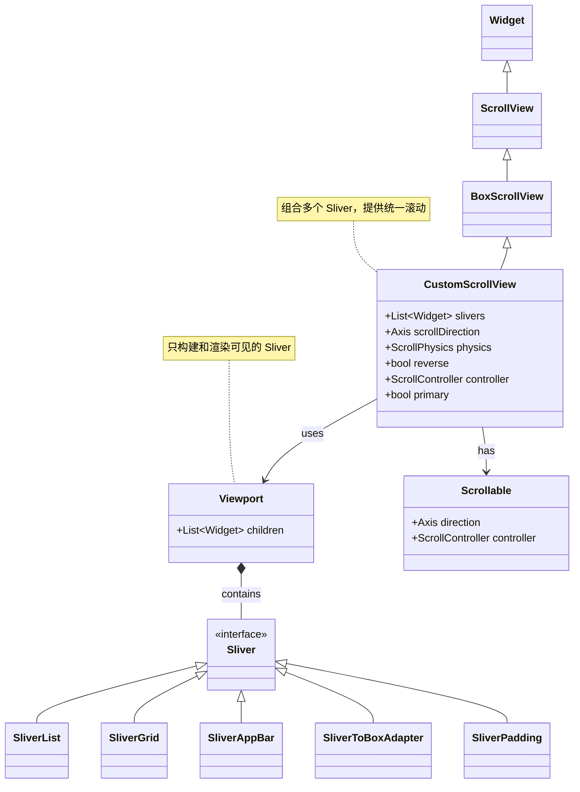
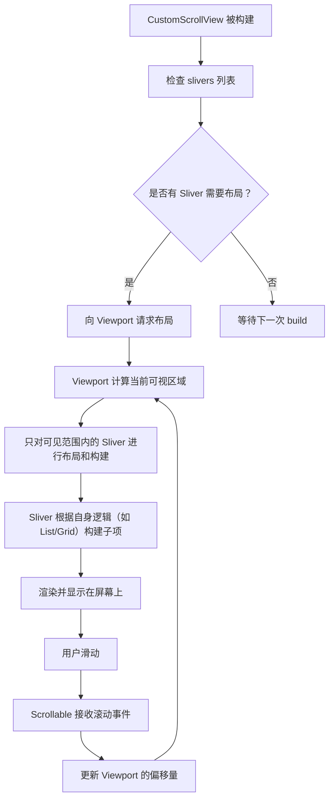
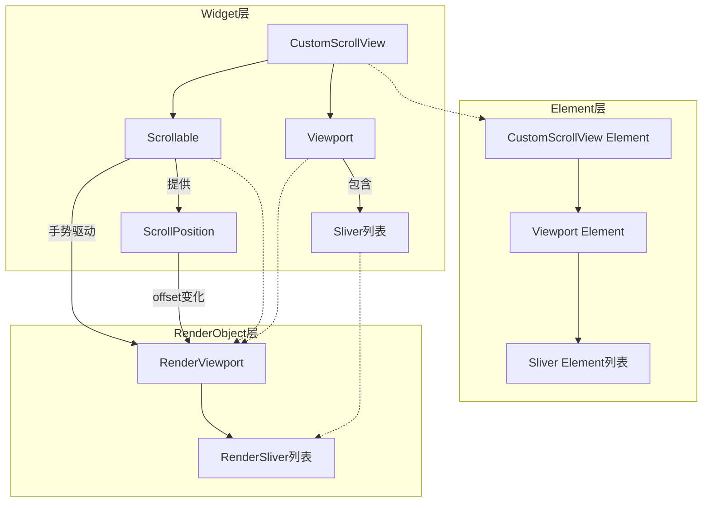
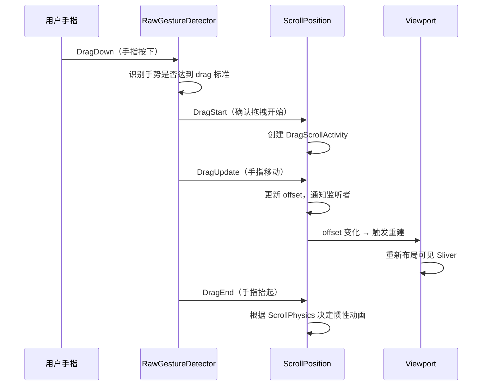
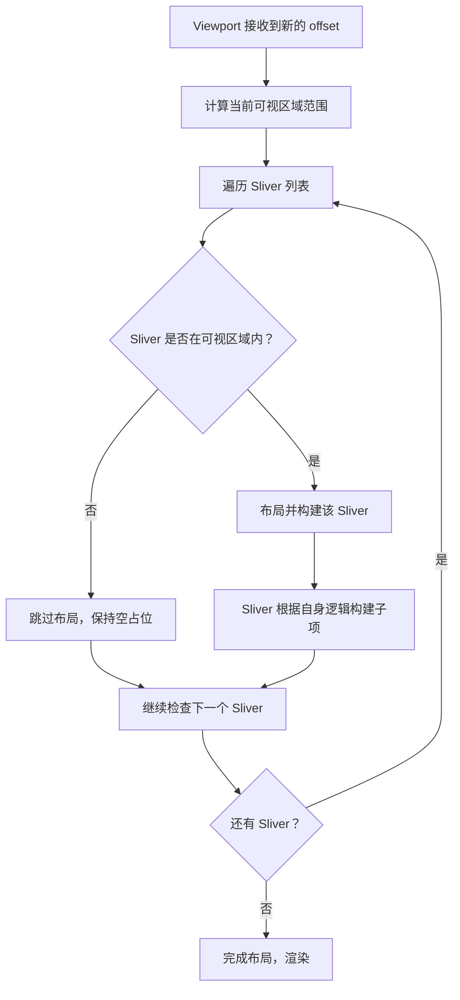

`CustomScrollView` 是 Flutter 中用于构建**复杂、高性能滚动布局**的核心组件。你可以把它想象成一个“超级容器”，它本身不直接绘制内容，而是通过接收一系列特殊的子组件——**Sliver（薄片/切片）**，并将它们的滚动行为统一管理，形成一个连贯的整体。

### 1. 架构设计：Sliver 机制

*   **核心概念**：`CustomScrollView` 是一个使用 **Sliver** 组件创建自定义滚动效果的滚动组件。Sliver 是专门为滚动布局设计的、可被高效构建和回收的 UI 片段。
*   **设计意图**：为什么我们需要它？当遇到 `ListView` 嵌套 `GridView` 这样的场景时，如果各自独立滚动，体验会很割裂。`CustomScrollView` 充当“胶水”的角色，它能将 `SliverList`、`SliverGrid`、`SliverAppBar` 等多个 Sliver “粘合”在一起，让它们共用同一个滚动容器，从而实现统一的滑动效果。

### 2. 类关系图（Mermaid）



### 3. 核心交互流程（Mermaid）

`CustomScrollView` 的内部工作流程如下：



### 4. 源码解析与核心参数

`CustomScrollView` 继承自 `BoxScrollView`，其核心是 `slivers` 属性。此属性接收一个 `Widget` 列表，但**这些 Widget 必须是 Sliver 类型**。

*   **`slivers` (`List<Widget>`)**：最重要的属性，包含多个 Sliver 组件。例如：
    *   `SliverList`：对应 `ListView`。
    *   `SliverGrid`：对应 `GridView`。
    *   `SliverAppBar`：可折叠的 Material Design 应用栏。
    *   `SliverToBoxAdapter`：**关键**，用于将普通的 `Widget`（如 `Container`、`Text`）嵌入到只能放置 Sliver 的列表中。
*   **`controller` (`ScrollController`)**：用于监听和控制滚动位置。如果 `primary` 为 `true`，则该属性不能设置，因为会使用 `PrimaryScrollController`。
*   **`physics` (`ScrollPhysics`)**：定义滚动特性，如回弹效果。常用的有 `BouncingScrollPhysics`（iOS 风格）和 `ClampingScrollPhysics`（Android 风格）。

### 5. 使用场景与示例

#### 场景一：组合 Grid 和 List（最常见的用法）

当页面头部是网格视图，底部是列表视图，且要求整体滑动时，这是最理想的解决方案。

```dart
CustomScrollView(
  slivers: <Widget>[
    // 1. 网格区域
    SliverGrid.count(
      crossAxisCount: 4,
      children: List.generate(8, (index) => Container(
        color: Colors.primaries[index % Colors.primaries.length],
        child: Center(child: Text('Grid $index')),
      )),
    ),
    // 2. 列表区域
    SliverList(
      delegate: SliverChildBuilderDelegate(
        (context, index) => ListTile(title: Text('List Item #$index')),
        childCount: 20,
      ),
    ),
  ],
)
```

#### 场景二：带折叠导航栏的页面

实现类似 App Store 或微信个人中心页面的效果：顶部是一个可以折叠、带有背景图的导航栏。

```dart
CustomScrollView(
  slivers: <Widget>[
    // 1. 可折叠的应用栏
    SliverAppBar(
      pinned: true, // 折叠后是否保留标题栏
      expandedHeight: 200,
      flexibleSpace: FlexibleSpaceBar(
        title: Text('我的主页'),
        background: Image.network('https://example.com/bg.jpg', fit: BoxFit.cover),
      ),
    ),
    // 2. 普通内容区域（使用 SliverToBoxAdapter 包裹）
    SliverToBoxAdapter(
      child: Container(
        height: 300,
        color: Colors.white,
        child: Center(child: Text('这里是普通内容')),
      ),
    ),
  ],
)
```

#### 场景三：嵌入普通 Widget

由于 `CustomScrollView` 只接受 Sliver，如果想把普通的 `Container`、`Text` 等组件放进去，必须用 `SliverToBoxAdapter` 包裹。

```dart
CustomScrollView(
  slivers: [
    SliverToBoxAdapter(
      child: Padding(
        padding: const EdgeInsets.all(16.0),
        child: Text('这是一个标题'),
      ),
    ),
    SliverList(...),
    SliverToBoxAdapter(
      child: ElevatedButton(onPressed: () {}, child: Text('底部按钮')),
    ),
  ],
)
```

### 6. 优缺点

| 优点                                                                                                                                        | 缺点                                                                                                                                                                                  |
| :------------------------------------------------------------------------------------------------------------------------------------------ | :------------------------------------------------------------------------------------------------------------------------------------------------------------------------------------ |
| **性能高效**：基于 Sliver 机制，`CustomScrollView` 只会构建和渲染可视区域内的元素，这与 `ListView.builder` 类似，非常适合长列表或复杂布局。 | **学习曲线陡峭**：需要理解 `Sliver`、`Viewport` 等底层概念，以及 `SliverList`、`SliverToBoxAdapter` 等多种组件的用法，入门有一定门槛。                                                |
| **高度灵活**：它可以无缝组合 `List`、`Grid`、`AppBar` 等完全不同类型的滚动组件，实现统一、连贯的滚动体验，这是常规 `ListView` 无法做到的。  | **调试相对复杂**：当布局出现问题时，由于涉及到 Sliver 的布局约束和滚动计算，调试起来可能比普通的 `Column` 或 `ListView` 更困难。                                                      |
| **官方推荐方案**：Flutter 官方文档明确推荐在处理复杂滚动布局（如可折叠导航栏）时使用 `CustomScrollView`。                                   | **代码结构变化大**：将现有 `ListView` 和 `GridView` 迁移到 `CustomScrollView`，需要将它们替换为对应的 `Sliver` 版本，并可能需要用 `SliverToBoxAdapter` 包装普通组件，改造工作量较大。 |

### 7. 常见坑与核心要点

1.  **不是所有 Widget 都能直接放**：`CustomScrollView` 的 `slivers` 属性**只接受 Sliver 组件**。直接把 `Container` 或 `Column` 放进去会报错。记住，必须用 `SliverToBoxAdapter` 或 `SliverFillRemaining` 等组件将它们“转译”成 Sliver。
2.  **区分 `ListView` 和 `SliverList`**：`ListView` 自己内部就包含了一个完整的滚动模型，它不能作为 `CustomScrollView` 的子项。你需要使用**没有独立滚动模型**的 `SliverList` 来替代它。
3.  **`SliverAppBar` 的核心属性**：实现折叠效果的关键是 `pinned`、`floating` 和 `expandedHeight`，以及提供 `flexibleSpace`（`flexibleSpace` 属性用于定义可伸缩的空间，通常配合 `FlexibleSpaceBar` 使用）。


# CustomScrollView 源码解析

## 1. 类定义与构造函数

CustomScrollView 继承自 `ScrollView`，其构造函数如下：

```dart
class CustomScrollView extends ScrollView {
  const CustomScrollView({
    super.key,
    super.scrollDirection = Axis.vertical,
    super.reverse = false,
    super.controller,
    super.primary,
    super.physics,
    super.scrollBehavior,
    super.shrinkWrap = false,
    super.center,
    super.anchor = 0.0,
    super.cacheExtent,
    this.slivers = const <Widget>[],
    super.semanticChildCount,
    super.dragStartBehavior = DragStartBehavior.start,
    super.keyboardDismissBehavior = ScrollViewKeyboardDismissBehavior.manual,
    super.restorationId,
    super.clipBehavior = Clip.hardEdge,
  });

  final List<Widget> slivers;

  @override
  List<Widget> buildSlivers(BuildContext context) => slivers;
}
```

**核心要点**：
- `slivers` 是唯一新增的属性，接收 Sliver 组件列表
- `buildSlivers` 方法直接返回 `slivers`，由父类 `ScrollView` 负责构建 `Viewport`
- 所有滚动相关的逻辑（手势、物理特性、滚动控制器）都由父类 `ScrollView` 和 `Scrollable` 提供

## 2. 三层架构（Widget / Element / RenderObject）

CustomScrollView 遵循 Flutter 标准的三层架构：



**分层职责**：

| 层级                | 职责                                                                 |
| ------------------- | -------------------------------------------------------------------- |
| **Widget 层**       | `Scrollable` 监听手势、计算偏移；`Viewport` 管理 Sliver 的布局和渲染 |
| **Element 层**      | `ViewportElement` 协调 Sliver 的构建和更新，执行 diff 策略           |
| **RenderObject 层** | `RenderViewport` 执行实际的布局计算和绘制，只构建可见区域的 Sliver   |

## 3. Scrollable 源码：手势与偏移计算

CustomScrollView 的滚动能力来自 `Scrollable` Widget。其 `build` 方法核心结构如下：

```dart
// Scrollable 的 build 方法（简化）
@override
Widget build(BuildContext context) {
  // 1. 创建 ScrollableScope，让子树可以定位到当前 Scrollable
  return ScrollableScope(
    scrollable: this,
    position: position,
    child: _ScrollableWithDetails(
      // 2. 用 RawGestureDetector 监听手势
      gestureDetector: RawGestureDetector(
        gestures: _gestureRecognizers,
        child: child,
      ),
      // 3. 传递滚动位置给子 Widget（即 Viewport）
      position: position,
    ),
  );
}
```

### 手势处理流程



### ScrollPosition 的核心作用

`ScrollPosition` 继承自 `ViewportOffset` 和 `ScrollMetrics`，是滚动状态的**数据源**：

```dart
abstract class ScrollPosition extends ViewportOffset with ScrollMetrics {
  // 当前滚动偏移量
  double get pixels;
  
  // 最小/最大滚动范围
  double get minScrollExtent;
  double get maxScrollExtent;
  
  // 跳转到指定位置（无动画）
  void jumpTo(double value);
  
  // 动画滚动到指定位置
  Future<void> animateTo(double to, {required Duration duration, required Curve curve});
}
```

- 作为 `ChangeNotifier`，offset 变化时会通知 `Viewport` 重建
- `ScrollActivity` 封装了不同滚动行为（拖拽、惯性、动画等）

## 4. ScrollPhysics：滚动物理特性

`ScrollPhysics` 决定滚动在不同边界场景下的表现：

| 方法                        | 作用                                                                              |
| --------------------------- | --------------------------------------------------------------------------------- |
| `applyPhysicsToUserOffset`  | 当用户滑到边界时，对偏移量施加阻尼效果                                            |
| `shouldAcceptUserOffset`    | 决定是否允许用户手势滑动（`NeverScrollableScrollPhysics` 返回 false）             |
| `applyBoundaryConditions`   | 边界矫正：`ClampingScrollPhysics` 不允许 overscroll，`BouncingScrollPhysics` 允许 |
| `createBallisticSimulation` | 用户抬起手指后的惯性/回弹动画方程                                                 |
| `recommendDeferredLoading`  | 快速 fling 时建议延迟加载非可见区域内容，提升性能                                 |

**组合机制**：`ScrollPhysics` 支持组合，传入 `parent` 即可叠加特性。例如 `BouncingScrollPhysics(parent: ClampingScrollPhysics())`。

## 5. Viewport：Sliver 的布局引擎

CustomScrollView 的 `buildSlivers` 返回 `slivers` 列表后，父类 `ScrollView` 会将这些 Sliver 传递给 `Viewport`：

```dart
// ScrollView.build（简化）
@override
Widget build(BuildContext context) {
  final slivers = buildSlivers(context);
  return ShrinkWrappingViewport(
    // 或 Viewport（当 shrinkWrap = false 时）
    offset: position,
    slivers: slivers,
  );
}
```

### Viewport 的懒加载机制



**核心优化**：Viewport 只对**可见区域内的 Sliver**执行布局和绘制，不可见的 Sliver 被跳过，这就是 Sliver 机制高性能的根本原因。

## 6. 关键源码注释

```dart
// 1. CustomScrollView: 将 slivers 直接传递给父类
@override
List<Widget> buildSlivers(BuildContext context) => slivers;

// 2. ScrollView: 构建 Viewport，传入 offset 和 slivers
Widget build(BuildContext context) {
  final slivers = buildSlivers(context);
  final viewport = Viewport(
    axisDirection: axisDirection,
    offset: position,
    slivers: slivers,
    cacheExtent: cacheExtent,
  );
  return scrollableBuilder(context, viewport);
}

// 3. Viewport: 核心布局逻辑（RenderViewport）
// 只布局 visible 范围内的 Sliver
// 通过 _childManager.estimateMaxScrollOffset 预估总高度
// 通过 _getLayoutOffset 计算每个 Sliver 的偏移位置
// 通过 _attemptLayout 执行实际布局
```

## 7. 重要 Caveat：Sliver 嵌套 Scrollable 的冲突

如果 CustomScrollView 的某个 Sliver 内部包含**同方向**的完整可滚动组件（如垂直方向嵌套垂直 ListView），会导致滚动事件冲突。

```dart
// ❌ 错误：垂直 CustomScrollView 内嵌垂直 ListView
CustomScrollView(
  slivers: [
    SliverToBoxAdapter(
      child: ListView.builder(...), // 同方向，事件冲突
    ),
  ],
)

// ✅ 正确：使用 SliverList 替代
CustomScrollView(
  slivers: [
    SliverList(delegate: ...), // 不是独立 Scrollable
  ],
)

// ✅ 或使用 NestedScrollView 处理嵌套滚动
NestedScrollView(
  headerSliverBuilder: ...,
  body: ListView.builder(...),
)
```

## 8. Sliver 组件一览

| Sliver 名称              | 对应组件                      | 说明                        |
| ------------------------ | ----------------------------- | --------------------------- |
| `SliverList`             | `ListView`                    | 列表                        |
| `SliverFixedExtentList`  | `ListView`（指定 itemExtent） | 固定高度列表                |
| `SliverGrid`             | `GridView`                    | 网格                        |
| `SliverAppBar`           | `AppBar`                      | 可折叠应用栏                |
| `SliverPadding`          | `Padding`                     | 内边距装饰                  |
| `SliverToBoxAdapter`     | -                             | 将普通 Widget 适配为 Sliver |
| `SliverPersistentHeader` | -                             | 滑动到顶部时固定            |
| `SliverFillRemaining`    | -                             | 填充剩余空间                |

## 9. 总结：源码设计精髓

1. **组合优于继承**：CustomScrollView 通过组合 `Scrollable` + `Viewport` 实现滚动能力，自身只负责提供 `slivers` 列表

2. **数据驱动渲染**：`ScrollPosition` 作为唯一数据源，变化时驱动 Viewport 重建，形成单向数据流

3. **懒加载优化**：`RenderViewport` 只布局可见 Sliver，未进入可视区域的 Sliver 不参与布局，实现高性能滚动

4. **职责分离**：手势 → `Scrollable`，偏移计算 → `ScrollPosition`，边界反馈 → `ScrollPhysics`，布局渲染 → `Viewport/RenderViewport`，各司其职，高内聚低耦合

> **注意**：本文源码解析基于 Flutter SDK 的公开 API 和架构分析，具体源码实现可能随版本更新。如需查看最新源码，请参考 Flutter 官方 GitHub 仓库。