好的！遵照您提供的详细模板，我将逐个深入讲解 Flutter 的 6 个核心动画组件/机制：`AnimatedContainer`、`AnimatedOpacity`、`AnimatedPositioned`、`AnimatedBuilder`、`AnimatedList` 和 `Hero`。

---

# 1. AnimatedContainer

`AnimatedContainer` 是 `Container` 的动画版本。当它的属性（如宽高、颜色、边距、装饰等）发生变化时，它会在一段时间内自动将属性从旧值过渡到新值，而无需手动管理 `AnimationController`。

---

## 1. 架构设计

- **Widget 定位**：`AnimatedContainer` 是一个 **StatefulWidget**，是 **隐式动画**（Implicit Animation）的典型代表。它继承自 `ImplicitlyAnimatedWidget`，自动处理动画的启动和执行。
- **组合关系**：`AnimatedContainer` 在 `build()` 方法中组合了一个普通的 `Container`，通过 `AnimatedWidget` 机制将动画值传递给 `Container` 的属性。
- **类继承关系**：
  `Widget` → `StatefulWidget` → `ImplicitlyAnimatedWidget` → `AnimatedContainer`

- **设计意图**：
  1. **降低动画门槛**：开发者无需创建 `AnimationController`、`Animation`、`Ticker` 等对象，只需改变属性值即可触发动画。
  2. **声明式动画**：完全符合 Flutter 的声明式 UI 范式——"描述 UI 应该是什么样子，框架自动处理变化过程"。
  3. **封装复杂性**：将 `AnimationController` 的生命周期管理（创建、启动、销毁）封装在内部。

---

## 2. 类关系图

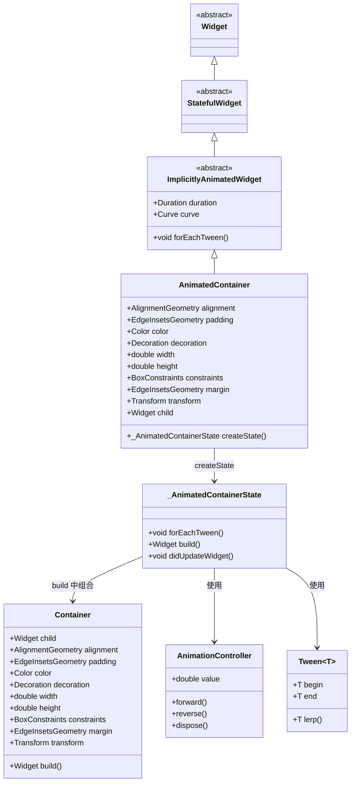

---

## 3. 流程图

### 属性变化触发动画流程

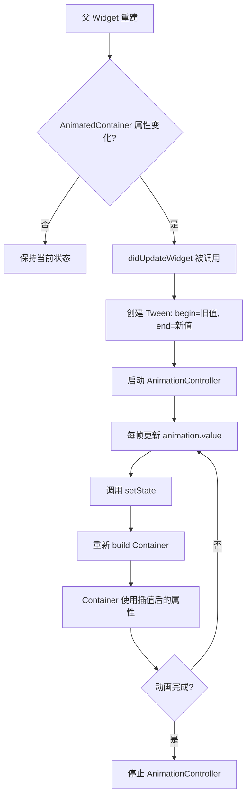

### 包裹层级图

```
┌─────────────────────────────────────────────────────┐
│                 AnimatedContainer                   │
│  ┌───────────────────────────────────────────────┐  │
│  │              Semantics (可选)                 │  │
│  │  ┌─────────────────────────────────────────┐  │  │
│  │  │              Container                  │  │  │
│  │  │  ┌───────────────────────────────────┐  │  │  │
│  │  │  │      child (用户传入的子组件)     │  │  │  │
│  │  │  └───────────────────────────────────┘  │  │  │
│  │  └─────────────────────────────────────────┘  │  │
│  └───────────────────────────────────────────────┘  │
└─────────────────────────────────────────────────────┘
```

> `AnimatedContainer` 内部组合了一个 `Container`，所有动画属性都应用到该 `Container` 上。

---

## 4. 源码解析

### 核心实现

```dart
// flutter/packages/flutter/lib/src/widgets/implicit_animations.dart (简化)
class AnimatedContainer extends ImplicitlyAnimatedWidget {
  const AnimatedContainer({
    super.key,
    this.alignment,
    this.padding,
    this.color,
    this.decoration,
    this.width,
    this.height,
    this.constraints,
    this.margin,
    this.transform,
    this.child,
    required super.duration,
    super.curve = Curves.linear,
    super.onEnd,
  });

  // ... 所有 Container 的属性

  @override
  _AnimatedContainerState createState() => _AnimatedContainerState();
}

class _AnimatedContainerState extends AnimatedWidgetBaseState<AnimatedContainer> {
  // 每个可动画属性对应一个 Tween
  AlignmentGeometryTween? _alignment;
  EdgeInsetsGeometryTween? _padding;
  ColorTween? _color;
  DecorationTween? _decoration;
  Tween<double>? _width;
  Tween<double>? _height;
  BoxConstraintsTween? _constraints;
  EdgeInsetsGeometryTween? _margin;
  TransformTween? _transform;

  @override
  void forEachTween(TweenVisitor<dynamic> visitor) {
    // 核心：遍历所有可动画属性，创建或更新 Tween
    _alignment = visitor(_alignment, widget.alignment, (dynamic value) {
      return AlignmentGeometryTween(begin: value as AlignmentGeometry?);
    }) as AlignmentGeometryTween?;
    
    _color = visitor(_color, widget.color, (dynamic value) {
      return ColorTween(begin: value as Color?);
    }) as ColorTween?;
    
    _width = visitor(_width, widget.width, (dynamic value) {
      return Tween<double>(begin: value as double?);
    }) as Tween<double>?;
    
    // ... 其他属性类似
  }

  @override
  Widget build(BuildContext context) {
    // 使用 Tween 的当前值构建 Container
    return Container(
      alignment: _alignment?.evaluate(animation),
      padding: _padding?.evaluate(animation),
      color: _color?.evaluate(animation),
      decoration: _decoration?.evaluate(animation),
      width: _width?.evaluate(animation),
      height: _height?.evaluate(animation),
      constraints: _constraints?.evaluate(animation),
      margin: _margin?.evaluate(animation),
      transform: _transform?.evaluate(animation),
      child: widget.child,
    );
  }
}
```

---

## 5. 使用场景

### 1. 基础：宽高和颜色同时变化

```dart
class BasicAnimatedContainer extends StatefulWidget {
  @override
  State<BasicAnimatedContainer> createState() => _BasicAnimatedContainerState();
}

class _BasicAnimatedContainerState extends State<BasicAnimatedContainer> {
  bool _isExpanded = false;

  @override
  Widget build(BuildContext context) {
    return Column(
      children: [
        AnimatedContainer(
          width: _isExpanded ? 200 : 100,
          height: _isExpanded ? 200 : 100,
          color: _isExpanded ? Colors.blue : Colors.red,
          duration: const Duration(milliseconds: 500),
          curve: Curves.easeInOut,
          child: Center(
            child: Text(_isExpanded ? '展开' : '折叠'),
          ),
        ),
        ElevatedButton(
          onPressed: () {
            setState(() => _isExpanded = !_isExpanded);
          },
          child: const Text('切换'),
        ),
      ],
    );
  }
}
```

### 2. 圆角边框过渡

```dart
AnimatedContainer(
  width: 200,
  height: 100,
  decoration: BoxDecoration(
    color: _isActive ? Colors.green : Colors.grey,
    borderRadius: BorderRadius.circular(_isActive ? 20 : 0),
    border: Border.all(
      color: _isActive ? Colors.darkGreen : Colors.grey,
      width: _isActive ? 4 : 1,
    ),
  ),
  duration: const Duration(milliseconds: 400),
  child: const Center(child: Text('状态')),
)
```

### 3. 内边距动画（内容平滑移动）

```dart
AnimatedContainer(
  padding: EdgeInsets.all(_isExpanded ? 40 : 8),
  decoration: BoxDecoration(
    color: Colors.blue[100],
    borderRadius: BorderRadius.circular(12),
  ),
  duration: const Duration(milliseconds: 500),
  child: const Text('内容会平滑移动'),
)
```

### 4. 对齐方式动画

```dart
AnimatedContainer(
  width: 200,
  height: 200,
  color: Colors.amber,
  alignment: _isTopLeft ? Alignment.topLeft : Alignment.bottomRight,
  duration: const Duration(milliseconds: 600),
  child: Container(
    width: 40,
    height: 40,
    color: Colors.red,
  ),
)
```

---

## 6. 优缺点

| 优点                                                                       | 缺点                                                                       |
| :------------------------------------------------------------------------- | :------------------------------------------------------------------------- |
| **极简 API**：只需改变属性值即可触发动画，无需管理 `AnimationController`。 | **不支持复杂动画**：无法同时控制多个属性的独立动画曲线或延迟。             |
| **自动管理生命周期**：内部自动处理 `AnimationController` 的创建和销毁。    | **属性变化无感知**：无法在动画过程中对属性变化做出响应（如判断动画方向）。 |
| **支持所有 Container 属性**：与 `Container` API 完全兼容，学习成本低。     | **性能开销**：每次属性变化都会重建整个 `Container` 树。                    |
| **声明式编程**：完全符合 Flutter 的 UI = f(state) 范式。                   | **无法精细控制**：无法暂停、反转或跳转到特定进度。                         |

---

## 7. 常见坑

### 坑 1：同时设置 color 和 decoration 导致冲突

**❌ 错误代码**：
```dart
AnimatedContainer(
  color: Colors.blue,  // ❌ 与 decoration 冲突
  decoration: BoxDecoration(
    borderRadius: BorderRadius.circular(12),
  ),
  duration: const Duration(milliseconds: 300),
)
```

**问题分析**：`Container` 的 `color` 实际上是 `decoration` 的简写，同时设置两者会报错。

**✅ 正确代码**：
```dart
AnimatedContainer(
  decoration: BoxDecoration(
    color: Colors.blue,  // 颜色放在 decoration 中
    borderRadius: BorderRadius.circular(12),
  ),
  duration: const Duration(milliseconds: 300),
)
```

### 坑 2：忘记在 setState 中更新属性

**❌ 错误代码**：
```dart
void _toggle() {
  _isExpanded = !_isExpanded; // ❌ 没有 setState，UI 不会更新
}
```

**✅ 正确代码**：
```dart
void _toggle() {
  setState(() {
    _isExpanded = !_isExpanded;
  });
}
```

### 坑 3：curve 设置不当导致动画不自然

**❌ 错误代码**：
```dart
AnimatedContainer(
  curve: Curves.linear, // 机械感强，不自然
  duration: const Duration(milliseconds: 300),
  // ...
)
```

**✅ 正确代码**：
```dart
AnimatedContainer(
  curve: Curves.easeInOut, // 更自然的缓动曲线
  duration: const Duration(milliseconds: 300),
  // ...
)
```

---

## 8. 性能优化

### 1. 使用 const 构造函数（当属性固定时）

```dart
const AnimatedContainer(
  duration: Duration(milliseconds: 300),
  child: Text('固定内容'),
)
```

### 2. 避免频繁重建

如果 `AnimatedContainer` 的 `child` 是复杂 Widget，考虑将其提取为独立 Widget：

```dart
AnimatedContainer(
  duration: const Duration(milliseconds: 300),
  child: const ComplexChildWidget(), // 提取为 const
)
```

### 3. 使用 RepaintBoundary 隔离

如果 `AnimatedContainer` 在动画过程中导致父 Widget 频繁重建，使用 `RepaintBoundary` 隔离：

```dart
RepaintBoundary(
  child: AnimatedContainer(
    // ...
  ),
)
```

---

# 2. AnimatedOpacity

`AnimatedOpacity` 当其 `opacity` 属性发生变化时，会让其子 Widget 平滑地渐隐或渐显。

---

## 1. 架构设计

- **Widget 定位**：`AnimatedOpacity` 是一个 **StatefulWidget**，属于隐式动画组件，继承自 `ImplicitlyAnimatedWidget`。它内部组合了一个 `Opacity` Widget，并将动画值传递给其 `opacity` 参数。

- **类继承关系**：
  `Widget` → `StatefulWidget` → `ImplicitlyAnimatedWidget` → `AnimatedOpacity`

- **设计意图**：
  1. **透明度动画封装**：将 `Opacity` 与 `AnimationController` 组合，实现透明度自动过渡。
  2. **视觉反馈**：用于 UI 元素的出现、消失、淡入淡出等场景。

---

## 2. 类关系图

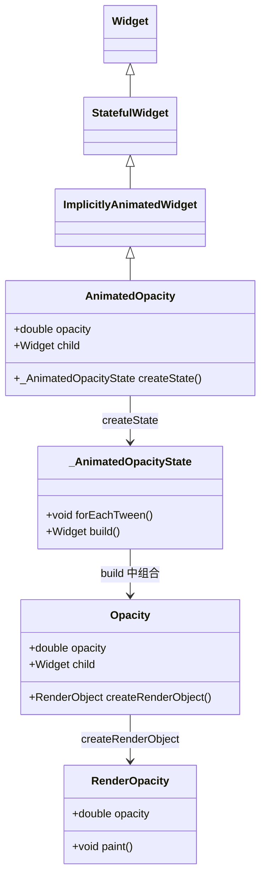

---

## 3. 流程图

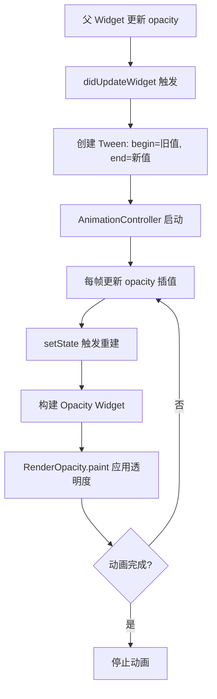

### 包裹层级图

```
┌─────────────────────────────────────────────────────┐
│                AnimatedOpacity                      │
│  ┌───────────────────────────────────────────────┐  │
│  │              Opacity                          │  │
│  │  ┌─────────────────────────────────────────┐  │  │
│  │  │           child (子组件)                │  │  │
│  │  └─────────────────────────────────────────┘  │  │
│  └───────────────────────────────────────────────┘  │
└─────────────────────────────────────────────────────┘
```

---

## 4. 源码解析

```dart
// flutter/packages/flutter/lib/src/widgets/implicit_animations.dart
class AnimatedOpacity extends ImplicitlyAnimatedWidget {
  const AnimatedOpacity({
    super.key,
    required this.opacity,
    required this.child,
    required super.duration,
    super.curve = Curves.linear,
    super.onEnd,
  });

  final double opacity;
  final Widget child;

  @override
  _AnimatedOpacityState createState() => _AnimatedOpacityState();
}

class _AnimatedOpacityState extends AnimatedWidgetBaseState<AnimatedOpacity> {
  Tween<double>? _opacity;

  @override
  void forEachTween(TweenVisitor<dynamic> visitor) {
    _opacity = visitor(_opacity, widget.opacity, (dynamic value) {
      return Tween<double>(begin: value as double);
    }) as Tween<double>?;
  }

  @override
  Widget build(BuildContext context) {
    return Opacity(
      opacity: _opacity?.evaluate(animation) ?? widget.opacity,
      child: widget.child,
    );
  }
}
```

---

## 5. 使用场景

### 1. 页面切换淡入淡出

```dart
class AnimatedOpacityExample extends StatefulWidget {
  @override
  State<AnimatedOpacityExample> createState() => _AnimatedOpacityExampleState();
}

class _AnimatedOpacityExampleState extends State<AnimatedOpacityExample> {
  bool _isVisible = true;

  @override
  Widget build(BuildContext context) {
    return Column(
      children: [
        AnimatedOpacity(
          opacity: _isVisible ? 1.0 : 0.0,
          duration: const Duration(milliseconds: 500),
          curve: Curves.easeInOut,
          child: Container(
            width: 200,
            height: 200,
            color: Colors.blue,
            child: const Center(child: Text('内容')),
          ),
        ),
        ElevatedButton(
          onPressed: () {
            setState(() => _isVisible = !_isVisible);
          },
          child: Text(_isVisible ? '隐藏' : '显示'),
        ),
      ],
    );
  }
}
```

### 2. 值从 0 到 1 的渐显

```dart
@override
void initState() {
  super.initState();
  Future.delayed(const Duration(milliseconds: 300), () {
    setState(() => _opacity = 1.0);
  });
}

AnimatedOpacity(
  opacity: _opacity,
  duration: const Duration(milliseconds: 400),
  child: const Text('淡入显示'),
)
```

### 3. 列表项入场动画

```dart
AnimatedOpacity(
  opacity: _isVisible ? 1.0 : 0.0,
  duration: const Duration(milliseconds: 400 + index * 50), // 每个延迟不同
  child: ListTile(
    title: Text('Item $index'),
  ),
)
```

### 4. 与 Visibility 的对比

```dart
// ❌ 不推荐：Visibility 直接移出/移入，无过渡
Visibility(
  visible: _show,
  child: Container(color: Colors.blue),
)

// ✅ 推荐：AnimatedOpacity 有平滑过渡
AnimatedOpacity(
  opacity: _show ? 1.0 : 0.0,
  duration: const Duration(milliseconds: 300),
  child: Container(color: Colors.blue),
)
```

---

## 6. 优缺点

| 优点                                                                     | 缺点                                                                        |
| :----------------------------------------------------------------------- | :-------------------------------------------------------------------------- |
| **极简 API**：只需改变 `opacity` 值即可触发动画。                        | **子 Widget 始终在树中**：即使 `opacity: 0`，子 Widget 仍会参与布局和绘制。 |
| **性能优秀**：`RenderOpacity` 直接操作 Canvas 透明度，无需重绘整个子树。 | **无法真正"移除"子 Widget**：`opacity: 0` 时子 Widget 仍占空间。            |
| **支持所有常用曲线**：通过 `curve` 参数轻松控制动画节奏。                | **不支持逐帧控制**：无法在动画过程中动态修改目标值。                        |

---

## 7. 常见坑

### 坑 1：opacity 为 0 时子 Widget 仍响应点击

**❌ 错误代码**：
```dart
AnimatedOpacity(
  opacity: 0.0,
  child: ElevatedButton(
    onPressed: () => print('点击'), // ❌ 仍然可点击
    child: const Text('按钮'),
  ),
)
```

**✅ 正确代码**：
```dart
AnimatedOpacity(
  opacity: _isVisible ? 1.0 : 0.0,
  child: IgnorePointer(
    ignoring: !_isVisible, // 透明度为 0 时禁用交互
    child: ElevatedButton(...),
  ),
)
```

### 坑 2：duration 为 0 导致无动画效果

**❌ 错误代码**：
```dart
AnimatedOpacity(
  duration: Duration.zero, // ❌ 瞬间变化，无动画
  opacity: _isVisible ? 1.0 : 0.0,
  child: ...,
)
```

**✅ 正确代码**：
```dart
AnimatedOpacity(
  duration: const Duration(milliseconds: 300),
  opacity: _isVisible ? 1.0 : 0.0,
  child: ...,
)
```

---

## 8. 性能优化

### 1. 使用 RepaintBoundary 隔离

如果 `AnimatedOpacity` 的子树很大，使用 `RepaintBoundary` 避免重绘传播：

```dart
AnimatedOpacity(
  opacity: _opacity,
  duration: const Duration(milliseconds: 300),
  child: RepaintBoundary(
    child: ComplexWidget(),
  ),
)
```

### 2. 对静态子 Widget 使用 const

```dart
AnimatedOpacity(
  opacity: _opacity,
  duration: const Duration(milliseconds: 300),
  child: const Text('固定文本'), // const 减少重建
)
```

---

# 3. AnimatedPositioned

`AnimatedPositioned` 是 `Positioned` 的动画版本。当 `Positioned` 的 `left`、`top`、`right`、`bottom`、`width`、`height` 等属性变化时，子 Widget 会平滑地移动到新位置。

---

## 1. 架构设计

- **Widget 定位**：`AnimatedPositioned` 是一个 **StatefulWidget**，是隐式动画组件，必须作为 `Stack` 的子 Widget 使用。它内部组合了一个 `Positioned` Widget。

- **类继承关系**：
  `Widget` → `StatefulWidget` → `ImplicitlyAnimatedWidget` → `AnimatedPositioned`

- **设计意图**：
  1. **位置动画封装**：让 `Stack` 中的子 Widget 能够平滑移动。
  2. **精准定位**：与 `Positioned` 一样，通过矩形定位属性精确控制位置。

---

## 2. 类关系图

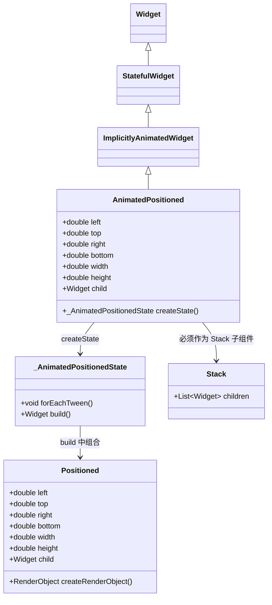

---

## 3. 流程图

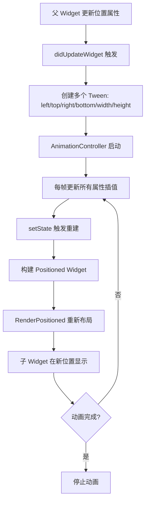

---

## 4. 源码解析

```dart
// flutter/packages/flutter/lib/src/widgets/implicit_animations.dart
class AnimatedPositioned extends ImplicitlyAnimatedWidget {
  const AnimatedPositioned({
    super.key,
    this.left,
    this.top,
    this.right,
    this.bottom,
    this.width,
    this.height,
    required this.child,
    required super.duration,
    super.curve = Curves.linear,
    super.onEnd,
  });

  final double? left;
  final double? top;
  final double? right;
  final double? bottom;
  final double? width;
  final double? height;
  final Widget child;

  @override
  _AnimatedPositionedState createState() => _AnimatedPositionedState();
}

class _AnimatedPositionedState extends AnimatedWidgetBaseState<AnimatedPositioned> {
  Tween<double>? _left;
  Tween<double>? _top;
  Tween<double>? _right;
  Tween<double>? _bottom;
  Tween<double>? _width;
  Tween<double>? _height;

  @override
  void forEachTween(TweenVisitor<dynamic> visitor) {
    _left = visitor(_left, widget.left, (dynamic value) {
      return Tween<double>(begin: value as double?);
    }) as Tween<double>?;
    // ... 其他属性类似
  }

  @override
  Widget build(BuildContext context) {
    return Positioned(
      left: _left?.evaluate(animation),
      top: _top?.evaluate(animation),
      right: _right?.evaluate(animation),
      bottom: _bottom?.evaluate(animation),
      width: _width?.evaluate(animation),
      height: _height?.evaluate(animation),
      child: widget.child,
    );
  }
}
```

---

## 5. 使用场景

### 1. 基础：水平移动

```dart
class AnimatedPositionedExample extends StatefulWidget {
  @override
  State<AnimatedPositionedExample> createState() => _AnimatedPositionedExampleState();
}

class _AnimatedPositionedExampleState extends State<AnimatedPositionedExample> {
  double _position = 0;

  @override
  Widget build(BuildContext context) {
    return Column(
      children: [
        SizedBox(
          width: 300,
          height: 200,
          child: Stack(
            children: [
              AnimatedPositioned(
                left: _position,
                top: 50,
                duration: const Duration(milliseconds: 500),
                curve: Curves.easeInOut,
                child: Container(
                  width: 50,
                  height: 50,
                  color: Colors.blue,
                ),
              ),
            ],
          ),
        ),
        Slider(
          value: _position,
          onChanged: (value) {
            setState(() => _position = value);
          },
          min: 0,
          max: 250,
        ),
      ],
    );
  }
}
```

### 2. 从屏幕外滑入

```dart
AnimatedPositioned(
  left: _isVisible ? 0 : -200, // 从左侧外滑入
  top: 100,
  duration: const Duration(milliseconds: 500),
  child: Container(
    width: 200,
    height: 100,
    color: Colors.green,
    child: const Center(child: Text('滑入')),
  ),
)
```

### 3. 动画到指定区域（配合 GestureDetector）

```dart
AnimatedPositioned(
  left: _isExpanded ? 50 : 100,
  top: _isExpanded ? 50 : 100,
  width: _isExpanded ? 200 : 100,
  height: _isExpanded ? 200 : 100,
  duration: const Duration(milliseconds: 400),
  child: GestureDetector(
    onTap: () => setState(() => _isExpanded = !_isExpanded),
    child: Container(
      color: Colors.amber,
      child: Center(child: Text(_isExpanded ? '缩小' : '放大')),
    ),
  ),
)
```

### 4. 卡片展开动画

```dart
AnimatedPositioned(
  left: _isExpanded ? 20 : 80,
  right: _isExpanded ? 20 : 80,
  top: _isExpanded ? 50 : 100,
  bottom: _isExpanded ? 50 : 200,
  duration: const Duration(milliseconds: 500),
  child: Card(
    child: Padding(
      padding: const EdgeInsets.all(16),
      child: Column(
        children: [
          Text('标题', style: TextStyle(fontSize: _isExpanded ? 24 : 16)),
          if (_isExpanded) const Text('展开后的更多内容...'),
        ],
      ),
    ),
  ),
)
```

### 5. 与其他 Animated 组件组合

```dart
Stack(
  children: [
    AnimatedPositioned(
      left: _positionX,
      top: _positionY,
      duration: const Duration(milliseconds: 500),
      child: AnimatedOpacity(
        opacity: _isVisible ? 1.0 : 0.0,
        duration: const Duration(milliseconds: 300),
        child: Container(
          width: 80,
          height: 80,
          color: Colors.red,
        ),
      ),
    ),
  ],
)
```

---

## 6. 优缺点

| 优点                                                                | 缺点                                                   |
| :------------------------------------------------------------------ | :----------------------------------------------------- |
| **流畅的位置动画**：自动插值 `left`/`top`/`right`/`bottom` 等属性。 | **必须作为 Stack 子组件**：无法独立使用。              |
| **支持多维同时动画**：位置和尺寸可同时变化。                        | **不支持相对定位**：只能使用 `Positioned` 的矩形定位。 |
| **API 简洁**：与 `Positioned` 完全兼容，学习成本低。                | **性能开销**：每次动画都会触发 `Stack` 的重新布局。    |

---

## 7. 常见坑

### 坑 1：在非 Stack 中使用 AnimatedPositioned

**❌ 错误代码**：
```dart
Column(
  children: [
    AnimatedPositioned( // ❌ 必须在 Stack 中
      left: 10,
      child: Text('错误'),
    ),
  ],
)
```

**✅ 正确代码**：
```dart
Stack(
  children: [
    AnimatedPositioned(
      left: 10,
      child: Text('正确'),
    ),
  ],
)
```

### 坑 2：同时设置 left/right 或 top/bottom 冲突

**❌ 错误代码**：
```dart
AnimatedPositioned(
  left: 10,
  right: 20, // ❌ 同时设置 left 和 right 可能产生冲突
  child: ...,
)
```

**✅ 正确代码**：
```dart
// 使用 left + width 或 right + width
AnimatedPositioned(
  left: 10,
  width: 200,
  child: ...,
)
```

---

## 8. 性能优化

### 1. 使用 RepaintBoundary

```dart
RepaintBoundary(
  child: AnimatedPositioned(
    // ...
  ),
)
```

### 2. 避免不必要的属性变化

只变化需要动画的属性，其他属性保持固定，减少 Tween 创建开销。

---

# 4. AnimatedBuilder

`AnimatedBuilder` 是一个通用的动画构建器，用于将动画逻辑与 UI 代码分离，实现复杂的自定义动画效果。它是显式动画的核心工具。

---

## 1. 架构设计

- **Widget 定位**：`AnimatedBuilder` 是一个 **StatelessWidget**，是一个通用的辅助组件，本身不产生动画，而是监听一个 `Listenable`（通常是 `Animation`）并在其变化时重建子 Widget。

- **类继承关系**：
  `Widget` → `StatelessWidget` → `AnimatedBuilder`

- **设计意图**：
  1. **关注点分离**：将动画逻辑（`AnimationController`、`Tween`）与 UI 代码分离。
  2. **性能优化**：只重建需要动画的部分，而非整个 Widget 树。
  3. **复用性**：同一个动画逻辑可应用于不同的 UI 结构。

---

## 2. 类关系图

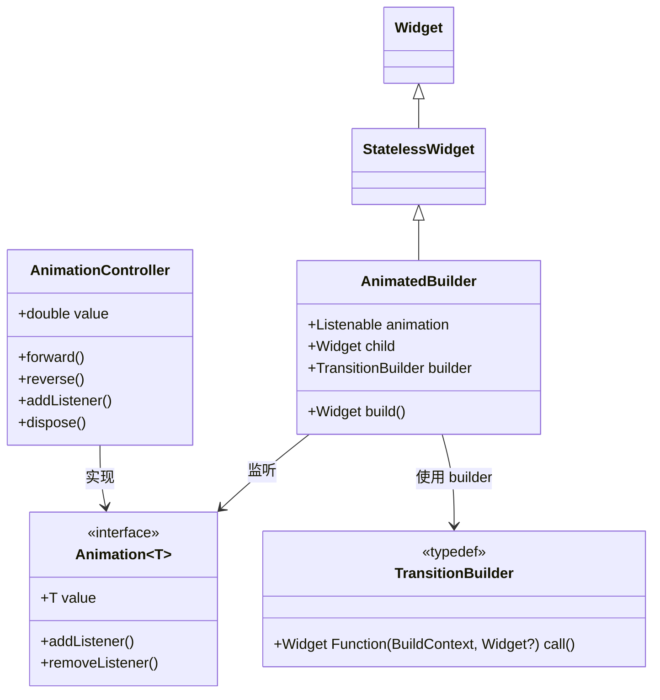

---

## 3. 流程图

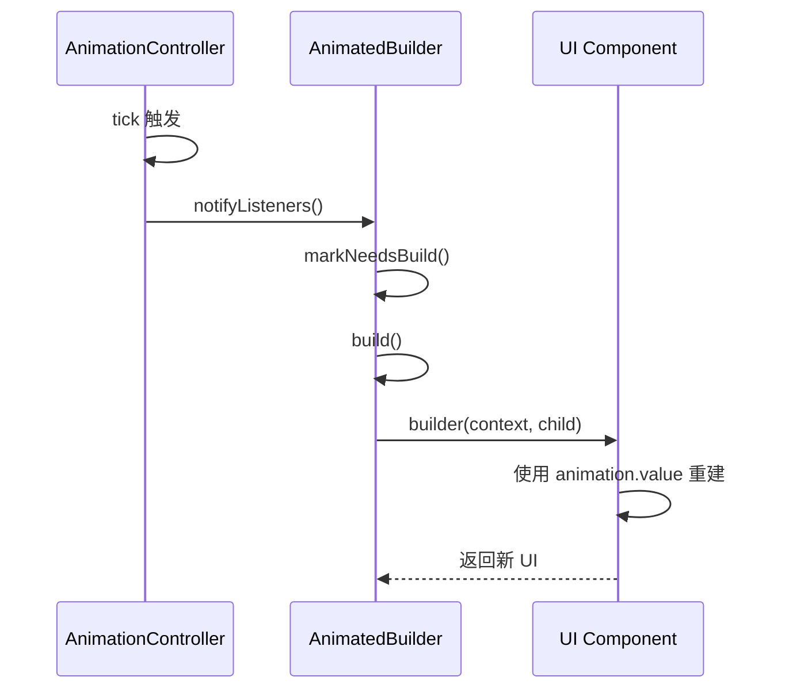

### 包裹层级图

```
┌─────────────────────────────────────────────────────┐
│                 AnimatedBuilder                     │
│  ┌───────────────────────────────────────────────┐  │
│  │               child (可选)                     │  │
│  │  ┌─────────────────────────────────────────┐  │  │
│  │  │        builder 构建的 UI                │  │  │
│  │  └─────────────────────────────────────────┘  │  │
│  └───────────────────────────────────────────────┘  │
└─────────────────────────────────────────────────────┘
```

---

## 4. 源码解析

```dart
// flutter/packages/flutter/lib/src/widgets/transitions.dart
class AnimatedBuilder extends StatelessWidget {
  const AnimatedBuilder({
    super.key,
    required this.animation,
    required this.builder,
    this.child,
  });

  final Listenable animation;
  final TransitionBuilder builder;
  final Widget? child;

  @override
  Widget build(BuildContext context) {
    return _AnimatedBuilderState(
      animation: animation,
      builder: builder,
      child: child,
    );
  }
}

// 内部状态管理：监听 animation 变化
class _AnimatedBuilderState extends State<AnimatedBuilder> {
  @override
  void initState() {
    super.initState();
    widget.animation.addListener(_handleChange);
  }

  @override
  void didUpdateWidget(AnimatedBuilder oldWidget) {
    super.didUpdateWidget(oldWidget);
    if (oldWidget.animation != widget.animation) {
      oldWidget.animation.removeListener(_handleChange);
      widget.animation.addListener(_handleChange);
    }
  }

  void _handleChange() {
    setState(() {}); // 触发重建
  }

  @override
  Widget build(BuildContext context) {
    return widget.builder(context, widget.child);
  }

  @override
  void dispose() {
    widget.animation.removeListener(_handleChange);
    super.dispose();
  }
}
```

---

## 5. 使用场景

### 1. 基础：旋转动画

```dart
class RotationExample extends StatefulWidget {
  @override
  State<RotationExample> createState() => _RotationExampleState();
}

class _RotationExampleState extends State<RotationExample>
    with SingleTickerProviderStateMixin {
  late final AnimationController _controller;
  late final Animation<double> _rotation;

  @override
  void initState() {
    super.initState();
    _controller = AnimationController(
      vsync: this,
      duration: const Duration(seconds: 2),
    )..repeat();

    _rotation = Tween<double>(begin: 0, end: 2 * 3.14159).animate(_controller);
  }

  @override
  Widget build(BuildContext context) {
    return AnimatedBuilder(
      animation: _rotation,
      builder: (context, child) {
        return Transform.rotate(
          angle: _rotation.value,
          child: Container(
            width: 100,
            height: 100,
            color: Colors.blue,
          ),
        );
      },
    );
  }

  @override
  void dispose() {
    _controller.dispose();
    super.dispose();
  }
}
```

### 2. 使用 child 参数优化性能

```dart
// child 参数中的 Widget 不会重建，只有 builder 中的会重建
AnimatedBuilder(
  animation: _controller,
  child: const Text('我不动'), // 静态部分
  builder: (context, child) {
    return Stack(
      children: [
        child!, // 复用静态子组件
        Positioned(
          left: _controller.value * 200,
          child: Container(color: Colors.red, width: 50, height: 50),
        ),
      ],
    );
  },
)
```

### 3. 颜色渐变动画

```dart
final Animation<Color> _colorTween = ColorTween(
  begin: Colors.blue,
  end: Colors.red,
).animate(_controller);

AnimatedBuilder(
  animation: _colorTween,
  builder: (context, child) {
    return Container(
      color: _colorTween.value,
      width: 200,
      height: 200,
    );
  },
)
```

### 4. 复杂组合动画

```dart
final Animation<double> _size = _controller.drive(
  Tween<double>(begin: 100, end: 200),
);

final Animation<Color> _color = _controller.drive(
  ColorTween(begin: Colors.blue, end: Colors.red),
);

AnimatedBuilder(
  animation: _controller,
  builder: (context, child) {
    return Container(
      width: _size.value,
      height: _size.value,
      color: _color.value,
      child: Center(
        child: Text('大小: ${_size.value.toStringAsFixed(0)}'),
      ),
    );
  },
)
```

### 5. 自定义绘制动画

```dart
class CustomPainterExample extends StatelessWidget {
  final Animation<double> animation;

  const CustomPainterExample({required this.animation});

  @override
  Widget build(BuildContext context) {
    return AnimatedBuilder(
      animation: animation,
      builder: (context, child) {
        return CustomPaint(
          painter: _MyPainter(animation.value),
        );
      },
    );
  }
}
```

---

## 6. 优缺点

| 优点                                                          | 缺点                                                                       |
| :------------------------------------------------------------ | :------------------------------------------------------------------------- |
| **关注点分离**：动画逻辑与 UI 代码解耦，代码更清晰。          | **需要手动管理 AnimationController**：生命周期管理由开发者负责。           |
| **性能优化**：通过 `child` 参数避免重建静态部分。             | **样板代码较多**：需要创建 `AnimationController`、`Tween` 并管理生命周期。 |
| **灵活性极高**：适用于任意自定义动画场景。                    | **对新手不友好**：需要理解 `Listenable`、`addListener` 等机制。            |
| **可复用**：同一个 `Animation` 可驱动多个 `AnimatedBuilder`。 | **容易造成过度重建**：如果 builder 中构建了复杂 Widget，可能影响性能。     |

---

## 7. 常见坑

### 坑 1：忘记 vsync 导致性能问题

**❌ 错误代码**：
```dart
AnimationController(
  duration: const Duration(seconds: 1),
  // ❌ 缺少 vsync，动画不会在屏幕刷新时触发
)
```

**✅ 正确代码**：
```dart
class _MyState extends State<MyWidget> with SingleTickerProviderStateMixin {
  late AnimationController _controller;

  @override
  void initState() {
    super.initState();
    _controller = AnimationController(
      vsync: this, // ✅ 必须提供 vsync
      duration: const Duration(seconds: 1),
    );
  }
}
```

### 坑 2：忘记 dispose AnimationController

**❌ 错误代码**：
```dart
@override
void initState() {
  super.initState();
  _controller = AnimationController(...)..repeat();
  // ❌ 没有在 dispose 中释放
}
```

**✅ 正确代码**：
```dart
@override
void dispose() {
  _controller.dispose(); // ✅ 必须释放
  super.dispose();
}
```

### 坑 3：在 builder 中创建复杂 Widget

**❌ 错误代码**：
```dart
AnimatedBuilder(
  animation: _controller,
  builder: (context, child) {
    // ❌ 每次动画帧都创建新 Widget
    return Container(
      child: Column(
        children: List.generate(100, (i) => Text('Item $i')),
      ),
    );
  },
)
```

**✅ 正确代码**：
```dart
// 将静态部分提取为 child
AnimatedBuilder(
  animation: _controller,
  child: const MyComplexStaticWidget(), // 不重建
  builder: (context, child) {
    return Transform.rotate(
      angle: _controller.value,
      child: child, // 复用
    );
  },
)
```

---

## 8. 性能优化

### 1. 使用 child 参数

将不随动画变化的静态 Widget 传递给 `child` 参数，避免重建。

```dart
AnimatedBuilder(
  animation: _controller,
  child: const Text('静态文本'),
  builder: (context, child) {
    return Stack(
      children: [
        Positioned(
          left: _controller.value * 100,
          child: Container(width: 50, height: 50, color: Colors.red),
        ),
        child!, // 复用静态部分
      ],
    );
  },
)
```

### 2. 使用 RepaintBoundary 隔离

```dart
RepaintBoundary(
  child: AnimatedBuilder(
    animation: _controller,
    builder: (context, child) => ...,
  ),
)
```

### 3. 使用 const 构造函数

```dart
const AnimatedBuilder(
  animation: _animation, // 注意：const 要求 animation 也是 const
  builder: _myBuilder,   // 要求 builder 是静态函数
)
```

---

# 5. AnimatedList

`AnimatedList` 是 `ListView` 的动画版本。当项目被添加或移除时，会自动播放动画效果。

---

## 1. 架构设计

- **Widget 定位**：`AnimatedList` 是一个 **StatefulWidget**，继承自 `AnimatedGrid` 的变体。它内部管理一个 `List<Widget>` 和对应的动画控制器。

- **类继承关系**：
  `Widget` → `StatefulWidget` → `AnimatedGrid` → `AnimatedList`

- **设计意图**：
  1. **自动增删动画**：列表项插入或移除时自动播放动画。
  2. **数据驱动**：通过 `AnimatedListState` 的 `insertItem` 和 `removeItem` 方法触发动画。
  3. **封装复杂性**：内部管理每个列表项的动画状态。

---

## 2. 类关系图

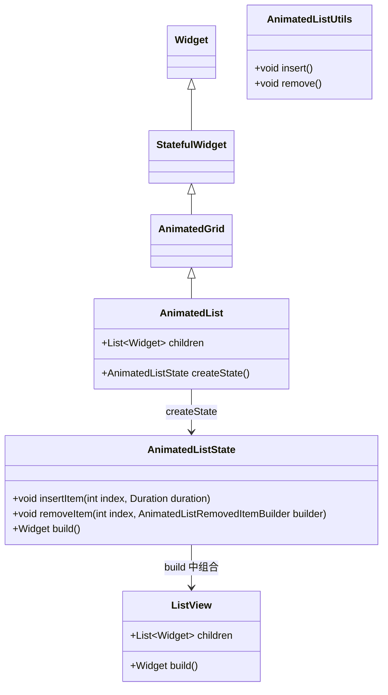

---

## 3. 流程图

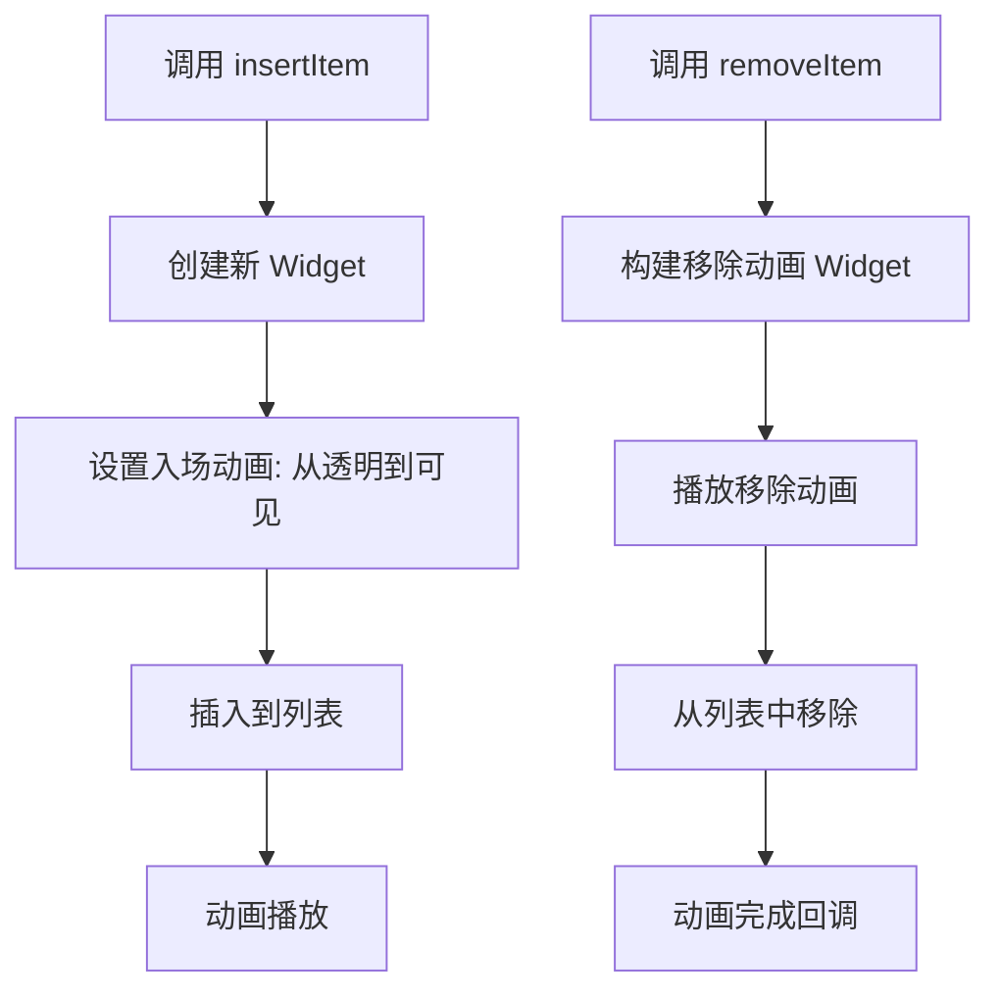

---

## 4. 源码解析

```dart
// flutter/packages/flutter/lib/src/widgets/animations.dart (简化)
class AnimatedList extends StatefulWidget {
  const AnimatedList({
    super.key,
    required this.itemBuilder,
    this.initialItemCount = 0,
  });

  final IndexedWidgetBuilder itemBuilder;
  final int initialItemCount;

  @override
  AnimatedListState createState() => AnimatedListState();
}

class AnimatedListState extends State<AnimatedList> {
  List<_Item> _items = [];

  @override
  void initState() {
    super.initState();
    _items = List.generate(widget.initialItemCount, (index) {
      return _Item(
        key: UniqueKey(),
        child: widget.itemBuilder(context, index),
      );
    });
  }

  void insertItem(int index, {Duration duration = const Duration(milliseconds: 300)}) {
    // 创建新项并插入
    final newItem = _Item(
      key: UniqueKey(),
      child: widget.itemBuilder(context, index),
    );
    _items.insert(index, newItem);
    // 触发入场动画
    setState(() {});
  }

  void removeItem(
    int index,
    AnimatedListRemovedItemBuilder builder, {
    Duration duration = const Duration(milliseconds: 300),
  }) {
    // 执行移除动画
    final removedItem = _items.removeAt(index);
    // 构建动画 Widget
    final animationWidget = builder(context, _removeAnimation, removedItem);
    // 动画结束后真正移除
    _removeAnimation.addStatusListener((status) {
      if (status == AnimationStatus.completed) {
        setState(() {});
      }
    });
  }

  @override
  Widget build(BuildContext context) {
    return ListView.builder(
      itemCount: _items.length,
      itemBuilder: (context, index) {
        return _items[index].child;
      },
    );
  }
}
```

---

## 5. 使用场景

### 1. 基础：添加/删除列表项

```dart
class AnimatedListExample extends StatefulWidget {
  @override
  State<AnimatedListExample> createState() => _AnimatedListExampleState();
}

class _AnimatedListExampleState extends State<AnimatedListExample> {
  final GlobalKey<AnimatedListState> _listKey = GlobalKey<AnimatedListState>();
  final List<String> _items = ['Item 1', 'Item 2', 'Item 3'];
  int _nextId = 4;

  void _addItem() {
    final int index = _items.length;
    _items.add('Item $_nextId');
    _nextId++;
    _listKey.currentState?.insertItem(index);
  }

  void _removeItem(int index) {
    final String removedItem = _items.removeAt(index);
    _listKey.currentState?.removeItem(
      index,
      (context, animation) => _buildRemovedItem(removedItem, animation),
      duration: const Duration(milliseconds: 300),
    );
  }

  Widget _buildRemovedItem(String item, Animation<double> animation) {
    return FadeTransition(
      opacity: animation,
      child: SizeTransition(
        sizeFactor: animation,
        child: ListTile(
          title: Text(item),
          tileColor: Colors.red[100],
        ),
      ),
    );
  }

  @override
  Widget build(BuildContext context) {
    return Column(
      children: [
        Row(
          mainAxisAlignment: MainAxisAlignment.center,
          children: [
            ElevatedButton(
              onPressed: _addItem,
              child: const Text('添加'),
            ),
          ],
        ),
        Expanded(
          child: AnimatedList(
            key: _listKey,
            initialItemCount: _items.length,
            itemBuilder: (context, index, animation) {
              return _buildItem(_items[index], animation, index);
            },
          ),
        ),
      ],
    );
  }

  Widget _buildItem(String item, Animation<double> animation, int index) {
    return FadeTransition(
      opacity: animation,
      child: SizeTransition(
        sizeFactor: animation,
        child: ListTile(
          title: Text(item),
          trailing: IconButton(
            icon: const Icon(Icons.delete, color: Colors.red),
            onPressed: () => _removeItem(index),
          ),
        ),
      ),
    );
  }
}
```

### 2. 带不同入场动画

```dart
Widget _buildItem(String item, Animation<double> animation, int index) {
  final Animation<Offset> _slideAnimation = Tween<Offset>(
    begin: const Offset(1.0, 0.0),
    end: Offset.zero,
  ).animate(CurvedAnimation(parent: animation, curve: Curves.easeOut));

  return SlideTransition(
    position: _slideAnimation,
    child: FadeTransition(
      opacity: animation,
      child: ListTile(title: Text(item)),
    ),
  );
}
```

### 3. 带删除确认

```dart
void _removeItemWithConfirm(int index) {
  showDialog(
    context: context,
    builder: (context) => AlertDialog(
      title: const Text('确认删除'),
      content: const Text('确定要删除吗？'),
      actions: [
        TextButton(
          onPressed: () => Navigator.pop(context),
          child: const Text('取消'),
        ),
        TextButton(
          onPressed: () {
            Navigator.pop(context);
            _removeItem(index);
          },
          child: const Text('删除'),
        ),
      ],
    ),
  );
}
```

---

## 6. 优缺点

| 优点                                                         | 缺点                                                 |
| :----------------------------------------------------------- | :--------------------------------------------------- |
| **自动增删动画**：无需手动管理每个列表项的动画。             | **必须通过 GlobalKey 操作**：API 设计略显复杂。      |
| **支持自定义动画**：可通过 `Animation` 自定义入场/出场效果。 | **仅支持线性列表**：不支持 Grid 布局。               |
| **性能优化**：只对变化项进行动画，其他项不重建。             | **移除动画的 builder 较复杂**：需要创建动画 Widget。 |

---

## 7. 常见坑

### 坑 1：忘记使用 GlobalKey 操作列表

**❌ 错误代码**：
```dart
AnimatedList(
  // ❌ 没有 key，无法调用 insertItem/removeItem
  itemBuilder: ...,
)
```

**✅ 正确代码**：
```dart
final GlobalKey<AnimatedListState> _listKey = GlobalKey();

AnimatedList(
  key: _listKey, // ✅ 必须
  itemBuilder: ...,
)

// 操作时使用
_listKey.currentState?.insertItem(index);
```

### 坑 2：数据与列表不同步

**❌ 错误代码**：
```dart
_items.add('New Item');
// ❌ 忘记调用 insertItem
_listKey.currentState?.insertItem(index);
```

**✅ 正确代码**：
```dart
_items.add('New Item');
_listKey.currentState?.insertItem(_items.length - 1);
```

### 坑 3：移除动画中访问已删除数据

**❌ 错误代码**：
```dart
void _removeItem(int index) {
  final String item = _items[index];
  _items.removeAt(index);
  _listKey.currentState?.removeItem(
    index,
    (context, animation) => _buildRemovedItem(item, animation),
  );
}
```

**✅ 正确代码**：在移除前保存数据，移除后再调用动画。

---

## 8. 性能优化

### 1. 使用 const 构建列表项

```dart
AnimatedList(
  itemBuilder: (context, index, animation) {
    return const MyListItem(); // 使用 const
  },
)
```

### 2. 使用 RepaintBoundary

```dart
RepaintBoundary(
  child: AnimatedList(
    key: _listKey,
    itemBuilder: (context, index, animation) {
      return _buildItem(...);
    },
  ),
)
```

---

# 6. Hero

`Hero` 在两个页面（路由）之间创建一个共享元素的转场动画，例如，一个图片从列表页平滑放大到详情页。

---

## 1. 架构设计

- **Widget 定位**：`Hero` 是一个 **StatelessWidget**，通过 `ModalRoute` 在两个页面之间共享同一个 `tag`，实现平滑过渡。

- **类继承关系**：
  `Widget` → `StatelessWidget` → `Hero`

- **设计意图**：
  1. **共享元素转场**：让用户感知两个页面之间的连续性。
  2. **视觉引导**：将注意力从源页面平滑转移到目标页面。
  3. **统一管理**：通过 `Navigator` 自动协调动画。

---

## 2. 类关系图

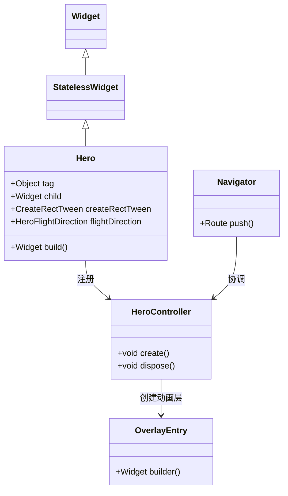

---

## 3. 流程图

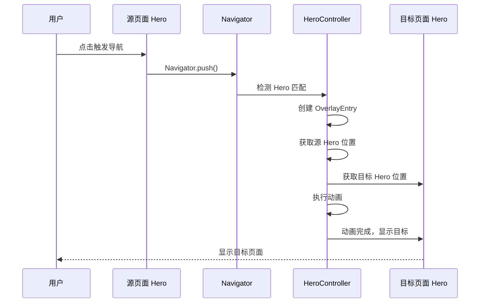

---

## 4. 源码解析

```dart
// flutter/packages/flutter/lib/src/widgets/heroes.dart (简化)
class Hero extends StatelessWidget {
  const Hero({
    super.key,
    required this.tag,
    required this.child,
    this.createRectTween,
    this.flightDirection = HeroFlightDirection.push,
  });

  final Object tag;
  final Widget child;
  final CreateRectTween? createRectTween;
  final HeroFlightDirection flightDirection;

  @override
  Widget build(BuildContext context) {
    return HeroControllerScope(
      child: child,
    );
  }
}

// HeroController 协调动画
class HeroController extends NavigatorObserver {
  void _handleHeroAnimation() {
    // 1. 查找源页面的 Hero
    // 2. 查找目标页面的 Hero
    // 3. 创建 Overlay 动画层
    // 4. 执行 from → to 的 Rect 插值动画
    // 5. 动画结束后，移除 Overlay
  }
}
```

---

## 5. 使用场景

### 1. 基础：图片从列表到详情

**列表页**：
```dart
ListTile(
  leading: Hero(
    tag: 'image_${item.id}',
    child: Image.network(item.imageUrl, width: 50, height: 50),
  ),
  title: Text(item.title),
  onTap: () {
    Navigator.push(
      context,
      MaterialPageRoute(
        builder: (context) => DetailPage(item: item),
      ),
    );
  },
)
```

**详情页**：
```dart
class DetailPage extends StatelessWidget {
  final Item item;

  const DetailPage({required this.item});

  @override
  Widget build(BuildContext context) {
    return Scaffold(
      body: Center(
        child: Hero(
          tag: 'image_${item.id}', // 必须与列表页 tag 一致
          child: Image.network(item.imageUrl, width: 300, height: 300),
        ),
      ),
    );
  }
}
```

### 2. 自定义动画曲线

```dart
Hero(
  tag: 'avatar',
  createRectTween: (Rect? begin, Rect? end) {
    return RectTween(begin: begin, end: end)
      .chain(CurveTween(curve: Curves.easeInOut));
  },
  child: CircleAvatar(radius: 40, backgroundImage: NetworkImage(url)),
)
```

### 3. 文字共享转场

```dart
Hero(
  tag: 'title_${item.id}',
  child: Text(
    item.title,
    style: TextStyle(fontSize: _isDetail ? 24 : 16),
  ),
)
```

### 4. 多个 Hero 同时转场

```dart
// 列表中同时共享图片和标题
Column(
  children: [
    Hero(tag: 'image_${id}', child: Image.network(url)),
    Hero(tag: 'title_${id}', child: Text(title)),
  ],
)
```

### 5. Hero 反向转场（返回时）

`Hero` 自动支持反向转场，从详情页返回列表页时，Hero 会自动从详情页位置飞回列表页位置。

---

## 6. 优缺点

| 优点                                                        | 缺点                                                     |
| :---------------------------------------------------------- | :------------------------------------------------------- |
| **视觉连续性极佳**：让用户清晰感知页面跳转的上下文。        | **tag 必须严格匹配**：大小写敏感，容易出错。             |
| **自动协调动画**：无需手动管理 `AnimationController`。      | **仅支持两个页面之间的转场**：不支持多页面链式转场。     |
| **支持自定义插值**：通过 `createRectTween` 自定义动画曲线。 | **复杂布局可能产生闪烁**：如 Hero 在列表中被重新布局时。 |
| **反向动画自动支持**：返回时自动播放反向动画。              | **不支持 Hero 嵌套**：Hero 不能嵌套使用。                |

---

## 7. 常见坑

### 坑 1：Hero tag 不匹配

**❌ 错误代码**：
```dart
// 列表页
Hero(tag: 'image_$id', child: ...)

// 详情页
Hero(tag: 'image_$itemId', child: ...) // ❌ tag 不一致
```

**✅ 正确代码**：
```dart
// 确保 tag 完全相同
const String heroTag = 'image_${item.id}';
```

### 坑 2：Hero 在列表中被回收

**问题**：当列表滚动时，`Hero` 可能被回收，导致转场失败。

**✅ 解决方案**：
```dart
// 使用 AutomaticKeepAliveClientMixin 保持 Hero 存活
class MyListItem extends StatefulWidget {
  @override
  State<MyListItem> createState() => _MyListItemState();
}

class _MyListItemState extends State<MyListItem>
    with AutomaticKeepAliveClientMixin {
  @override
  bool get wantKeepAlive => true;

  @override
  Widget build(BuildContext context) {
    super.build(context);
    return Hero(tag: ..., child: ...);
  }
}
```

### 坑 3：Hero 在透明背景上闪烁

**问题**：当 Hero 从透明背景转到彩色背景时，可能产生闪烁。

**✅ 解决方案**：
```dart
// 设置 Hero 的 flightDirection
Hero(
  tag: 'image',
  flightDirection: HeroFlightDirection.push, // 或 pop
  child: ...,
)
```

---

## 8. 性能优化

### 1. 使用 RepaintBoundary

```dart
Hero(
  tag: 'image',
  child: RepaintBoundary(
    child: Image.network(url),
  ),
)
```

### 2. 避免 Hero 嵌套

```dart
// ❌ 错误
Hero(tag: 'outer', child: Hero(tag: 'inner', child: ...))

// ✅ 正确：只使用一个 Hero
Hero(tag: 'combined', child: Column(...))
```

### 3. 使用 const tag

```dart
// 如果 tag 固定不变，使用 const
const Hero(
  tag: 'fixed_tag',
  child: ...,
)
```